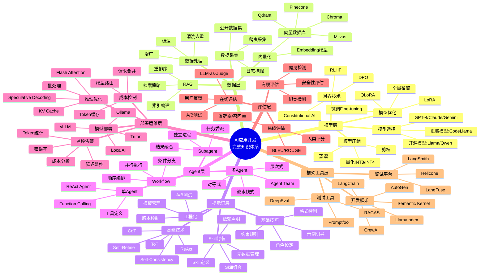

除了**思维链 CoT**，目前业界公认**最稳、最强、最不容易翻车**的提示词写法，就这几类。我直接给你**可复制模板 + 适用场景**，你拿去套就能显著提升输出质量。

# 1. 角色定位 + 约束锁死（最稳）
先给 AI 定死身份、风格、边界，它就不会乱发挥。

```plain
你是一位资深【架构师/工程师/产品经理】。
只输出专业、简洁、可落地的内容，不闲聊、不抒情、不解释。
禁止冗余，禁止跑题，禁止添加无关内容。
请完成：【任务】
```

优点：

+ 输出极度可控
+ 不会突然变啰嗦、变鸡汤
+ 适合工程、代码、文档类

---

# 2. 少样本示例（Few-Shot）最强泛化
给 1～3 个示例，AI 会严格模仿格式、风格、深度。

```plain
任务：把中文术语翻译成专业英文。

示例1：
设计文档 → Design Document
示例2：
系统架构 → System Architecture
示例3：
接口规范 → API Specification

请翻译：
【你的内容】
```

优点：

+ 格式永远不会崩
+ 风格高度统一
+ 适合翻译、命名、表格、结构化输出

---

# 3. 结构化输出强制模板（Output Schema）
直接规定输出结构，AI 必须按骨架填内容。

```plain
请按以下固定结构输出，不要改动层级：

1. 需求背景
2. 核心方案
3. 模块划分
4. 数据结构
5. 接口定义
6. 风险与注意事项

内容：【xxx】
```

优点：

+ 写方案、设计文档、报告几乎 100% 不翻车
+ 不会漏项、不会乱排版

---

# 4. 逆向约束法（防止胡说）
专门对付 AI 瞎编、乱造、虚构信息。

```plain
完成任务时：
- 只使用已知信息，不编造不存在的内容
- 不确定的地方标注【待确认】
- 不扩展、不脑补、不假设
- 不使用模糊表述

任务：【xxx】
```

适合：

+ 代码
+ 技术方案
+ 法律/财务/合规类内容

---

# 5. 分步拆解 + 只看结果（Zero-CoT）
比思维链更轻，只要求步骤，不看思考过程。





