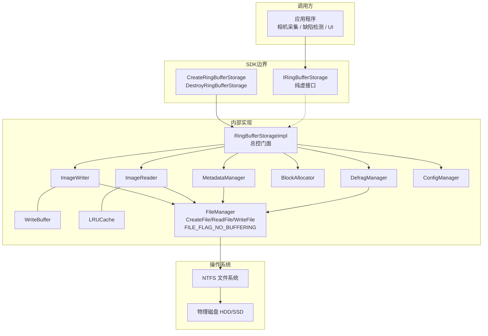
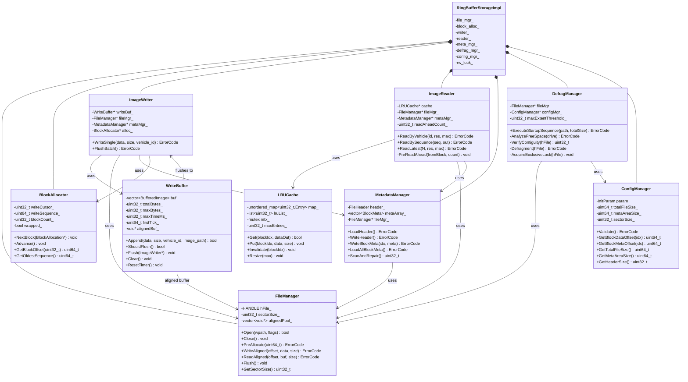
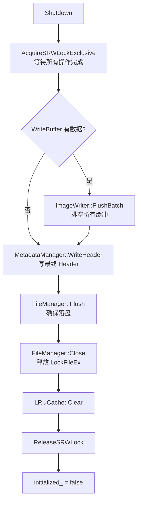
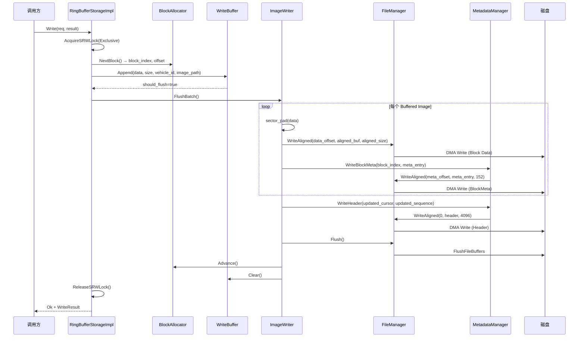
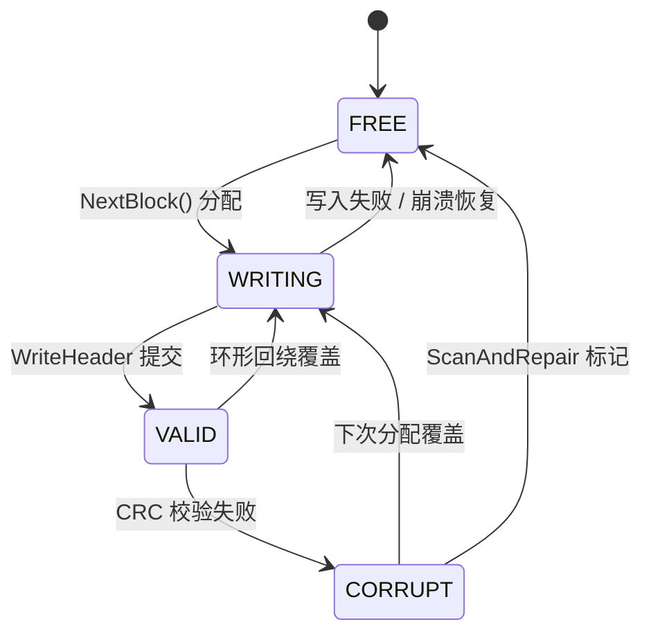

# 方案四 详细设计文档

> **预分配 + 直接 I/O 环形缓冲区** — 车辆检测图像存储系统  
> `独立第三方库` `数据库经典方案` `C++ / Windows NTFS`  
> 版本 1.0 | 2026-06-08 | 机密

---

## 目录

1. [概述](#1-概述)
2. [公共接口设计（库边界）](#2-公共接口设计库边界)
3. [系统架构](#3-系统架构)
4. [类图（UML）](#4-类图uml)
5. [核心流程图](#5-核心流程图)
6. [文件布局与数据协议](#6-文件布局与数据协议)
7. [关键设计决策](#7-关键设计决策)
8. [崩溃一致性与容错](#8-崩溃一致性与容错)
9. [配置参数（InitParam）](#9-配置参数initparam)
10. [附录](#10-附录)

---

## 1. 概述

### 1.1 文档目的与范围

本文档是 **RingBufferStorage**（环形缓冲图像存储库）的详细设计文档。目标读者为系统架构师、C++ 开发工程师和 QA 测试工程师。文档定位为独立第三方库的设计规格，涵盖公共接口、内部架构、数据协议和容错策略。

### 1.2 背景

工业车辆漆面缺陷检测系统中，相机阵列对每辆车的车身外观连续拍照。关键指标：

- **吞吐量**：每 1 分钟驶入 1 辆车
- **数据量**：每辆车约 4 GB，数百张高分辨率图像
- **存储策略**：保留最近数百辆车的图像，超出部分自动滚动覆盖（FIFO）
- **目录结构**：车辆 ID → 拍照点位 → 多张图像（不同项目层级可能不同）

### 1.3 设计目标

- **稳定低延迟写入**：消除运行时元数据操作导致的延迟抖动（毛刺）
- **磁盘性能瓶颈**：系统存图性能取决于磁盘硬件，而非 CPU 或内存
- **有界存储**：通过环形缓冲自动覆盖最旧数据，磁盘占用恒定
- **崩溃恢复**：断电或进程崩溃后，能从文件自身元数据恢复一致性状态
- **独立库封装**：作为第三方库发布，公共接口简洁，内部实现完全隐藏

### 1.4 非目标

图像压缩/编码、相机硬件控制、缺陷检测算法、进程间通信（IPC）、网络传输、云端备份。

### 1.5 约束条件

| 约束项 | 说明 |
|--------|------|
| 操作系统 | Windows，NTFS 文件系统（Win2K+ 支持 SetFileValidData） |
| 磁盘类型 | HDD（需强制物理连续性）或 SSD（连续性为健康指标） |
| 进程模型 | 单进程访问，文件以 dwShareMode=0 独占打开 |
| 特权要求 | 需 SE_MANAGE_VOLUME_NAME 特权（或以管理员权限运行） |
| 扇区对齐 | 直接 I/O 要求 Buffer 地址、文件偏移、传输大小三者均为扇区大小（512B）整数倍 |

### 1.6 术语表

| 术语 | 定义 |
|------|------|
| Block | 环形缓冲区中的一个数据槽位，存储单张图像。大小为 max_image_bytes。 |
| BlockMeta | Block 的元数据：时间戳、实际大小、CRC、标志位、车辆 ID。 |
| write_cursor | 当前写入位置的 Block 索引（0 ~ N−1），环形递增。 |
| write_sequence | 全局单调递增的写入序号，用于跨回绕排序。 |
| DMA | 直接内存访问 — 数据在用户缓冲区和磁盘之间传输，不经 CPU 拷贝。 |
| Extent | NTFS 文件的一组物理连续簇。Extent 数越少 → 碎片化越低。 |
| FSCTL | 文件系统控制码，通过 DeviceIoControl 向 NTFS 发送指令。 |
| Page Cache | Windows 内核的文件缓存，直接 I/O（FILE_FLAG_NO_BUFFERING）完全绕过它。 |
| image_path | BlockMeta 中存储的子路径字段，记录车辆目录以下的层级路径（可变深度），`/` 分隔，如 `"POS03/CAM01"`。 |

---

## 2. 公共接口设计（库边界）

> **设计原则：** 以下为调用方唯一需要知道的契约。FileManager、BlockAllocator、ImageWriter、ImageReader、LRUCache、WriteBuffer、MetadataManager、DefragManager 等均为内部实现，不对外暴露。

### 2.1 公共接口类 IRingBufferStorage

```cpp
// ring_buffer_storage.h — SDK 唯一公开头文件
#pragma once
#include <cstdint>

// 前向声明
struct InitParam;
struct WriteRequest;
struct WriteResult;
struct ReadRequest;
struct ReadResult;
struct ImageInfo;
struct StorageStats;

enum class ErrorCode : uint32_t {
    Ok                 = 0,
    Win32Error         = 1,   // 调用 GetLastError() 获取详细信息
    InvalidParam       = 2,   // InitParam 校验失败
    ImageTooLarge      = 3,   // 图像大小超过 max_image_bytes
    FileCorrupt        = 4,   // Header magic 或 CRC 不匹配
    DiskFull           = 5,   // 空闲空间不足
    NotInitialized     = 6,
    NotFound           = 7,   // vehicle_id 未匹配到任何图像
    CrcMismatch        = 8,   // Block 数据 CRC 校验失败（非致命）
    DefragFailed       = 9,
    TooFragmented      = 10,
    AlreadyLocked      = 11,  // 文件已被另一实例锁定
};

class IRingBufferStorage {
public:
    virtual ~IRingBufferStorage() = default;

    // 初始化：创建/打开文件，碎片整理，崩溃恢复扫描
    virtual ErrorCode Initialize(const InitParam& param) = 0;

    // 关闭：排空 WriteBuffer → 写最终 Header → Flush → 关闭文件
    virtual void     Shutdown() = 0;

    // 写入一张图像。返回 ErrorCode::Ok 或错误码。
    virtual ErrorCode Write(const WriteRequest& req, WriteResult* result) = 0;

    // 读取图像：按 vehicle_id / sequence / 最新 N 张等多种查询方式
    virtual ErrorCode Read(const ReadRequest& req, ReadResult* result) = 0;

    // 获取运行时统计
    virtual void     GetStats(StorageStats* stats) = 0;
};
```

### 2.2 工厂函数（DLL 导出）

```cpp
// 唯一的创建/销毁入口。内部返回 RingBufferStorageImpl 实例。
IRingBufferStorage* CreateRingBufferStorage();
void               DestroyRingBufferStorage(IRingBufferStorage* p);
```

> **设计意图：** 工厂函数隔离了 new/delete 的跨模块（DLL/EXE）问题。调用方只持有接口指针，无法访问任何内部类。

### 2.3 SDK 公开类型

| 类型 | 用途 |
|------|------|
| `InitParam` | 初始化参数结构体（见第 9 章） |
| `WriteRequest` | 写入请求：图像数据指针 + 大小 + vehicle_id + image_path |
| `WriteResult` | 写入结果：分配的 block_index + write_sequence |
| `ReadRequest` | 读取请求：查询方式（by_vehicle / by_sequence / by_path / latest_n）+ 参数 |
| `ReadResult` | 读取结果：图像数据 + ImageInfo 数组 |
| `ImageInfo` | 单张图像元信息：vehicle_id、image_path、timestamp、actual_size、block_index、sequence |
| `StorageStats` | 运行时统计：已用 block 数、写入总字节数、覆盖次数、CRC 错误次数 |
| `ErrorCode` | 所有错误码枚举 |

### 2.4 WriteRequest / WriteResult / ReadRequest / ReadResult 定义

```cpp
// ── 写入 ──
struct WriteRequest {
    const void*    data;         // 图像数据指针
    uint32_t        data_size;    // 图像字节数（≤ max_image_bytes）
    const wchar_t*  vehicle_id;   // 车辆标识字符串
    const wchar_t*  image_path;   // 子路径（可变层级），如 L"POS03/CAM01"
};

struct WriteResult {
    uint32_t  block_index;   // 分配的 Block 索引
    uint64_t  sequence;      // 全局写入序号
};

// ── 读取 ──
enum class ReadMode : uint32_t { ByVehicle, BySequence, ByPath, LatestN };

struct ReadRequest {
    ReadMode  mode;
    union {
        const wchar_t* vehicle_id;   // ByVehicle / ByPath: 车辆 ID
        uint64_t    sequence;       // BySequence: 全局序号
        uint32_t    count;          // LatestN: 最新 N 张
    } query;
    const wchar_t* path_prefix;     // ByPath: 子路径前缀，如 "POS03/"；"" 匹配全部
    void*     output_buffer;
    uint32_t  output_capacity;
    uint32_t  max_results;      // 最多返回多少条 ImageInfo（用于 ByVehicle / ByPath）
};

struct ReadResult {
    uint32_t   images_returned;  // 实际返回的图像数量
    uint32_t   total_bytes;       // 输出数据总字节数
    ImageInfo* infos;             // 指向元信息数组（调用方提供缓冲区）
};

struct ImageInfo {                  // 对外暴露
    wchar_t   vehicle_id[64];
    wchar_t   image_path[64];   // 子路径（可变层级），/ 分隔
    uint64_t  timestamp;       // FILETIME 格式
    uint32_t  actual_size;
    uint32_t  block_index;
    uint64_t  sequence;
};
```

### 2.5 调用示例

```cpp
// 1. 创建实例
auto* storage = CreateRingBufferStorage();

// 2. 初始化
InitParam param = {};
param.file_path          = L"D:\\data\\vehicle_ring.dat";
param.total_capacity_bytes = 800ULL * 1024 * 1024 * 1024;  // 800 GB
param.max_image_bytes    = 4 * 1024 * 1024;               // 4 MB
param.max_vehicles       = 200;
if (storage->Initialize(param) != ErrorCode::Ok) { /* 处理错误 */ }

// 3. 写入
WriteRequest wreq = { image_buf, image_len, L"VIN_001", L"POS03/CAM01" };
WriteResult  wres;
storage->Write(wreq, &wres);

// 4. 读取
ReadRequest rreq = { ReadMode::ByVehicle, {.vehicle_id = L"VIN_001"}, nullptr, buf, cap, 100 };
ReadResult  rres;
storage->Read(rreq, &rres);

// 4b. 按子路径前缀查询（匹配 POS03/CAM01 等）
ReadRequest preq = { ReadMode::ByPath, {.vehicle_id = L"VIN_001"}, L"POS03/", buf, cap, 50 };
storage->Read(preq, &rres);

// 5. 关闭
storage->Shutdown();
DestroyRingBufferStorage(storage);
```

---

## 3. 系统架构

### 3.1 分层架构图



> 虚线 = 实现关系 | 实线 = 组合 / 依赖 | SDK 边界以上为调用方可见，以下全部隐藏

### 3.2 内部模块职责

| 模块 | 职责 | 关键接口 |
|------|------|----------|
| **RingBufferStorageImpl** | 实现 IRingBufferStorage，协调所有子模块。持有 SRWLock 控制并发。 | Initialize, Shutdown, Write, Read, GetStats |
| **FileManager** | 文件的创建/打开/关闭，预分配 SetFileValidData，对齐读写。管理 aligned buffer pool。 | Open, Close, PreAllocate, WriteAligned, ReadAligned, Flush, GetSectorSize |
| **BlockAllocator** | 环形游标管理：提供 NextBlock() 返回下一个写入位；检测覆盖；维护 write_cursor 和 write_sequence。 | NextBlock, Advance, GetBlockOffset, GetOldestSequence |
| **ImageWriter** | 写入流程编排：扇区填充 → DMA 写 Block → 写 BlockMeta → 写 Header → Flush。 | WriteSingle, FlushBatch |
| **ImageReader** | 读取流程：LRU 查找 → 未命中时 DMA 读盘 → CRC 校验 → 预读。 | ReadByVehicle, ReadBySequence, ReadLatest, PreReadAhead |
| **LRUCache** | 应用层读缓存：hash map + 双向链表。Block 被覆盖时主动淘汰缓存条目。 | Get, Put, Invalidate, Resize |
| **WriteBuffer** | 写入攒批：积累图像后一次性 DMA 写入。双阈值触发——数量阈值 OR 时间阈值，满足任一即刷盘。 | Append, ShouldFlush, Flush, Clear, ResetTimer |
| **MetadataManager** | Header 和 BlockMeta 的读写。启动时 ScanAndRepair 崩溃恢复。 | LoadHeader, WriteHeader, WriteBlockMeta, LoadAllBlockMeta, ScanAndRepair |
| **DefragManager** | 启动五步碎片整理序列：分析位图 → 预分配 → 验证连续性 → 整理 → 锁定。 | ExecuteStartupSequence |
| **ConfigManager** | 参数校验和偏移量计算。暴露所有布局相关的 getter。 | Validate, GetBlockDataOffset, GetBlockMetaOffset, GetTotalFileSize |

### 3.3 并发模型

**读写锁策略：**
- **SRWLock**（Slim Reader/Writer Lock）
- Write() → 独占写锁
- Read() → 共享读锁（多读者并发）
- GetStats() → 共享读锁
- Initialize() / Shutdown() → 独占写锁

**写者优先规则：**
- 写请求到达时不再接受新的读请求
- 已有读者完成后写者立即执行
- 防止高负载下读者饿死写者
- WriteBuffer 攒批期间仅持锁一次

---

## 4. 类图（UML）

### 4.1 公共接口层

```mermaid
classDiagram
    class IRingBufferStorage {
        &lt;&lt;interface&gt;&gt;
        +Initialize(InitParam) ErrorCode
        +Shutdown() void
        +Write(WriteRequest, WriteResult*) ErrorCode
        +Read(ReadRequest, ReadResult*) ErrorCode
        +GetStats(StorageStats*) void
    }
    class RingBufferStorageImpl {
        -unique_ptr~FileManager~ file_mgr_
        -unique_ptr~BlockAllocator~ block_alloc_
        -unique_ptr~ImageWriter~ writer_
        -unique_ptr~ImageReader~ reader_
        -unique_ptr~MetadataManager~ meta_mgr_
        -unique_ptr~DefragManager~ defrag_mgr_
        -unique_ptr~ConfigManager~ config_mgr_
        -SRWLOCK rw_lock_
        -bool initialized_
        +Initialize(InitParam) ErrorCode
        +Shutdown() void
        +Write(WriteRequest, WriteResult*) ErrorCode
        +Read(ReadRequest, ReadResult*) ErrorCode
        +GetStats(StorageStats*) void
    }
    IRingBufferStorage &lt;|.. RingBufferStorageImpl : implements
```

### 4.2 内部实现层完整类图



### 4.3 关键数据结构（内部，不对外暴露）

```cpp
// ═══ FileHeader (4096 字节, packed) ═══
#pragma pack(1)
struct FileHeader {
    uint32_t magic;              // 0x52494E47 ("RING")
    uint32_t version;            // 当前为 1
    uint64_t block_size;         // 每个 Block 最大字节数
    uint32_t block_count;        // Block 总数 N
    uint32_t write_cursor;       // 当前写入位置 (0 ~ N-1)
    uint64_t write_sequence;     // 全局单调递增写入序号
    uint8_t  reserved[4060];     // 保留
    uint32_t header_crc32;       // 前 4092 字节的 CRC32（位于偏移 4092）
};
#pragma pack()

// ═══ BlockMeta (每项 152 字节, packed) ═══
#pragma pack(1)
struct BlockMeta {
    uint64_t timestamp;          // 写入时间 (FILETIME UTC)
    uint32_t actual_size;        // 图像实际字节数 (≤ block_size)
    uint32_t data_crc32;         // 图像数据 CRC32 校验值
    uint8_t  flags;              // 0=FREE, 1=VALID, 2=CORRUPT
    wchar_t  vehicle_id[32];    // 车辆标识字符串 (64 字节)
    wchar_t  image_path[32];    // 子路径，可变层级，'/' 分隔 (64 字节)
    uint8_t  reserved[7];       // 对齐填充
};
#pragma pack()
static_assert(sizeof(BlockMeta) == 152, "BlockMeta must be 152 bytes");
```

---

## 5. 核心流程图

### 5.1 启动初始化流程

```mermaid
flowchart TD
    A[调用 Initialize(param)] --> B{ConfigManager::Validate}
    B -->|参数非法| C[返回 InvalidParam]
    B -->|通过| D[获取 SE_MANAGE_VOLUME_NAME 特权]
    D --> E{文件是否存在?}
    E -->|新建| F[FSCTL_GET_VOLUME_BITMAP<br/>分析空闲位图]
    F --> G{最大连续空闲区<br/>≥ 目标文件大小?}
    G -->|否| H[返回 DiskFull]
    G -->|是| I[CreateFile<br/>dwShareMode=0<br/>FILE_FLAG_NO_BUFFERING]
    I --> J[SetFileValidData<br/>瞬时预分配全部空间]
    J -->|失败| K[回退: SetEndOfFile<br/>+ 分块写零]
    K --> L
    J -->|成功| L[FSCTL_GET_RETRIEVAL_POINTERS<br/>查询 Extent 数量]
    L --> M{Extent 数 ≥ 阈值?}
    M -->|是| N[FSCTL_MOVE_FILE<br/>强制碎片整理]
    N --> O{整理后 Extent ≤ 阈值?}
    O -->|否| P[返回 TooFragmented]
    O -->|是| Q
    M -->|否| Q[LockFileEx<br/>加排他字节范围锁]
    E -->|已存在| R[MetadataManager::LoadHeader]
    R --> S{magic + CRC 正确?}
    S -->|否| T[返回 FileCorrupt]
    S -->|是| U[MetadataManager::ScanAndRepair<br/>遍历 BlockMeta → CRC 校验<br/>重建 write_cursor / sequence]
    U --> Q
    Q --> V[MetadataManager::LoadAllBlockMeta<br/>加载全部元数据到内存]
    V --> W[BlockAllocator::Init<br/>LRUCache::Init]
    W --> X[initialized_ = true<br/>返回 Ok]
```

### 5.2 图像写入流程（热路径）

```mermaid
flowchart TD
    A[Write(req, result)] --> B[AcquireSRWLockExclusive]
    B --> C{data_size ≤ max_image_bytes?}
    C -->|否| D[返回 ImageTooLarge]
    C -->|是| E[BlockAllocator::NextBlock<br/>获取 write_cursor / offset]
    E --> F[WriteBuffer::Append<br/>积累到 WriteBuffer<br/>含 vehicle_id + image_path]
    F --> G{WriteBuffer::ShouldFlush?<br/>数量阈值 OR 时间阈值}
    G -->|否| I[释放锁, 返回 Ok]
    G -->|是| J[ImageWriter::FlushBatch]
    J --> K[遍历 WriteBuffer 中每张图]
    K --> L[扇区填充:<br/>aligned_size = ceil(size/512)*512<br/>尾部填零]
    L --> M[FileManager::WriteAligned<br/>DMA 写入 Block Data 区]
    M --> N[构建 BlockMeta 条目<br/>timestamp, crc32, vehicle_id<br/>image_path, flags=VALID]
    N --> O[MetadataManager::WriteBlockMeta<br/>写入 BlockMeta 区]
    O --> P{还有更多?}
    P -->|是| K
    P -->|否| Q[MetadataManager::WriteHeader<br/>更新 write_cursor + sequence]
    Q --> R[FileManager::Flush<br/>确保数据落盘]
    R --> S[LRUCache::Invalidate<br/>淘汰被覆盖 Block 的缓存]
    S --> T[BlockAllocator::Advance<br/>cursor = (cursor+1) % N<br/>sequence++]
    T --> U[WriteBuffer::Clear]
    U --> I
```

> **提交点（Commit Point）：** WriteHeader 是整个写入的提交点。在此之前崩溃 → 数据已落盘但 cursor 未更新 → 恢复时 ScanAndRepair 发现并修复。在此之后崩溃 → 完全恢复。

### 5.3 图像读取流程

```mermaid
flowchart TD
    A[Read(req, result)] --> B[AcquireSRWLockShared]
    B --> C{ReadMode?}
    C -->|ByVehicle| D[遍历内存中 BlockMeta 数组]
    C -->|ByPath| D
    D --> E{flags == VALID?}
    E -->|是| E2{vehicle_id 匹配?<br/>且 ByPath: path_prefix 前缀匹配}
    E2 -->|匹配| F[LRUCache::Get(block_index)]
    E2 -->|不匹配| N{遍历完成?}
    F -->|命中| G[从缓存拷贝数据]
    F -->|未命中| H[FileManager::ReadAligned<br/>DMA 读取 Block Data]
    H --> I[CRC32 校验]
    I -->|通过| J[LRUCache::Put(block_index)]
    J --> K[触发 PreReadAhead<br/>异步预读 N+1, N+2]
    K --> G
    I -->|失败| L[记录 CrcMismatch<br/>跳过此 Block, 继续]
    G --> M[填充 ImageInfo]
    E -->|不匹配| N{遍历完成?}
    M --> N
    L --> N
    N -->|否| D
    N -->|是| O
    C -->|BySequence| P[直接计算 block_index<br/>通过 sequence 映射]
    P --> F
    C -->|LatestN| Q[从 write_cursor-1 倒序遍历 N 个 VALID Block]
    Q --> F
    O --> R[释放锁, 返回结果数]
```

### 5.4 环形缓冲回绕流程

```mermaid
flowchart LR
    A[write_cursor = N-1] --> B[NextBlock 调用]
    B --> C[计算 next = (N-1+1) % N = 0]
    C --> D{BlockMeta[0].flags?}
    D -->|FREE| E[直接分配, 不覆盖]
    D -->|VALID| F[标记 is_overwrite=true<br/>旧 Block 将被覆盖]
    F --> G[Write 流程写入新数据]
    G --> H[LRUCache::Invalidate(0)<br/>淘汰缓存中的旧数据]
    H --> I[新 BlockMeta 覆盖旧条目]
    I --> J[write_sequence = old_seq + 1]
    J --> K[旧数据的 sequence<br/>已落后 N 个序号<br/>查询时自然被过滤]
```

### 5.5 崩溃恢复流程

```mermaid
flowchart TD
    A[MetadataManager::ScanAndRepair] --> B[ReadAligned(offset=0, 4096)<br/>读取 Header]
    B --> C{magic + CRC 正确?}
    C -->|否| D[假定空文件<br/>write_cursor=0<br/>write_sequence=0]
    C -->|是| E[ReadAligned(offset=4096<br/>读取全部 BlockMeta 数组]
    E --> F[遍历 BlockMeta[0..N-1]]
    F --> G{flags == VALID?}
    G -->|是| H[ReadAligned(Block Data)<br/>计算 CRC32]
    H --> I{CRC 匹配?}
    I -->|是| J[记录 max_sequence<br/>记录 max_valid_block_index]
    I -->|否| K[标记 flags=CORRUPT<br/>WriteBlockMeta 落盘]
    G -->|否| L{遍历完成?}
    J --> L
    K --> L
    L -->|否| F
    L -->|是| M{max_sequence > 0?}
    M -->|是| N[write_cursor = (max_valid_block+1) % N<br/>write_sequence = max_sequence]
    M -->|否| D
    N --> O[WriteHeader<br/>提交恢复后的状态]
    D --> O
    O --> P[返回损坏 Block 数量]
```

### 5.6 关闭流程



---

## 6. 文件布局与数据协议

### 6.1 文件布局规格

| 偏移量 | 大小 | 内容 |
|--------|------|------|
| `0x0000_0000` | 4,096 字节 | **FileHeader**（magic, version, block_size, block_count, write_cursor, write_sequence, header_crc32） |
| `0x0000_1000` | META_AREA_SIZE | **BlockMeta 数组**：N × sizeof(BlockMeta)，扇区补齐。sizeof(BlockMeta) = 152 字节，N 条记录连续存放。 |
| `0x0000_1000 + META_AREA_SIZE` | N × block_size | **Block Data Area**：N 个连续 Block，每个 Block 大小为 block_size 字节。 |

```
┌────────────┬────────────────────────────┬──────────────────────────────────────┐
│ FileHeader │ BlockMeta[0..N-1]          │ Block 0  │ Block 1  │ ... │ Block N-1 │
│   4KB      │ N × 152B (sector padded)  │  4MB     │  4MB     │     │   4MB      │
└────────────┴────────────────────────────┴──────────────────────────────────────┘
```

### 6.2 编址公式

| 公式 | 说明 |
|------|------|
| `HEADER_SIZE = 4096` | FileHeader 固定占 1 页（8 个 512B 扇区） |
| `META_AREA_SIZE = ceil(N × 152 / sector_size) × sector_size` | BlockMeta 数组，扇区补齐 |
| `block_data_offset(i) = 4096 + META_AREA_SIZE + i × block_size` | 第 i 个 Block 的数据起始偏移 |
| `block_meta_offset(i) = 4096 + i × 152` | 第 i 个 BlockMeta 的起始偏移 |
| `total_file_size = 4096 + META_AREA_SIZE + N × block_size` | 文件总大小 |

### 6.3 循环索引逻辑

```cpp
// 环形递增
uint32_t next_cursor = (write_cursor + 1) % block_count;

// 物理索引 → 逻辑年龄（距当前 cursor 的距离）
uint32_t logical_age(uint32_t physical_idx, uint32_t cursor, uint32_t N) {
    return (cursor - physical_idx + N) % N;
}
// 0 = 最新写入的, 1 = 倒数第二, ..., N-1 = 最旧的
```

### 6.4 写入协议（含同步点）

单张图像写入的原子性由以下协议保证。写入顺序不可调换：

| 步骤 | 操作 | 说明 |
|------|------|------|
| **Step 1** | 写 Block Data | `WriteAligned(block_data_offset, aligned_buf, aligned_size)`。DMA 直写到目标 Block。此时无元数据指向它 → 崩溃后无影响。 |
| **Step 2** | 写 BlockMeta（预提交） | `WriteBlockMeta(write_cursor, meta_entry)`。元数据落盘，包含 CRC。崩溃后 ScanAndRepair 能发现并恢复。 |
| **Step 3** | **写 Header（提交点）** | `WriteHeader({write_cursor+1, sequence+1})`。Header 落盘后，新 Block 正式生效。⚠️ 这是提交点。 |
| **Step 4** | FlushFileBuffers | 确保 DMA 数据从磁盘写缓存刷入物理介质。FILE_FLAG_NO_BUFFERING 已绕过 Page Cache，此步骤确保磁盘缓存也落地。 |

### 6.5 读取协议

1. 遍历内存中 BlockMeta 数组（无磁盘 I/O）
2. ByVehicle：匹配 vehicle_id；ByPath：匹配 vehicle_id + path_prefix 前缀比较
3. 对每个匹配 entry → LRU 查找 → 命中直接返回
4. 未命中 → DMA 读盘（对齐读取）→ CRC 校验
5. CRC 通过 → 插入 LRU + 触发预读
6. BySequence 路径为 O(1)：直接用 sequence 定位 block_index

### 6.6 扇区对齐协议

| 对齐项 | 要求 | 保证方式 |
|--------|------|----------|
| 用户 Buffer 地址 | sector_size 倍数 | `_aligned_malloc(size, sector_size)` |
| 文件偏移量 | sector_size 倍数 | Header=4096=8×512; meta_area_size 扇区补齐; block_size 为 sector_size 倍数（Init 时校验） |
| 传输大小 | sector_size 倍数 | `aligned = ((actual + sector_size - 1) / sector_size) * sector_size`，尾部填零 |

### 6.7 目录结构到 Block 存储的映射

#### 6.7.1 映射模型

调用方的三层物理目录结构通过 `vehicle_id` + `image_path` 两个字段编码到 BlockMeta 中：

```
物理目录（三层示例）：
  D:\images\
    ├─ VIN001/                    ← 第1层：车辆
    │   ├─ POS03/                 ← 第2层：拍照点
    │   │   ├─ CAM01/             ← 第3层：相机（可选）
    │   │   │   ├─ img_001.jpg
    │   │   │   └─ img_002.jpg
    │   │   └─ img_003.jpg        ← 第2层直接存图也合法
    │   └─ POS05/
    │       └─ img_004.jpg

映射到 BlockMeta：
  vehicle_id = "VIN001",  image_path = "POS03/CAM01"  → img_001, img_002
  vehicle_id = "VIN001",  image_path = "POS03"        → img_003
  vehicle_id = "VIN001",  image_path = "POS05"        → img_004
```

**核心原则：** `vehicle_id` 为顶层强制标识；`image_path` 承载其下所有层级，`/` 分隔，深度可变，不同项目的层级差异全部由 `image_path` 表达。

#### 6.7.2 路径编码约定

| 规则 | 说明 |
|------|------|
| 分隔符 | `/`（正斜杠），与 URI 惯例一致 |
| vehicle_id | 必填，不可为空，标识顶层车辆 |
| image_path | 可为空字符串 `""`，表示图片直接在车辆根目录下 |
| 最大分段数 | 不限（32 个 wchar_t 内任意深度） |
| 编码字符 | 可打印字符，不含 `\0`、`/` 保留为分隔符 |

#### 6.7.3 前缀匹配语义

ByPath 查询使用前缀匹配，语义为"匹配该车辆下指定子路径范围内的所有图像"：

```
查询：vehicle_id = "VIN001", path_prefix = "POS03/"
匹配：image_path = "POS03/"       → 不匹配（不含斜杠）
匹配：image_path = "POS03"        → 不匹配（无尾随斜杠）
匹配：image_path = "POS03/CAM01"  → 匹配 ✓
匹配：image_path = "POS03/CAM02"  → 匹配 ✓
匹配：image_path = "POS05"        → 不匹配

查询：vehicle_id = "VIN001", path_prefix = ""
匹配：该车辆下所有 image_path → 等效于 ByVehicle
```

匹配算法 (O(n) 遍历)：
```cpp
bool PathMatches(const wchar_t* stored_path, const wchar_t* prefix) {
    if (prefix[0] == L'\0') return true;  // 空前缀匹配全部
    size_t prefix_len = wcslen(prefix);
    return wcsncmp(stored_path, prefix, prefix_len) == 0;
}
```

#### 6.7.4 写入时调用方映射示例

```cpp
// 调用方扫描目录，按车辆→拍照点→图像写入
void StoreImages(IRingBufferStorage* storage, 
                 const wchar_t* vehicle, const wchar_t* position,
                 const std::vector<ImageData>& images) {
    for (auto& img : images) {
        WriteRequest req = {
            img.data, img.size, vehicle, position
        };
        WriteResult res;
        storage->Write(req, &res);
    }
}
// 不同项目的层次差异：调用方自行组装 image_path
// 项目A (3层):  image_path = "POS03/CAM01"
// 项目B (2层):  image_path = "POS03"
```

---

## 7. 关键设计决策

### 7.1 为什么预分配？

消除运行时 NTFS 簇分配、$Bitmap 位图更新、$MFT 记录扩展、$LogFile 日志写入等元数据操作。这些操作是写入延迟抖动（10ms → 500ms+ 毛刺）的根本原因。预分配通过 `SetFileValidData` 瞬时完成，后续写入的延迟完全取决于磁盘带宽。

### 7.2 为什么直接 I/O？

`FILE_FLAG_NO_BUFFERING` 使数据路径变为：用户 Buffer → DMA → 磁盘，零 CPU 拷贝。同时完全绕过 Page Cache，避免 4GB/辆的图像数据挤走其他进程的热数据（DLL、可执行页等）。代价是需要自建应用层缓存。

### 7.3 为什么 BlockMeta 集中在前部？

继承方案二的布局优势：启动恢复时顺序读一次即可获取全部元数据；支持变长存储（actual_size ≤ block_size），空间利用率 ~99%；Header + BlockMeta 物理相邻，回写元数据时一次 Seek 即可。

### 7.4 对齐策略

Header = 4KB（8 扇区）；block_size 取 4096 倍数（如 4MB = 4096×1024）；Meta 区若 `N×152` 不为 512 的倍数，则尾部填充到下一个 512B 边界。三者均绕开了直接 I/O 的对齐陷阱。

### 7.5 缓存策略

- **WriteBuffer** 双阈值触发刷盘——数量阈值（默认 16 张）或时间阈值（默认 1000ms），满足任一即触发一次 DMA 写入。兼顾高负载攒批效率与低负载数据时效。
- **LRU Read Cache** 缓存最近读取的 32 个 Block，命中时完全避免磁盘 I/O。Block 被环形覆盖时主动淘汰对应条目。
- **Read-Ahead** 在缓存未命中时异步预读后续 2 个 Block，适配顺序回放场景。

### 7.6 为什么三层空间隔离？

- **Layer 1**：NTFS $Bitmap 标记簇为"已分配" → 其他文件无法占用。
- **Layer 2**：`dwShareMode=0` → Windows I/O 管理器拒绝任何其他进程的 CreateFile。
- **Layer 3**：`LockFileEx` → 字节范围锁，同进程内的额外防护。

三层确保文件独占，免于资源管理器缩略图提取、杀毒软件扫描等外部干扰。

### 7.7 为什么环形覆盖而非显式删除？

免除 OS 的文件删除开销（释放簇、更新 $Bitmap、写 $LogFile）。cursor 自然递增覆盖最旧 Block，无需 GC 线程。sequence 号码提供跨回绕的时间排序。一个 Block 只有两种状态：VALID（可读）或 FREE（可写）。

### 7.8 WriteBuffer 双阈值刷盘

#### 7.8.1 设计动机

方案四的直接 I/O 每次 WriteFile 都会触发一次 DMA 传输。如果每来一张图像就单独写入，每张图都要经历 `SetFilePointerEx + WriteFile + Flush` 的完整路径，系统调用和 DMA 启动开销会显著降低吞吐。WriteBuffer 的攒批设计解决了这个问题，但纯数量阈值有两个缺陷：

1. **低负载时数据长时间滞留**：如果写入频率低（如每 5 秒一张图），凑满 16 张需 80 秒，突然崩溃损失大
2. **车辆拍摄结束时尾部数据遗漏**：最后一辆车可能只拍了 5 张图，未达到数量阈值就结束了

因此引入**时间阈值**作为第二触发条件。

#### 7.8.2 触发逻辑

```
触发条件（满足任一即刷盘）：
  ① 累积图像数 ≥ write_buffer_block_count  (数量阈值, 默认 16)
  ② 距首张图进入时间 ≥ write_buffer_flush_ms (时间阈值, 默认 1000ms)
```

计时起点：`Clear()` 后第一次 `Append()` 时记录 `first_tick_`（`QueryPerformanceCounter`）。

```cpp
bool ShouldFlush() const {
    if (buf_.empty()) return false;
    if (buf_.size() >= max_count_) return true;
    uint64_t elapsed_ms = ((NowTick() - first_tick_) * 1000) / perf_freq_;
    return elapsed_ms >= max_time_ms_;
}
```

#### 7.8.3 状态机

```
         ┌─────────┐
         │  IDLE   │  buf_ 为空
         └────┬────┘
              │ Append(第1张图) → 记录 first_tick_
         ┌────▼────┐
         │ ACCUM   │ 积累中，每次 Append 后检查 ShouldFlush()
         └────┬────┘
              │ count≥阈值 OR time≥阈值 → FLUSHING
         ┌────▼────┐
         │FLUSHING │ ImageWriter::FlushBatch 持锁执行
         └────┬────┘
              │ Clear() → 清空 buf_，重置 first_tick_ → IDLE
```

#### 7.8.4 锁策略

| 场景 | 行为 |
|------|------|
| 未达阈值 | Append 后立即释放写锁，锁持有时间最小 |
| 达阈值触发热路径 | 持写锁完成 Flush → WriteHeader → Advance → Clear 整条路径 |
| Shutdown | 强制 Flush 排空所有缓冲，无视阈值 |

#### 7.8.5 配置交互

| 场景 | 数量阈值 | 时间阈值 | 刷盘策略 |
|------|---------|---------|---------|
| 高负载（每分钟 4GB，数百张图） | 常触发 | 几乎不触发 | 数量驱动刷盘 |
| 低负载（间歇写入） | 很少触发 | 1 秒触发 | 时间驱动刷盘 |
| 车辆边界 | 不触发 | — | Shutdown / 调用方时序自然分割 |

---

## 8. 崩溃一致性与容错

### 8.1 崩溃场景矩阵

| 崩溃时机 | 磁盘残留状态 | 恢复动作 | 数据损失 |
|----------|-------------|----------|----------|
| 写 Block Data 期间 | Block 区有部分数据，旧 BlockMeta 仍在 | 旧元数据仍指向旧数据，此 Block 下次分配时被覆盖 | **无** |
| Block Data 完成，写 BlockMeta 期间 | Block 数据完整，BlockMeta 可能残缺 | CRC 校验失败 → 标记为 FREE | **无**（该图可重拍） |
| BlockMeta 完成，写 Header 之前 | Block 数据 + Meta 完整，Header cursor 未更新 | ScanAndRepair 发现 meta 中有序列 > Header 序列的 VALID Block → 自动修正 cursor | **零**（完全恢复） |
| Header 写完之后，Flush 之前 | 所有元数据已落盘 | 正常启动即可。极小概率磁盘缓存丢失 → CRC 下次校验时标记 CORRUPT | **极低** |

### 8.2 CRC 三层校验

| 层级 | 校验对象 | 说明 |
|------|----------|------|
| **Layer 1** | Header CRC32 | 校验 FileHeader 前 4092 字节。启动时验证，失败则假定文件为空或尝试从 BlockMeta 重建。 |
| **Layer 2** | BlockMeta CRC32 | 每个 BlockMeta 条目中存储对应 Block 数据的 CRC32。启动恢复时逐一核对，不匹配则标记为 CORRUPT。 |
| **Layer 3** | 运行时 CRC 校验 | 每次 Read 操作从磁盘读取数据后计算 CRC，与 BlockMeta 中的 data_crc32 对比。不匹配返回 CrcMismatch（非致命），不做元数据修改。 |

### 8.3 优雅降级

| 故障场景 | 降级策略 | 影响 |
|----------|----------|------|
| SetFileValidData 失败（无特权） | 回退到 SetEndOfFile + 分块写零（64MB/chunk，Overlapped I/O） | 首次初始化耗时增加（需写满全文件零值），运行时不变 |
| FSCTL_MOVE_FILE 失败 | 记录警告日志，以降级 Extent 数继续运行 | HDD 上顺序写性能下降（寻道增加），SSD 几乎无影响 |
| CRC 不匹配（运行时读） | 跳过该 Block，继续返回其他匹配结果 | 个别图像丢失（系统可通过重拍获取） |

---

## 9. 配置参数（InitParam）

### 9.1 调用方必须提供（无合理默认值）

| 参数 | 类型 | 含义 |
|------|------|------|
| `file_path` | `const wchar_t*` | 存储文件完整路径，如 `L"D:\\data\\ring.dat"` |
| `total_capacity_bytes` | `uint64_t` | 环形缓冲总容量（= 文件大小），如 `800ULL * 1024 * 1024 * 1024`（800 GB） |
| `max_image_bytes` | `uint32_t` | 单张图像最大尺寸（即 block_size），如 `4 * 1024 * 1024`（4 MB） |
| `max_vehicles` | `uint32_t` | 需保留的车辆数量上限，如 200。用于推导 block_count 下限 |

### 9.2 调用方可选提供（有默认值，可覆盖）

| 参数 | 默认值 | 含义 |
|------|--------|------|
| `write_buffer_block_count` | `16` | WriteBuffer 数量阈值：积累多少个 Block 后一次性 DMA 刷盘 |
| `write_buffer_flush_ms` | `1000` | WriteBuffer 时间阈值：距首张图进入超时后强制刷盘（毫秒） |
| `lru_cache_block_count` | `32` | LRU 读缓存最多缓存多少个 Block |
| `read_ahead_block_count` | `2` | 顺序访问时预读后续多少个 Block |
| `max_extent_threshold` | `3`（HDD）/ `10`（SSD） | Extent 数量超过此值时触发碎片整理 |
| `defrag_timeout_seconds` | `300` | 碎片整理最大等待时间（秒） |
| `enable_read_cache` | `true` | 是否启用应用层 LRU 读缓存 |
| `enable_write_buffer` | `true` | 是否启用写入攒批 |

### 9.3 库内部自动推导（调用方不感知）

| 参数 | 推导方式 |
|------|----------|
| `block_count` | `total_capacity_bytes / (max_image_bytes + 152)`，且确保 ≥ max_vehicles × 1000（每车约 1000 张图） |
| `header_size` | 固定为 4096 |
| `meta_area_size` | `ceil(N × 152 / sector_size) × sector_size` |
| `sector_size` | 运行时 `GetDiskFreeSpace` 获取（通常 512） |
| `write_buffer_bytes` | `write_buffer_block_count × max_image_bytes` |
| `lru_cache_bytes` | `lru_cache_block_count × max_image_bytes` |

### 9.4 校验规则

- `max_image_bytes` 必须是 sector_size 的整数倍
- `total_capacity_bytes` ≥ HEADER_SIZE + META_AREA_SIZE + block_size（至少 1 个 Block）
- `max_vehicles` ≥ 1
- `file_path` 所指卷的可用空间 ≥ total_capacity_bytes
- `max_extent_threshold` ≥ 1
- 非法参数在 `Initialize()` 时立即返回 `ErrorCode::InvalidParam`

### 9.5 推荐配置 Profile

| Profile | total_capacity | max_image | max_vehicles | block_count | write_buf | lru_cache |
|---------|---------------|-----------|-------------|-------------|-----------|-----------|
| **生产 HDD 2TB** | 800 GB | 4 MB | 200 | 200,000 | 16 | 32 |
| **生产 SSD 1TB** | 400 GB | 4 MB | 100 | 100,000 | 32 | 64 |
| **开发 / 测试** | 4 GB | 4 MB | 1 | 1,000 | 4 | 8 |

---

## 10. 附录

### 10.1 Windows API 速查表

| API / IOCTL | 用途 | 调用位置 |
|-------------|------|----------|
| `CreateFileW(dwShareMode=0, FILE_FLAG_NO_BUFFERING)` | 独占打开文件，设置直接 I/O | FileManager::Open |
| `SetFileValidData` | 瞬时预分配（需 SE_MANAGE_VOLUME_NAME） | FileManager::PreAllocate |
| `DeviceIoControl(FSCTL_GET_VOLUME_BITMAP)` | 获取卷空闲簇位图 | DefragManager::AnalyzeFreeSpace |
| `DeviceIoControl(FSCTL_GET_RETRIEVAL_POINTERS)` | 查询文件物理 Extent 布局 | DefragManager::VerifyContiguity |
| `DeviceIoControl(FSCTL_MOVE_FILE)` | 强制文件碎片整理 | DefragManager::Defragment |
| `LockFileEx(LOCKFILE_EXCLUSIVE_LOCK)` | 字节范围排他锁 | DefragManager::AcquireExclusiveLock |
| `_aligned_malloc / _aligned_free` | 扇区对齐的内存分配 | FileManager / WriteBuffer |
| `FlushFileBuffers` | 强制刷新文件缓冲区到磁盘 | FileManager::Flush |
| `GetDiskFreeSpace` | 获取逻辑扇区大小 | ConfigManager::Validate |

### 10.2 时序图 — 写入



### 10.3 Block 生命周期状态机



### 10.4 性能基准测试方法

| 指标 | 测量方法 | 合格标准 |
|------|----------|----------|
| 写入延迟 P50 | 10000 次 Write() 取中位数 | < 30ms (HDD 4MB block) |
| 写入延迟 P99 | 10000 次 Write() 取 99 分位 | < 50ms（无毛刺） |
| 写入延迟 P99.9 | 10000 次 Write() 取 99.9 分位 | < 100ms |
| 吞吐量 | 持续写入 10 分钟，计算 MB/s | ≥ 磁盘顺序写带宽的 80% |
| Extent 数量 | 启动后 GetStats 查询 | ≤ 3 (HDD), ≤ 10 (SSD) |
| CRC 覆盖 | 读取全部 Valid Block 并校验 | 100% 通过 |
| 缓存命中率 | 连续读取 1000 张顺序图像 | ≥ 85%（含预读） |
