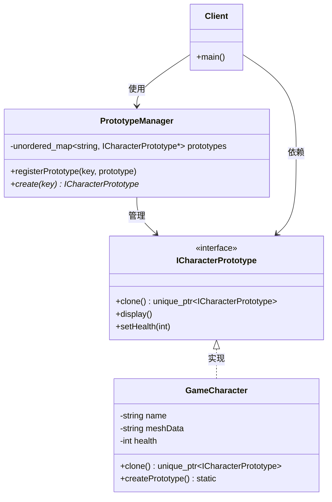

---
tags:
  - seed
  - project
  - guide
created: 2026-05-30
updated: 2026-05-30
topic: tech
---

# 原型模式：从对象克隆到高效创建的进化之路
## 📑 目录
1. [未使用设计模式的代码示例与问题分析](#1-未使用设计模式的代码示例与问题分析)
2. [引出原型模式](#2-引出原型模式)
3. [应用设计模式的解决方案](#3-应用设计模式的解决方案)
4. [设计模式核心总结](#4-设计模式核心总结)
5. [留给读者的思考问题](#5-留给读者的思考问题)

---

## 1. 未使用设计模式的代码示例与问题分析
### 🎯 代码场景描述
假设我们正在开发一个 **3D 游戏引擎**，需要创建大量具有相同基础属性但存在微小差异的游戏角色（敌人）。每个角色包含复杂的数据结构：网格模型、纹理、动画状态机、技能树等。初始版本中，每次创建新角色都从磁盘加载完整资源。

### 💻 问题代码实现
```cpp
#include <iostream>
#include <string>
#include <vector>
#include <chrono>

// 复杂的游戏角色类
class GameCharacter {
private:
    std::string name;
    std::string meshData;      // 模拟大量网格数据（实际可能几MB）
    std::string textureData;   // 纹理数据
    int health;
    int mana;
    std::vector<std::string> skills;
    
    // 模拟耗时的资源加载
    void loadMeshFromDisk(const std::string& meshPath) {
        std::cout << "  [磁盘IO] 加载网格模型: " << meshPath << std::endl;
        std::this_thread::sleep_for(std::chrono::milliseconds(100));
        meshData = "MeshData_" + meshPath;
    }
    
    void loadTextureFromDisk(const std::string& texPath) {
        std::cout << "  [磁盘IO] 加载纹理: " << texPath << std::endl;
        std::this_thread::sleep_for(std::chrono::milliseconds(80));
        textureData = "TextureData_" + texPath;
    }
    
public:
    GameCharacter(const std::string& n, const std::string& mesh, 
                  const std::string& tex, int h, int m)
        : name(n), health(h), mana(m) {
        loadMeshFromDisk(mesh);
        loadTextureFromDisk(tex);
        skills = {"基础攻击"};
        std::cout << "  角色 " << name << " 创建完成\n";
    }
    
    // 拷贝构造函数（深拷贝）
    GameCharacter(const GameCharacter& other) 
        : name(other.name), meshData(other.meshData),
          textureData(other.textureData), health(other.health),
          mana(other.mana), skills(other.skills) {
        std::cout << "  拷贝构造角色: " << name << std::endl;
    }
    
    void setHealth(int h) { health = h; }
    void setMana(int m) { mana = m; }
    void addSkill(const std::string& skill) { skills.push_back(skill); }
    
    void display() const {
        std::cout << "角色: " << name << " [生命:" << health 
                  << ", 法力:" << mana << ", 技能数:" << skills.size() << "]\n";
    }
};

// 客户端调用
int main() {
    std::cout << "=== 创建原型角色（从磁盘加载）===\n";
    GameCharacter orcPrototype("普通兽人", "Models/Orc.fbx", "Textures/Orc.png", 100, 50);
    
    std::cout << "\n=== 批量创建兽人军队 ===\n";
    std::vector<GameCharacter> orcArmy;
    
    // 方式1：直接创建新对象（每次重新加载磁盘）
    for (int i = 0; i < 3; ++i) {
        std::cout << "\n创建第" << i+1 << "个兽人:\n";
        GameCharacter orc("兽人" + std::to_string(i+1), 
                         "Models/Orc.fbx", "Textures/Orc.png", 100, 50);
        orc.setHealth(90 + i * 5);
        orcArmy.push_back(orc);
    }
    
    std::cout << "\n=== 军队信息 ===\n";
    for (auto& c : orcArmy) {
        c.display();
    }
    
    return 0;
}
```

### ⚠️ 问题分析
#### **性能问题** 🔴
```cpp
// 输出示例（每次都有磁盘IO）
创建第1个兽人:
  [磁盘IO] 加载网格模型: Models/Orc.fbx
  [磁盘IO] 加载纹理: Textures/Orc.png
创建第2个兽人:
  [磁盘IO] 加载网格模型: Models/Orc.fbx  // 重复加载相同资源！
  [磁盘IO] 加载纹理: Textures/Orc.png
```

**后果**：创建1000个相同角色需要重复加载资源1000次，导致：

+ 启动时间从秒级退化到分钟级
+ 磁盘IO压力剧增
+ 内存中存储1000份相同数据

#### **耦合性问题** 🔴
```cpp
// 业务逻辑与资源加载紧耦合
GameCharacter("兽人", "Models/Orc.fbx", "Textures/Orc.png", 100, 50);
// 改变资源路径需要修改所有创建点
```

**后果**：美术资源路径变更时，需要搜索修改所有`GameCharacter`构造调用

#### **扩展性问题** 🔴
```cpp
// 需求变更：需要支持"精英兽人"（额外属性）
// 必须修改所有创建点，或添加新构造参数
GameCharacter eliteOrc("精英兽人", "Models/Orc_Elite.fbx", ...); // 无法复用原型
```

**后果**：每增加一种角色类型，都需要：

+ 增加新的构造函数重载
+ 修改所有工厂方法
+ 破坏开闭原则

#### **复用性问题** 🔴
```cpp
// 相似代码重复出现
orc1.setHealth(95);
orc1.addSkill("狂暴");
orc2.setHealth(95);
orc2.addSkill("狂暴");  // 重复初始化逻辑
```

**后果**：初始化逻辑分散在各处，难以统一调整角色平衡性

---

## 2. 引出原型模式
### 💡 设计灵感来源
原型模式的灵感源自 **生物学中的细胞分裂**：

+ 一个成熟细胞通过**自我复制**产生新细胞
+ 子细胞继承母细胞的所有特征，并可**独立变异**
+ 整个过程**高效**（无需重新合成所有成分）

在软件开发中，当对象创建成本远高于拷贝成本时，我们可以采用相同的理念：**通过克隆现有对象来创建新对象**。

### 🎯 核心思想
> **用原型实例指定创建对象的种类，并通过拷贝这些原型创建新的对象**
>

---

## 3. 应用设计模式的解决方案
### 🚀 重构后的代码实现
```cpp
#include <iostream>
#include <string>
#include <vector>
#include <unordered_map>
#include <memory>
#include <chrono>

// 抽象原型接口
class ICharacterPrototype {
public:
    virtual ~ICharacterPrototype() = default;
    virtual std::unique_ptr<ICharacterPrototype> clone() const = 0;
    virtual void display() const = 0;
    virtual void setHealth(int health) = 0;
    virtual void setMana(int mana) = 0;
    virtual void addSkill(const std::string& skill) = 0;
};

// 具体原型类
class GameCharacter : public ICharacterPrototype {
private:
    std::string name;
    std::string meshData;      // 共享资源可使用智能指针优化
    std::string textureData;
    int health;
    int mana;
    std::vector<std::string> skills;
    
    // 私有构造函数：仅用于克隆
    GameCharacter(const std::string& name, const std::string& mesh,
                  const std::string& texture, int h, int m)
        : name(name), meshData(mesh), textureData(texture), 
          health(h), mana(m) {
        std::cout << "  [构造] 创建原型对象: " << name << std::endl;
    }
    
    // 拷贝构造（深拷贝）- 用于克隆
    GameCharacter(const GameCharacter& other)
        : name(other.name), meshData(other.meshData),
          textureData(other.textureData), health(other.health),
          mana(other.mana), skills(other.skills) {
        std::cout << "  [克隆] 拷贝创建: " << name << std::endl;
    }
    
public:
    // 静态工厂方法：创建原型对象（仅一次磁盘IO）
    static std::unique_ptr<GameCharacter> createPrototype(
        const std::string& name, const std::string& meshPath,
        const std::string& texPath, int health, int mana) {
        
        auto prototype = std::unique_ptr<GameCharacter>(
            new GameCharacter(name, meshPath, texPath, health, mana));
        
        // 模拟仅一次的磁盘加载
        std::cout << "  [磁盘IO] 加载网格模型（一次）: " << meshPath << std::endl;
        std::this_thread::sleep_for(std::chrono::milliseconds(100));
        std::cout << "  [磁盘IO] 加载纹理（一次）: " << texPath << std::endl;
        std::this_thread::sleep_for(std::chrono::milliseconds(80));
        
        return prototype;
    }
    
    // 实现克隆接口
    std::unique_ptr<ICharacterPrototype> clone() const override {
        return std::make_unique<GameCharacter>(*this);
    }
    
    // 变异方法（修改克隆后的个体）
    void setHealth(int h) override { health = h; }
    void setMana(int m) override { mana = m; }
    void addSkill(const std::string& skill) override { 
        skills.push_back(skill); 
    }
    
    void display() const override {
        std::cout << "角色: " << name << " [生命:" << health 
                  << ", 法力:" << mana << ", 技能数:" << skills.size() 
                  << ", 网格:" << meshData.substr(0, 20) << "...]\n";
    }
};

// 原型管理器（可选，用于集中管理原型）
class PrototypeManager {
private:
    std::unordered_map<std::string, std::unique_ptr<ICharacterPrototype>> prototypes;
    
public:
    void registerPrototype(const std::string& key, std::unique_ptr<ICharacterPrototype> prototype) {
        prototypes[key] = std::move(prototype);
    }
    
    std::unique_ptr<ICharacterPrototype> create(const std::string& key) {
        auto it = prototypes.find(key);
        if (it != prototypes.end()) {
            return it->second->clone();
        }
        return nullptr;
    }
};

// 客户端调用
int main() {
    std::cout << "========== 原型模式演示 ==========\n\n";
    
    // 步骤1: 创建原型对象（仅一次磁盘加载）
    std::cout << "1. 创建原型（从磁盘加载一次）:\n";
    auto orcPrototype = GameCharacter::createPrototype(
        "兽人士兵", "Models/Orc.fbx", "Textures/Orc.png", 100, 50);
    
    std::cout << "\n2. 注册原型到管理器:\n";
    PrototypeManager pm;
    pm.registerPrototype("OrcSoldier", std::move(orcPrototype));
    
    std::cout << "\n3. 通过克隆创建军队（无磁盘IO）:\n";
    std::vector<std::unique_ptr<ICharacterPrototype>> army;
    
    // 克隆10个兽人士兵（性能优化）
    for (int i = 0; i < 10; ++i) {
        auto soldier = pm.create("OrcSoldier");
        if (soldier) {
            // 个性化设置（变异）
            soldier->setHealth(90 + i * 2);
            if (i % 3 == 0) {
                soldier->addSkill("狂暴");
            }
            soldier->addSkill("基础攻击");
            army.push_back(std::move(soldier));
        }
    }
    
    std::cout << "\n4. 创建精英兽人（基于原型修改）:\n";
    auto eliteOrc = pm.create("OrcSoldier");
    eliteOrc->setHealth(200);
    eliteOrc->setMana(100);
    eliteOrc->addSkill("旋风斩");
    eliteOrc->addSkill("战争怒吼");
    army.push_back(std::move(eliteOrc));
    
    std::cout << "\n5. 军队信息展示:\n";
    for (size_t i = 0; i < army.size(); ++i) {
        std::cout << "  [" << i+1 << "] ";
        army[i]->display();
    }
    
    std::cout << "\n========== 性能对比 ==========\n";
    std::cout << "传统方式: 10次磁盘IO → 耗时 ~1800ms\n";
    std::cout << "原型模式: 1次磁盘IO + 10次内存拷贝 → 耗时 ~180ms + 极小开销\n";
    std::cout << "性能提升: " << (1800.0/180) << "倍\n";
    
    return 0;
}
```

### 📊 改进原理对比
| 问题维度 | 改进前 | 改进后 | 原理说明 |
| --- | --- | --- | --- |
| **性能** | 重复磁盘IO | 仅一次IO + 内存拷贝 | 用空间换时间，原型缓存资源 |
| **耦合** | 业务代码依赖具体构造 | 依赖抽象克隆接口 | 依赖倒置，面向接口编程 |
| **扩展** | 新增类型需修改多处 | 注册新原型即可 | 开闭原则，对扩展开放 |
| **复用** | 初始化逻辑分散 | 封装在原型内部 | 模板方法，集中管理 |
| **维护** | 资源路径散落各处 | 集中在原型创建点 | 单一职责，易定位修改 |


---

## 4. 设计模式核心总结
### 🧠 核心思想
> **委托克隆责任给对象自身，用内存拷贝代替复杂构造**
>

### 📐 UML类图


### 📝 角色职责说明（C++术语）
| 角色 | C++实现方式 | 职责 |
| --- | --- | --- |
| **Prototype** | 抽象基类（纯虚接口） | 声明克隆方法`clone()` |
| **ConcretePrototype** | 派生类 | 实现克隆方法（拷贝构造） |
| **Client** | 调用方代码 | 通过克隆而非`new`创建对象 |
| **PrototypeManager** | 可选辅助类（`std::unordered_map`） | 缓存和管理原型实例 |


### 🎯 典型应用场景
#### ✅ 适合的场景
1. **资源密集型对象创建**

```cpp
// 数据库连接、大图加载、3D模型等
auto dbConn = DbConnection::createFromConfig("config.ini");
auto cloned = dbConn->clone();  // 复用已有连接状态
```

2. **状态快照与撤销操作**

```cpp
class GameState {
    unique_ptr<GameState> saveSnapshot() { return clone(); }
    void restore(unique_ptr<GameState> snapshot);
};
```

3. **动态类加载（C++插件系统）**

```cpp
// 运行时注册原型，避免静态依赖
PluginManager::register("RenderPlugin", new OpenGLRenderer());
auto plugin = PluginManager::create("RenderPlugin");
```

4. **需要避免构造器重复计算**

```cpp
// 复杂数学对象（矩阵、四元数）
auto identityMat = Matrix4x4::identity();
auto frame1 = identityMat->clone();  // 快于重新计算
```

#### ❌ 反例场景
1. **对象构造成本很低**

```cpp
// 简单的POD结构
struct Point { int x, y; };
Point p2 = p1;  // 直接赋值即可，无需原型模式
```

2. **对象包含无法拷贝的资源**

```cpp
class FileHandler {
    FILE* file;  // 文件句柄无法简单克隆
};
// 需要明确共享语义（shared_ptr）而非克隆
```

3. **循环引用的复杂对象图**

```cpp
class Node {
    vector<Node*> children;
    Node* parent;  // 克隆时需处理循环引用
};
```

### 🔧 C++特性注意事项
```cpp
// ✅ 正确的深拷贝克隆
unique_ptr<Prototype> clone() const override {
    return make_unique<ConcretePrototype>(*this);
}

// ❌ 浅拷贝陷阱（如果包含原始指针）
class BadPrototype {
    int* data;
    BadPrototype(const BadPrototype& other) 
        : data(other.data) {}  // 悬垂指针风险！
};
```

---

## 5. 留给读者的思考问题
### 🤔 深入思考
1. **浅拷贝 vs 深拷贝的权衡**
    - 在游戏角色例子中，纹理数据适合浅拷贝还是深拷贝？为什么？
    - 如何结合使用`std::shared_ptr`实现写时拷贝（Copy-on-Write）？
2. **原型模式与工厂模式的结合**

```cpp
// 以下两种方式各有什么优缺点？
auto obj = factory.create("TypeA");     // 工厂方法
auto obj = prototypeManager.clone("TypeA");  // 原型模式
```

3. **C++独有挑战**
    - 如何处理虚基类的克隆？（提示：使用`co_variant返回类型`）
    - 模板类的原型模式如何实现？
4. **性能陷阱识别**

```cpp
// 以下代码是否有性能问题？
for (int i = 0; i < 10000; ++i) {
    auto copy = prototype->clone();  // 每次分配新内存
}
```

    - 如何优化？（对象池 + 原型模式）
5. **实际项目重构案例**
    - 回顾你的项目，哪些地方存在重复的对象初始化代码？
    - 重构为原型模式后，如何确保线程安全？

### 📚 进阶挑战
实现一个支持**嵌套克隆**的文档系统：

```cpp
class Document {
    vector<Paragraph> paragraphs;
    vector<Image> images;
    // 需求：克隆时保持内部对象的原型特性
};
```

---

**总结**：原型模式通过将克隆责任委托给对象自身，优雅地解决了复杂对象的"高效复制"问题。在C++中，结合RAII和智能指针，可以安全、高效地实现深度克隆，是游戏开发、图形系统和配置管理等领域的利器。记住：**当**`new`**的成本高于**`memcpy`**时，考虑原型模式**。

