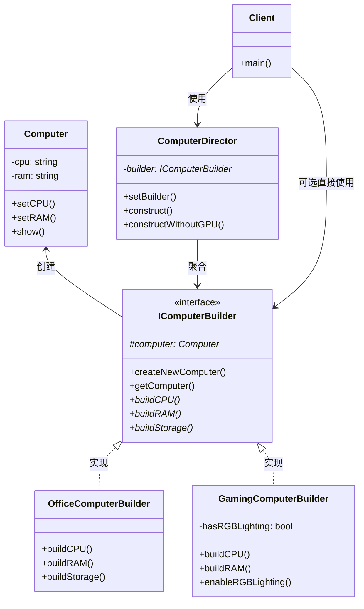

# 建造者模式：从复杂对象构建到流水线式装配的进化之路
## 📑 目录
1. [未使用设计模式的代码示例与问题分析](#1-未使用设计模式的代码示例与问题分析)
2. [引出建造者模式](#2-引出建造者模式)
3. [应用设计模式的解决方案](#3-应用设计模式的解决方案)
4. [设计模式核心总结](#4-设计模式核心总结)
5. [留给读者的思考问题](#5-留给读者的思考问题)

---

## 1. 未使用设计模式的代码示例与问题分析
### 🎯 代码场景描述
假设我们正在开发一个 **电脑配置系统**，需要支持组装不同类型的电脑（办公电脑、游戏电脑、服务器）。每台电脑包含多个组件：CPU、内存、硬盘、显卡、主板、电源等。这些组件的配置参数复杂，且不同电脑类型对组件的要求差异很大。

### 💻 问题代码实现
```cpp
#include <iostream>
#include <string>
#include <vector>
#include <memory>

// 电脑产品类
class Computer {
private:
    std::string cpu;
    std::string motherboard;
    std::string ram;
    std::string storage;
    std::string gpu;
    std::string powerSupply;
    std::vector<std::string> accessories;  // 赠品配件
    
public:
    void setCPU(const std::string& cpu) { this->cpu = cpu; }
    void setMotherboard(const std::string& mb) { motherboard = mb; }
    void setRAM(const std::string& ram) { this->ram = ram; }
    void setStorage(const std::string& storage) { this->storage = storage; }
    void setGPU(const std::string& gpu) { this->gpu = gpu; }
    void setPowerSupply(const std::string& ps) { powerSupply = ps; }
    void addAccessory(const std::string& accessory) { accessories.push_back(accessory); }
    
    void show() const {
        std::cout << "\n========== 电脑配置 ==========\n";
        std::cout << "CPU: " << cpu << "\n";
        std::cout << "主板: " << motherboard << "\n";
        std::cout << "内存: " << ram << "\n";
        std::cout << "硬盘: " << storage << "\n";
        std::cout << "显卡: " << gpu << "\n";
        std::cout << "电源: " << powerSupply << "\n";
        std::cout << "赠品: ";
        for (const auto& acc : accessories) std::cout << acc << " ";
        std::cout << "\n============================\n";
    }
};

// 电脑组装工厂（胖构造函数 + 多个工厂方法）
class ComputerFactory {
public:
    // 方式1：巨型构造函数（参数爆炸）
    static Computer* createComputer(
        const std::string& cpu, const std::string& mb, const std::string& ram,
        const std::string& storage, const std::string& gpu, const std::string& ps,
        const std::vector<std::string>& accessories = {}) {
        
        Computer* computer = new Computer();
        computer->setCPU(cpu);
        computer->setMotherboard(mb);
        computer->setRAM(ram);
        computer->setStorage(storage);
        computer->setGPU(gpu);
        computer->setPowerSupply(ps);
        for (const auto& acc : accessories) {
            computer->addAccessory(acc);
        }
        return computer;
    }
    
    // 方式2：多个特定场景的工厂方法（代码重复）
    static Computer* createOfficeComputer() {
        Computer* computer = new Computer();
        computer->setCPU("Intel i5-12400");
        computer->setMotherboard("B660M");
        computer->setRAM("DDR4 16GB");
        computer->setStorage("512GB SSD");
        computer->setGPU("集成显卡");
        computer->setPowerSupply("400W");
        computer->addAccessory("鼠标垫");
        computer->addAccessory("清洁套装");
        return computer;
    }
    
    static Computer* createGamingComputer() {
        Computer* computer = new Computer();
        computer->setCPU("Intel i9-13900K");
        computer->setMotherboard("Z790");
        computer->setRAM("DDR5 32GB");
        computer->setStorage("1TB NVMe SSD");
        computer->setGPU("RTX 4090");
        computer->setPowerSupply("1000W 金牌");
        computer->addAccessory("电竞鼠标");
        computer->addAccessory("机械键盘");
        computer->addAccessory("游戏耳机");
        return computer;
    }
    
    static Computer* createServerComputer() {
        Computer* computer = new Computer();
        computer->setCPU("Intel Xeon Gold 6248R");
        computer->setMotherboard("C621");
        computer->setRAM("DDR4 ECC 128GB");
        computer->setStorage("4TB NVMe SSD RAID 10");
        computer->setGPU("基础显示");
        computer->setPowerSupply("1600W 冗余电源");
        // 服务器没有赠品
        return computer;
    }
};

// 客户端调用
int main() {
    std::cout << "=== 方案1：使用巨型构造函数 ===";
    auto pc1 = ComputerFactory::createComputer(
        "Ryzen 7 7800X3D", "B650", "32GB", "1TB SSD", "RTX 4070", "750W",
        {"鼠标", "键盘"});
    pc1->show();
    delete pc1;
    
    std::cout << "\n=== 方案2：使用预定义工厂方法 ===";
    auto pc2 = ComputerFactory::createGamingComputer();
    pc2->show();
    
    std::cout << "\n=== 需求变更：需要定制游戏电脑 ===";
    // 需求：游戏电脑升级到64GB内存，更换为RTX 4080，不要键盘赠品
    // 问题：必须重新创建整个对象，或修改工厂方法
    auto gamingCustom = ComputerFactory::createComputer(
        "Intel i9-13900K", "Z790", "64GB", "1TB NVMe SSD", "RTX 4080", "1000W 金牌",
        {"电竞鼠标", "游戏耳机"});  // 缺少键盘
    gamingCustom->show();
    delete gamingCustom;
    
    delete pc2;
    return 0;
}
```

### ⚠️ 问题分析
#### **扩展性问题** 🔴
```cpp
// 需求：增加水冷散热器组件
// 必须修改Computer类、所有工厂方法和已有客户端代码
class Computer {
    std::string cooling;  // 新增字段
    // setCooling()...
};

// 所有工厂方法都要修改
Computer* createOfficeComputer() {
    // ... 原有代码
    computer->setCooling("风冷");  // 新增
}
```

**后果**：

+ 添加新组件需要修改N个地方（N = 工厂方法数量）
+ 违反开闭原则，每次扩展都导致大规模代码变更
+ 容易遗漏某些工厂方法，导致配置不一致

#### **耦合性问题** 🔴
```cpp
// 客户端代码与具体创建过程紧耦合
Computer* gaming = ComputerFactory::createGamingComputer();
// 客户端不知道内部设置了哪些组件，但必须接受整个预设
```

**后果**：

+ 客户端无法灵活控制组装过程
+ 测试困难：无法单独测试某个组件的配置逻辑
+ 产品表示与构建过程未分离

#### **复用性问题** 🔴
```cpp
// 代码重复严重
static Computer* createOfficeComputer() {
    // 20行重复的setter调用
}

static Computer* createGamingComputer() {
    // 几乎相同的结构，只是值不同
}

static Computer* createServerComputer() {
    // 再次重复
}
```

**后果**：

+ 修改初始化流程（如增加日志）需要修改所有工厂方法
+ 代码膨胀，维护成本指数级增长
+ 容易出现复制粘贴错误

#### **维护性问题** 🔴
```cpp
// 需求变更：所有电脑需要增加雷电4接口
// 必须修改所有现有工厂方法和未来新增的方法
computer->addPort("Thunderbolt 4");  // 到处添加
```

**具体后果**：

| 场景 | 影响 |
| --- | --- |
| 新增组件类型 | 修改Computer + 所有Builder + 所有Factory方法 |
| 修改默认配置 | 遍历所有工厂方法逐一修改 |
| 增加新电脑类型 | 新增工厂方法 + 复制粘贴大量代码 |
| 组件间依赖校验 | 无法集中校验（如大功率CPU必须配高端主板） |


#### **性能问题** 🟡
```cpp
// 创建过程中可能存在重复计算或无效初始化
Computer* gaming = ComputerFactory::createGamingComputer();
gaming->setRAM("64GB");  // 创建时已设32GB，又覆盖
```

**后果**：

+ 不必要的对象创建和属性重设
+ 无法实现对象池或缓存策略

---

## 2. 引出建造者模式
### 💡 设计灵感来源
建造者模式的灵感源自 **现实中的流水线装配**：

> 在汽车制造工厂，一辆汽车的组装被分解为多个独立步骤：安装底盘 → 发动机 → 轮胎 → 内饰 → 电气系统。**流水线结构**允许：
>
> + 同一套工序可以生产不同配置的汽车（标准版、豪华版）
> + 更换某个工位的设备即可升级特定部件
> + 总监工统一调度，确保组装顺序正确
>

将这个思想映射到软件开发：

+ **建造者** = 某个工位的装配工人
+ **指挥者** = 生产线总监
+ **产品** = 最终产出的复杂对象

### 🎯 核心思想
> **将一个复杂对象的构建与其表示分离，使得同样的构建过程可以创建不同的表示**
>

---

## 3. 应用设计模式的解决方案
### 🚀 重构后的代码实现
```cpp
#include <iostream>
#include <string>
#include <vector>
#include <memory>

// ========== 产品类 ==========
class Computer {
private:
    std::string cpu;
    std::string motherboard;
    std::string ram;
    std::string storage;
    std::string gpu;
    std::string powerSupply;
    std::vector<std::string> accessories;
    
public:
    void setCPU(const std::string& c) { cpu = c; }
    void setMotherboard(const std::string& mb) { motherboard = mb; }
    void setRAM(const std::string& r) { ram = r; }
    void setStorage(const std::string& s) { storage = s; }
    void setGPU(const std::string& g) { gpu = g; }
    void setPowerSupply(const std::string& ps) { powerSupply = ps; }
    void addAccessory(const std::string& acc) { accessories.push_back(acc); }
    
    void show() const {
        std::cout << "\n========== 电脑配置 ==========\n";
        std::cout << "CPU: " << cpu << "\n主板: " << motherboard 
                  << "\n内存: " << ram << "\n硬盘: " << storage
                  << "\n显卡: " << gpu << "\n电源: " << powerSupply << "\n赠品: ";
        for (const auto& acc : accessories) std::cout << acc << " ";
        std::cout << "\n============================\n";
    }
};

// ========== 抽象建造者接口 ==========
class IComputerBuilder {
protected:
    Computer* computer;  // C++注意：使用原始指针管理生命周期
    
public:
    virtual ~IComputerBuilder() = default;
    
    void createNewComputer() {
        computer = new Computer();
    }
    
    Computer* getComputer() {
        Computer* result = computer;
        computer = nullptr;
        return result;
    }
    
    // 构建步骤（纯虚函数）
    virtual void buildCPU() = 0;
    virtual void buildMotherboard() = 0;
    virtual void buildRAM() = 0;
    virtual void buildStorage() = 0;
    virtual void buildGPU() = 0;
    virtual void buildPowerSupply() = 0;
    virtual void buildAccessories() = 0;
};

// ========== 具体建造者1：办公电脑 ==========
class OfficeComputerBuilder : public IComputerBuilder {
public:
    void buildCPU() override { computer->setCPU("Intel i5-12400"); }
    void buildMotherboard() override { computer->setMotherboard("B660M"); }
    void buildRAM() override { computer->setRAM("DDR4 16GB"); }
    void buildStorage() override { computer->setStorage("512GB SSD"); }
    void buildGPU() override { computer->setGPU("集成显卡"); }
    void buildPowerSupply() override { computer->setPowerSupply("400W 铜牌"); }
    void buildAccessories() override {
        computer->addAccessory("鼠标垫");
        computer->addAccessory("清洁套装");
    }
};

// ========== 具体建造者2：游戏电脑 ==========
class GamingComputerBuilder : public IComputerBuilder {
private:
    bool hasRGBLighting = true;  // 演示可变配置
    
public:
    void buildCPU() override { computer->setCPU("Intel i9-13900K"); }
    void buildMotherboard() override { computer->setMotherboard("Z790"); }
    void buildRAM() override { computer->setRAM("DDR5 32GB"); }
    void buildStorage() override { computer->setStorage("1TB NVMe SSD"); }
    void buildGPU() override { computer->setGPU("RTX 4090"); }
    void buildPowerSupply() override { computer->setPowerSupply("1000W 金牌全模组"); }
    void buildAccessories() override {
        computer->addAccessory("电竞鼠标");
        computer->addAccessory("机械键盘");
        computer->addAccessory("游戏耳机");
        if (hasRGBLighting) {
            computer->addAccessory("RGB灯带");
        }
    }
    
    void enableRGBLighting(bool enable) { hasRGBLighting = enable; }
};

// ========== 具体建造者3：服务器 ==========
class ServerComputerBuilder : public IComputerBuilder {
public:
    void buildCPU() override { computer->setCPU("Intel Xeon Gold 6248R x2"); }
    void buildMotherboard() override { computer->setMotherboard("C621"); }
    void buildRAM() override { computer->setRAM("DDR4 ECC 128GB"); }
    void buildStorage() override { computer->setStorage("4TB NVMe SSD RAID 10"); }
    void buildGPU() override { computer->setGPU("基础显示"); }
    void buildPowerSupply() override { computer->setPowerSupply("1600W 冗余电源 (1+1)"); }
    void buildAccessories() override {
        // 服务器无赠品
        computer->addAccessory("导轨套件");
    }
};

// ========== 指挥者 ==========
class ComputerDirector {
private:
    IComputerBuilder* builder;
    
public:
    void setBuilder(IComputerBuilder* b) { builder = b; }
    
    // 统一的构建流程（可定制）
    Computer* construct() {
        builder->createNewComputer();
        
        // 定义组装顺序（重要：某些步骤依赖顺序）
        builder->buildMotherboard();    // 1. 先选主板
        builder->buildCPU();             // 2. CPU必须兼容主板
        builder->buildRAM();             // 3. 内存
        builder->buildStorage();         // 4. 硬盘
        builder->buildGPU();             // 5. 显卡
        builder->buildPowerSupply();     // 6. 电源（根据总功耗）
        builder->buildAccessories();     // 7. 最后加赠品
        
        return builder->getComputer();
    }
    
    // 支持跳过某些步骤的灵活构建
    Computer* constructWithoutGPU() {
        builder->createNewComputer();
        builder->buildMotherboard();
        builder->buildCPU();
        builder->buildRAM();
        builder->buildStorage();
        // 跳过GPU
        builder->buildPowerSupply();
        builder->buildAccessories();
        return builder->getComputer();
    }
};

// ========== 客户端调用 ==========
int main() {
    std::cout << "========== 建造者模式演示 ==========\n";
    
    ComputerDirector director;
    
    // 1. 组装办公电脑
    std::cout << "\n【场景1】组装办公电脑";
    OfficeComputerBuilder officeBuilder;
    director.setBuilder(&officeBuilder);
    Computer* officePC = director.construct();
    officePC->show();
    delete officePC;
    
    // 2. 组装游戏电脑（标准版）
    std::cout << "\n【场景2】组装游戏电脑（标准）";
    GamingComputerBuilder gamingBuilder;
    director.setBuilder(&gamingBuilder);
    Computer* gamingPC = director.construct();
    gamingPC->show();
    delete gamingPC;
    
    // 3. 游戏电脑定制版（不带RGB）
    std::cout << "\n【场景3】组装游戏电脑（无RGB定制版）";
    GamingComputerBuilder customGamingBuilder;
    customGamingBuilder.enableRGBLighting(false);  // 定制：关闭RGB
    director.setBuilder(&customGamingBuilder);
    Computer* noRGBPC = director.construct();
    noRGBPC->show();
    delete noRGBPC;
    
    // 4. 服务器（无显卡版）
    std::cout << "\n【场景4】组装服务器（无显卡版）";
    ServerComputerBuilder serverBuilder;
    director.setBuilder(&serverBuilder);
    Computer* server = director.constructWithoutGPU();  // 使用不同构建流程
    server->show();
    delete server;
    
    // 5. 演示灵活组合：不使用Director，直接使用Builder
    std::cout << "\n【场景5】直接使用Builder（不使用Director）";
    GamingComputerBuilder directBuilder;
    directBuilder.createNewComputer();
    directBuilder.buildMotherboard();
    directBuilder.buildCPU();
    directBuilder.buildRAM();
    directBuilder.buildStorage();
    directBuilder.buildGPU();
    directBuilder.buildPowerSupply();
    directBuilder.buildAccessories();
    Computer* directPC = directBuilder.getComputer();
    directPC->show();
    delete directPC;
    
    return 0;
}
```

### 📊 改进原理对比
| 问题维度 | 改进前 | 改进后 | 原理说明 |
| --- | --- | --- | --- |
| **扩展性** | 新增组件需修改N处 | 只需修改抽象接口 + 具体建造者 | **开闭原则**：对扩展开放，对修改封闭 |
| **耦合性** | 客户端依赖具体工厂 | 客户端依赖抽象建造者 | **依赖倒置**：面向接口编程 |
| **复用性** | 代码重复严重 | 构建步骤复用，只需重写差异部分 | **模板方法模式**：提取公共流程 |
| **维护性** | 需求变更影响全局 | 变更隔离在单个建造者内 | **单一职责**：每个建造者专注一种产品 |
| **灵活性** | 无法控制组装细节 | 可动态调整构建步骤 | **策略模式**：算法可替换 |


#### 代码差异对比
```cpp
// ❌ 改进前：需要6个参数，且顺序固定
Computer* pc = ComputerFactory::createComputer(
    "i9", "Z790", "32GB", "1TB", "RTX4090", "1000W", {"鼠标", "键盘"});

// ✅ 改进后：语义清晰，可选步骤，可读性强
GamingComputerBuilder builder;
builder.enableRGBLighting(true);  // 个性化配置
director.setBuilder(&builder);
Computer* pc = director.construct();
```

---

## 4. 设计模式核心总结
### 🧠 核心思想
> **将产品构造过程拆解为独立步骤，通过相同的组装流水线生产不同配置的复杂对象**
>

### 📐 UML类图


### 📝 角色职责说明（C++术语）
| 角色 | C++实现方式 | 职责 |
| --- | --- | --- |
| **Product** | 普通类（无继承要求） | 表示复杂对象，提供setter/getter |
| **Builder** | 抽象基类（纯虚接口） | 声明构建步骤，提供产品获取方法 |
| **ConcreteBuilder** | 派生类 | 实现各步骤，可添加额外配置方法 |
| **Director** | 独立类（可选） | 封装构建顺序，提供多种构建流程 |
| **Client** | main函数或业务代码 | 选择建造者，调用Director或直接使用Builder |


### 🎯 典型应用场景
#### ✅ 适合的场景
1. **参数众多的对象创建**

```cpp
// 避免 telescoping constructor 反模式
// 改进前：构造函数有15+参数
// 改进后：链式调用
auto config = NetworkConfigBuilder()
    .setIP("192.168.1.1")
    .setPort(8080)
    .setTimeout(5000)
    .setRetryCount(3)
    .build();
```

2. **同一流程不同表示**

```cpp
// 解析不同格式的文档生成相同的数据结构
Director director;
director.setBuilder(new XMLBuilder());
auto xmlDoc = director.construct();
director.setBuilder(new JSONBuilder());
auto jsonDoc = director.construct();
```

3. **需要校验对象完整性**

```cpp
// 在construct()中添加校验逻辑
Computer* construct() override {
    // 确保关键组件存在
    if (computer->getCPU().empty()) {
        throw std::runtime_error("CPU is required!");
    }
    return computer;
}
```

4. **构建步骤复杂且顺序重要**

```cpp
// SQL查询构建器
SQLQueryBuilder builder;
builder.select("name").from("users").where("age > 18").orderBy("name");
```

#### ❌ 反例场景
1. **产品极其简单**

```cpp
// 只有2-3个字段，用构造函数即可
class Point { int x, y, z; };
Point p(1, 2, 3);  // 足够清晰
```

2. **产品可变且状态频繁变化**

```cpp
// 建造者模式适用于不可变对象构建
// 如果需要大量setter，不是好选择
```

3. **性能敏感的内核态代码**

```cpp
// 建造者模式引入虚函数调用开销
// 嵌入式系统或高频调用场景需谨慎
```

### 🔧 C++特性注意事项
```cpp
// ✅ 推荐：产品类的流式接口（Fluent Interface）
class ComputerBuilder {
    ComputerBuilder& setCPU(const std::string& cpu) & {
        computer_.cpu = cpu;
        return *this;
    }
    ComputerBuilder&& setCPU(const std::string& cpu) && {
        computer_.cpu = cpu;
        return std::move(*this);
    }
};

// 使用方式
auto pc = ComputerBuilder().setCPU("i9").setRAM("32GB").build();

// ⚠️ 注意：处理移动语义和生命周期
class Director {
    std::unique_ptr<Computer> construct() {
        // 返回unique_ptr避免内存泄漏
        return std::unique_ptr<Computer>(builder->getComputer());
    }
};
```

---

## 5. 留给读者的思考问题
### 🤔 深入思考
1. **建造者模式与工厂模式的抉择**

```cpp
// 以下场景你会选择哪种模式？
// 场景A：创建数据库连接（主机、端口、用户名、密码、超时、池大小...）
// 场景B：根据操作系统类型创建不同的文件系统对象
```

2. **建造者模式的变体**
    - **链式调用建造者**：如何实现C++中的流式接口？
    - **静态内部类建造者**（Java风格）：C++中如何模拟？
3. **与不可变对象的配合**

```cpp
// 如何保证Product构建后不可变？
class ImmutableComputer {
    const std::string cpu_;
    const std::string ram_;
    // 如何用Builder构建？
};
```

4. **性能优化挑战**

```cpp
// 避免重复构建相同配置的对象
class CachedDirector {
    std::unordered_map<std::string, Computer*> cache;
    Computer* constructWithCache(const std::string& key);
};
```

5. **实际项目重构案例**
    - 回顾你的项目，哪些地方的构造函数参数超过5个？
    - 哪些地方存在多个相似的创建方法？

### 🎯 进阶挑战
实现一个支持**嵌套构建**的配置系统：

```cpp
// 构建一个复杂的服务器集群配置
class ClusterConfig {
    std::vector<ServerConfig> servers;
    NetworkConfig network;
    StorageConfig storage;
};

// 要求：使用建造者模式支持
// ClusterBuilder → ServerBuilder → NetworkBuilder 的嵌套调用
```

---

**总结**：建造者模式是处理复杂对象创建的首选方案。它将"构建过程"从"产品表示"中解耦，使得相同的构建步骤可以创建不同的产品。在C++中，结合RAII和智能指针，可以安全高效地实现对象组装。记住：**当你需要分步构建一个包含多个组件的复杂对象，并且希望复用相同的构建流程时，请考虑建造者模式**。

