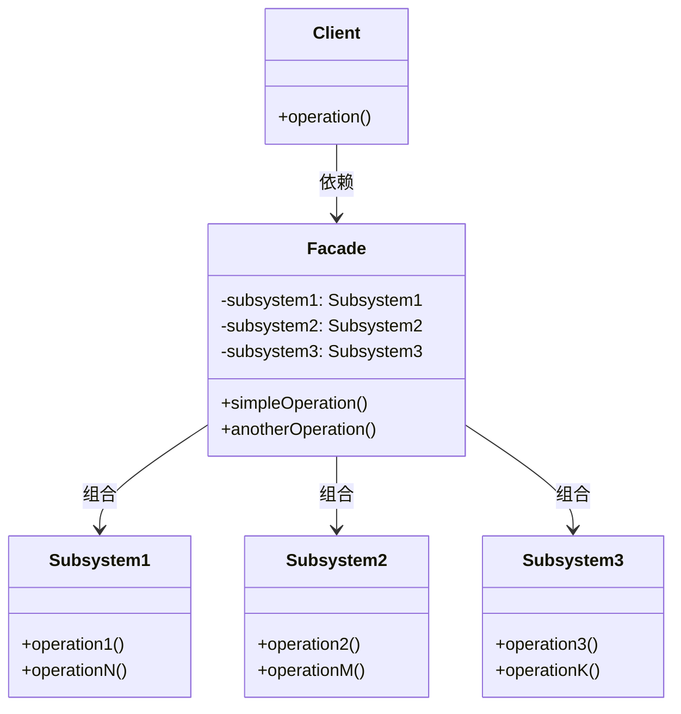

# 外观模式：如何为复杂子系统打造简洁接口？
> 让复杂的子系统变得简单易用，一行代码搞定原本需要多行操作的功能
>

## 📑 目录
+ [问题场景：智能家居控制系统的困境](#问题场景智能家居控制系统的困境)
+ [未使用外观模式的代码与问题分析](#未使用外观模式的代码与问题分析)
+ [外观模式：化繁为简的设计智慧](#外观模式化繁为简的设计智慧)
+ [应用外观模式的解决方案](#应用外观模式的解决方案)
+ [设计模式核心总结](#设计模式核心总结)
+ [留给读者的思考](#留给读者的思考)

---

## 问题场景：智能家居控制系统的困境
想象这样一个场景：你正在开发一个智能家居控制系统。用户晚上睡觉前，需要完成一系列操作——关灯、拉窗帘、锁门、调节空调温度、关闭电视...

作为开发者，你提供了各个子系统的独立接口。用户（或客户端代码）需要记住正确的操作顺序，并逐一调用这些接口。这就像让用户自己组装汽车一样荒谬！

让我们看看这种设计在实际项目中会带来什么问题。

## 未使用外观模式的代码与问题分析
### 模拟业务场景
开发一个智能家居控制系统，包含灯光、窗帘、门锁、空调、电视等子系统。用户需要实现“睡眠模式”——一键关闭所有设备并调整空调到适宜温度。

### 问题代码实现
```cpp
#include <iostream>
#include <string>

// 灯光子系统
class LightSystem {
public:
    void turnOn() { std::cout << "灯光已打开" << std::endl; }
    void turnOff() { std::cout << "灯光已关闭" << std::endl; }
    void setBrightness(int level) { 
        std::cout << "灯光亮度设置为: " << level << std::endl; 
    }
};

// 窗帘子系统
class CurtainSystem {
public:
    void open() { std::cout << "窗帘已打开" << std::endl; }
    void close() { std::cout << "窗帘已关闭" << std::endl; }
    void setPercentage(int percent) {
        std::cout << "窗帘开合度设置为: " << percent << "%" << std::endl;
    }
};

// 门锁子系统
class DoorLockSystem {
public:
    void lock() { std::cout << "门已上锁" << std::endl; }
    void unlock() { std::cout << "门已解锁" << std::endl; }
    bool isLocked() { return true; }
};

// 空调子系统
class AirConditioner {
public:
    void turnOn() { std::cout << "空调已打开" << std::endl; }
    void turnOff() { std::cout << "空调已关闭" << std::endl; }
    void setTemperature(int temp) {
        std::cout << "空调温度设置为: " << temp << "度" << std::endl;
    }
    void setMode(const std::string& mode) {
        std::cout << "空调模式设置为: " << mode << std::endl;
    }
};

// 电视子系统
class Television {
public:
    void powerOn() { std::cout << "电视已打开" << std::endl; }
    void powerOff() { std::cout << "电视已关闭" << std::endl; }
    void setChannel(int channel) {
        std::cout << "切换到频道: " << channel << std::endl;
    }
};

// 客户端代码：需要手动控制所有设备
int main() {
    // 创建所有子系统对象
    LightSystem light;
    CurtainSystem curtain;
    DoorLockSystem doorLock;
    AirConditioner ac;
    Television tv;
    
    // 用户需要执行"睡眠模式" - 需要记住所有步骤！
    std::cout << "=== 执行睡眠模式 ===" << std::endl;
    
    // 步骤1: 关闭灯光
    light.turnOff();
    
    // 步骤2: 关闭窗帘
    curtain.close();
    
    // 步骤3: 锁门
    doorLock.lock();
    
    // 步骤4: 调节空调到26度，睡眠模式
    ac.turnOn();
    ac.setTemperature(26);
    ac.setMode("睡眠模式");
    
    // 步骤5: 关闭电视
    tv.powerOff();
    
    // 用户可能还需要实现"离家模式" - 又需要重新写一遍调用逻辑！
    std::cout << "\n=== 执行离家模式 ===" << std::endl;
    light.turnOff();
    curtain.close();
    doorLock.lock();
    ac.turnOff();  // 空调需要关闭而不是开启
    tv.powerOff();
    
    return 0;
}
```

### 问题深度分析
#### 1. **耦合性问题** 🔗
客户端代码直接依赖了**5个**具体的子系统类。如果子系统接口变更（比如`turnOff()`改名为`powerDown()`），所有客户端代码都需要修改。

#### 2. **复用性问题** 📋
“睡眠模式”和“离家模式”的逻辑无法复用。如果10个地方需要睡眠模式，就要复制粘贴10次相同的代码序列。一旦操作顺序需要调整（比如先关电视再关灯），就要修改10个地方！

#### 3. **维护性问题** 🛠️
假设需求变更：睡眠模式需要增加“关闭所有智能插座”。在没有外观模式的情况下，**每个**调用睡眠模式的地方都需要添加一行代码。在大型项目中，这可能涉及几十甚至上百处修改。

#### 4. **扩展性问题** 📈
添加新设备（如智能音箱）时，不仅要创建新类，还要修改所有使用场景的客户端代码。这违反了**开闭原则**（对扩展开放，对修改关闭）。

#### 5. **性能问题** ⚡
客户端每次都要创建所有子系统对象，即使某些模式下某些设备根本不需要操作。例如“离家模式”可能不需要操作电视，但对象仍然被创建了。

### 实际项目中的后果
+ **代码重复率飙升**：相同的设备操作序列在项目中出现几十次
+ **测试成本增加**：每个客户端调用处都需要单独测试
+ **需求变更灾难**：添加新功能意味着“牵一发而动全身”
+ **新人上手困难**：需要理解所有子系统的接口和调用顺序
+ **重构风险高**：修改一处可能遗漏其他几十处

---

## 外观模式：化繁为简的设计智慧
### 模式灵感来源 💡
外观模式的灵感来自于**现实生活中的“一键操作”设备**：

+ **汽车油门踏板**：隐藏了发动机、变速箱、燃油系统等复杂协同工作
+ **智能手机的“飞行模式”**：一键关闭蜂窝网络、WiFi、蓝牙等多个功能
+ **餐厅的点餐服务**：顾客只需对服务员说“我要一份套餐”，背后是厨房多个工位的协同

**核心思想**：为复杂的子系统提供一个统一的、简化的接口，让客户端通过这个“外观”与子系统交互，而不是直接依赖众多子系统。

---

## 应用外观模式的解决方案
### 重构后的代码实现
```cpp
#include <iostream>
#include <memory>
#include <string>

// ========== 子系统类（保持不变） ==========
class LightSystem {
public:
    void turnOn() { std::cout << "灯光已打开" << std::endl; }
    void turnOff() { std::cout << "灯光已关闭" << std::endl; }
    void setBrightness(int level) { 
        std::cout << "灯光亮度设置为: " << level << std::endl; 
    }
};

class CurtainSystem {
public:
    void open() { std::cout << "窗帘已打开" << std::endl; }
    void close() { std::cout << "窗帘已关闭" << std::endl; }
    void setPercentage(int percent) {
        std::cout << "窗帘开合度设置为: " << percent << "%" << std::endl;
    }
};

class DoorLockSystem {
public:
    void lock() { std::cout << "门已上锁" << std::endl; }
    void unlock() { std::cout << "门已解锁" << std::endl; }
    bool isLocked() { return true; }
};

class AirConditioner {
public:
    void turnOn() { std::cout << "空调已打开" << std::endl; }
    void turnOff() { std::cout << "空调已关闭" << std::endl; }
    void setTemperature(int temp) {
        std::cout << "空调温度设置为: " << temp << "度" << std::endl;
    }
    void setMode(const std::string& mode) {
        std::cout << "空调模式设置为: " << mode << std::endl;
    }
};

class Television {
public:
    void powerOn() { std::cout << "电视已打开" << std::endl; }
    void powerOff() { std::cout << "电视已关闭" << std::endl; }
    void setChannel(int channel) {
        std::cout << "切换到频道: " << channel << std::endl;
    }
};

// ========== 外观类：智能家居控制器 ==========
class SmartHomeFacade {
public:
    SmartHomeFacade() 
        : light_(std::make_unique<LightSystem>()),
          curtain_(std::make_unique<CurtainSystem>()),
          doorLock_(std::make_unique<DoorLockSystem>()),
          ac_(std::make_unique<AirConditioner>()),
          tv_(std::make_unique<Television>()) {}
    
    // 睡眠模式：一键准备睡眠环境
    void sleepMode() {
        std::cout << "\n===== 启动睡眠模式 =====" << std::endl;
        light_->turnOff();
        curtain_->close();
        doorLock_->lock();
        ac_->turnOn();
        ac_->setTemperature(26);
        ac_->setMode("睡眠模式");
        tv_->powerOff();
        std::cout << "===== 睡眠模式已就绪，晚安！=====\n" << std::endl;
    }
    
    // 离家模式：一键离家安全设置
    void leaveHomeMode() {
        std::cout << "\n===== 启动离家模式 =====" << std::endl;
        light_->turnOff();
        curtain_->close();
        doorLock_->lock();
        ac_->turnOff();
        tv_->powerOff();
        std::cout << "===== 离家模式已激活，一路平安！=====\n" << std::endl;
    }
    
    // 观影模式：一键影院体验
    void movieMode() {
        std::cout << "\n===== 启动观影模式 =====" << std::endl;
        light_->turnOff();
        curtain_->close();
        ac_->turnOn();
        ac_->setTemperature(24);
        ac_->setMode("普通模式");
        tv_->powerOn();
        tv_->setChannel(100);  // 电影频道
        std::cout << "===== 观影模式已启动，享受电影吧！=====\n" << std::endl;
    }
    
    // 如果需要高级控制，仍然可以访问原始子系统
    LightSystem* getLight() { return light_.get(); }
    AirConditioner* getAC() { return ac_.get(); }
    
private:
    std::unique_ptr<LightSystem> light_;
    std::unique_ptr<CurtainSystem> curtain_;
    std::unique_ptr<DoorLockSystem> doorLock_;
    std::unique_ptr<AirConditioner> ac_;
    std::unique_ptr<Television> tv_;
};

// ========== 客户端代码：简洁优雅 ==========
int main() {
    // 创建外观对象（智能家居控制器）
    SmartHomeFacade smartHome;
    
    // 一键启动睡眠模式
    smartHome.sleepMode();
    
    // 一键启动离家模式
    smartHome.leaveHomeMode();
    
    // 一键启动观影模式
    smartHome.movieMode();
    
    // 如果用户需要高级控制，仍然可以访问底层子系统
    std::cout << "\n===== 高级用户手动控制 =====" << std::endl;
    smartHome.getLight()->setBrightness(50);
    smartHome.getAC()->setTemperature(22);
    
    return 0;
}
```

### 解决方案优势分析
#### 1. **解耦对象关系** 🔓
+ **改进前**：客户端依赖5个具体类
+ **改进后**：客户端只依赖1个外观类
+ **原理**：用**组合**代替了客户端与子系统的**紧耦合**关系

#### 2. **提高扩展性** 📈
添加新的“会客模式”：

```cpp
// 只需在外观类中添加新方法，所有客户端立即获得新功能
void guestMode() {
    light_->setBrightness(80);
    curtain_->open();
    ac_->setTemperature(24);
    tv_->powerOn();
    tv_->setChannel(1);
}
```

#### 3. **增强复用性** ♻️
“睡眠模式”的逻辑封装在一个方法中，任何需要的地方只需一行调用：

```cpp
smartHome.sleepMode();  // 复用！无需重复代码
```

#### 4. **提升维护性** 🛡️
需求变更：睡眠模式需要增加“关闭智能插座”

```cpp
// 只需修改外观类的一个方法，所有调用处自动生效！
void sleepMode() {
    // ... 原有代码
    smartPlug_->powerOff();  // 只加这一行
}
```

#### 5. **性能优化** ⚡
子系统对象在外观类中**创建一次**，所有模式复用这些对象，避免了重复创建的开销。

### 代码差异对比
| 维度 | 未使用外观模式 | 使用外观模式 |
| --- | --- | --- |
| 客户端代码行数 | 15+ 行（每个场景） | 1 行 |
| 依赖的类数量 | 5个具体类 | 1个外观类 |
| 修改睡眠模式的影响范围 | 所有调用处（N处） | 1个方法 |
| 新增场景模式的工作量 | 复制粘贴N处 | 添加1个方法 |
| 单元测试复杂度 | 需测试所有组合 | 只需测试外观类 |


---

## 设计模式核心总结
### 核心思想 🎯
> **为子系统提供统一的简化接口，封装复杂性，让客户端通过这个“门面”与系统交互。**
>

**一句话概括本质**：外观模式通过引入一个中间层，将复杂的子系统调用转化为简单的接口调用，实现了“高内聚、低耦合”的设计目标。

### UML类图


### 各角色职责说明（C++术语）
| 角色 | 职责 | C++实现要点 |
| --- | --- | --- |
| **Facade（外观）** | 知道哪些子系统负责处理哪些请求；将客户端请求委派给合适的子系统对象 | 使用组合模式持有子系统对象的指针（推荐`std::unique_ptr`或`std::shared_ptr`） |
| **Subsystem（子系统）** | 实现具体功能；处理外观委派的任务；完全不知道外观的存在 | 普通类，无需特殊设计，保持独立性和可测试性 |
| **Client（客户端）** | 只通过外观接口与子系统交互，无需直接调用子系统 | 只依赖外观类，降低编译依赖，加快编译速度 |


### 典型应用场景
#### ✅ 适合的业务场景
1. **遗留系统重构**：为复杂的老系统提供新接口，避免大规模修改
2. **多层系统入口**：如编译器前端、操作系统API（如POSIX）
3. **第三方库封装**：隐藏复杂配置，提供简化接口
4. **性能优化场景**：减少频繁创建/销毁子系统对象的开销
5. **C++特定场景**：
    - 降低头文件依赖，减少编译时间
    - 封装C语言库，提供RAII资源管理
    - 简化模板元编程的复杂调用

#### ❌ 反例场景（不适用情况）
1. **子系统本身就是简单的**：增加外观层是过度设计
2. **需要高度灵活性的场景**：外观限制了子系统的直接访问
3. **客户端需要精细控制**：外观的“简化”可能成为障碍
4. **性能极致敏感的场景**：外观模式增加了一层间接调用（通常可忽略）

---

## 留给读者的思考
### 🤔 思考问题
1. **外观模式与适配器模式的区别是什么？**
    - 外观模式是“简化接口”，适配器模式是“转换接口”。你能举出具体例子说明吗？
2. **外观类是否违反了“单一职责原则”？**
    - 外观类包含了多个场景模式，这是否意味着它有多个改变的原因？
3. **如何平衡“简化”与“灵活性”？**
    - 如果客户端需要绕过外观直接访问子系统，应该怎么做？这种做法是设计缺陷吗？
4. **在实际项目中，外观模式可能带来什么问题？**
    - 思考：如果子系统接口频繁变化，外观类会成为“维护瓶颈”吗？
5. **外观模式与中介者模式有何异同？**
    - 两者都涉及多个对象间的协调，但核心区别是什么？

### 💡 实践建议
+ 在代码Review中，如果发现某段代码重复调用多个对象的方法序列，考虑引入外观模式
+ 外观模式不是“银弹”，不要为每个子系统都创建外观
+ 外观类应该与子系统保持松耦合，子系统接口变化时，外观类应该是唯一需要修改的地方

---

**下期预告**：下一篇我们将探讨**策略模式**——如何优雅地替换算法家族，让代码在运行时灵活切换行为。敬请期待！

> 💬 欢迎在评论区分享你对本文的思考，或者提出你想了解的设计模式！
>

---

_本文为设计模式系列文章第三篇，关注公众号「C++设计模式实战」获取更多精彩内容_

