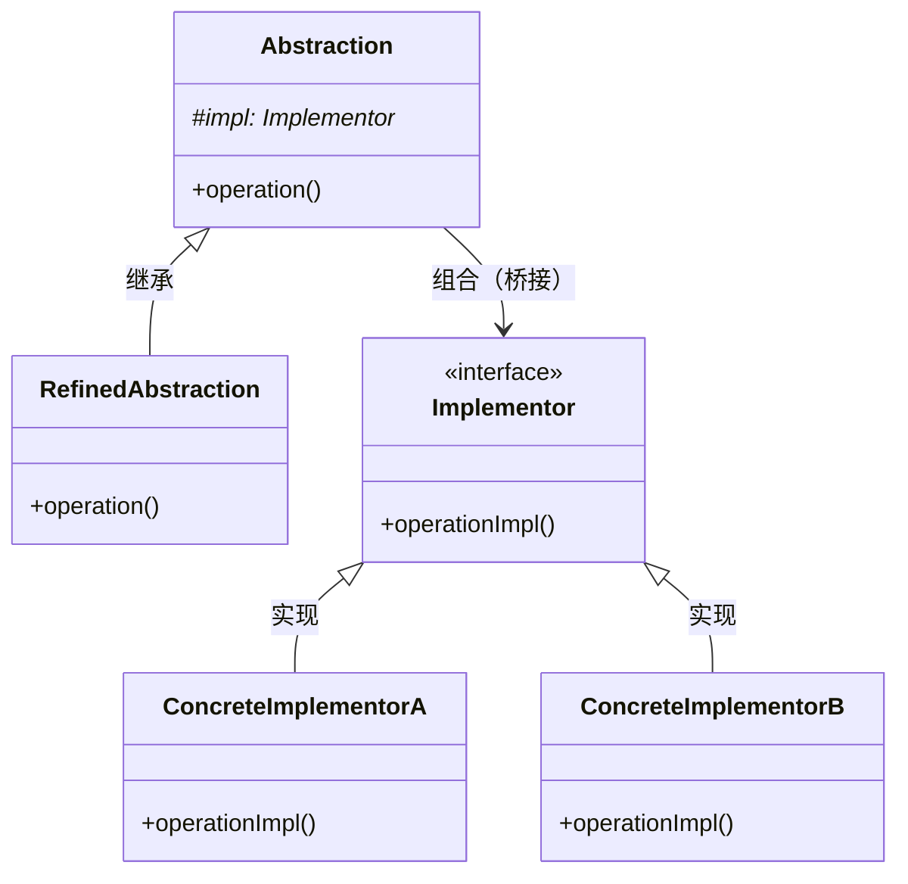

---
tags:
  - seed
  - project
  - guide
created: 2026-05-30
updated: 2026-05-30
topic: tech
---

# 桥接模式：如何将抽象与实现解耦，让它们独立变化？
> 当维度爆炸成为噩梦，桥接模式是你的救星
>

## 📑 目录
+ [问题场景：跨平台绘图程序的困境](#问题场景跨平台绘图程序的困境)
+ [未使用桥接模式的代码与问题分析](#未使用桥接模式的代码与问题分析)
+ [桥接模式：分而治之的设计智慧](#桥接模式分而治之的设计智慧)
+ [应用桥接模式的解决方案](#应用桥接模式的解决方案)
+ [设计模式核心总结](#设计模式核心总结)
+ [留给读者的思考](#留给读者的思考)

---

## 问题场景：跨平台绘图程序的困境
想象这样一个场景：你正在开发一个**跨平台的图形绘制程序**。系统需要支持多种**形状**（圆形、矩形、三角形）和多种**绘制API**（Windows GDI、Linux Cairo、macOS Quartz）。

如果采用传统的继承方案，你会创建类似这样的类层次结构：

```plain
Shape (抽象基类)
├── Circle
│   ├── CircleWindows
│   ├── CircleLinux
│   └── CircleMac
├── Rectangle
│   ├── RectangleWindows
│   ├── RectangleLinux
│   └── RectangleMac
└── Triangle
    ├── TriangleWindows
    ├── TriangleLinux
    └── TriangleMac
```

当你有 **M 种形状** 和 **N 种绘制API** 时，需要创建 **M × N** 个类！这就是经典的**类爆炸**问题。

更糟糕的是，当增加新的形状（如椭圆）或新的绘制API（如WebGPU）时，类的数量会呈**乘积级增长**。

让我们看看这种设计在实际项目中会带来什么问题。

## 未使用桥接模式的代码与问题分析
### 模拟业务场景
开发一个跨平台绘图程序，支持：

+ **形状**：圆形、矩形
+ **绘制API**：Windows GDI、Linux Cairo
+ 功能：绘制形状、调整大小

### 问题代码实现
```cpp
#include <iostream>
#include <string>

// ========== Windows GDI 实现 ==========
class WindowsGDICircle {
public:
    void drawCircle(int x, int y, int radius) {
        std::cout << "[Windows GDI] 绘制圆形 at (" << x << "," << y 
                  << ") 半径=" << radius << std::endl;
    }
};

class WindowsGDIRectangle {
public:
    void drawRect(int x, int y, int width, int height) {
        std::cout << "[Windows GDI] 绘制矩形 at (" << x << "," << y 
                  << ") 尺寸=" << width << "x" << height << std::endl;
    }
};

// ========== Linux Cairo 实现 ==========
class LinuxCairoCircle {
public:
    void renderCircle(double x, double y, double r) {
        std::cout << "[Linux Cairo] 渲染圆形 at (" << x << "," << y 
                  << ") 半径=" << r << std::endl;
    }
};

class LinuxCairoRectangle {
public:
    void renderRect(double x, double y, double w, double h) {
        std::cout << "[Linux Cairo] 渲染矩形 at (" << x << "," << y 
                  << ") 尺寸=" << w << "x" << h << std::endl;
    }
};

// ========== 形状类（每个组合都需要一个类！） ==========
class WindowsCircle {
public:
    WindowsCircle(int x, int y, int radius) 
        : x_(x), y_(y), radius_(radius) {}
    
    void draw() {
        gdi_.drawCircle(x_, y_, radius_);
    }
    
    void resize(int factor) {
        radius_ *= factor;
    }
    
private:
    int x_, y_, radius_;
    WindowsGDICircle gdi_;
};

class WindowsRectangle {
public:
    WindowsRectangle(int x, int y, int width, int height)
        : x_(x), y_(y), width_(width), height_(height) {}
    
    void draw() {
        gdi_.drawRect(x_, y_, width_, height_);
    }
    
    void resize(int factor) {
        width_ *= factor;
        height_ *= factor;
    }
    
private:
    int x_, y_, width_, height_;
    WindowsGDIRectangle gdi_;
};

class LinuxCircle {
public:
    LinuxCircle(int x, int y, int radius)
        : x_(x), y_(y), radius_(radius) {}
    
    void draw() {
        cairo_.renderCircle(x_, y_, radius_);
    }
    
    void resize(int factor) {
        radius_ *= factor;
    }
    
private:
    double x_, y_, radius_;
    LinuxCairoCircle cairo_;
};

class LinuxRectangle {
public:
    LinuxRectangle(int x, int y, int width, int height)
        : x_(x), y_(y), width_(width), height_(height) {}
    
    void draw() {
        cairo_.renderRect(x_, y_, width_, height_);
    }
    
    void resize(int factor) {
        width_ *= factor;
        height_ *= factor;
    }
    
private:
    double x_, y_, width_, height_;
    LinuxCairoRectangle cairo_;
};

// ========== 客户端代码 ==========
int main() {
    std::cout << "=== 跨平台绘图程序（问题版本） ===" << std::endl;
    
    // Windows平台
    std::cout << "\n--- Windows平台 ---" << std::endl;
    WindowsCircle winCircle(100, 100, 50);
    WindowsRectangle winRect(200, 200, 80, 60);
    winCircle.draw();
    winRect.draw();
    
    // Linux平台
    std::cout << "\n--- Linux平台 ---" << std::endl;
    LinuxCircle linuxCircle(100, 100, 50);
    LinuxRectangle linuxRect(200, 200, 80, 60);
    linuxCircle.draw();
    linuxRect.draw();
    
    // 问题：如果我想用统一的接口操作所有形状？
    // 无法实现！WindowsCircle 和 LinuxCircle 没有共同基类
    
    // 问题：如果我想在运行时切换绘制API？
    // 无法实现！绘制API在编译时就已经固定
    
    return 0;
}
```

### 问题深度分析
#### 1. **类爆炸问题** 💣
当有 **M 种形状** 和 **N 种绘制API** 时，需要创建 **M × N** 个类：

| 形状数 | API数 | 类数量 |
| --- | --- | --- |
| 3 | 2 | 6 |
| 5 | 3 | 15 |
| 10 | 5 | 50 |


**实际后果**：

+ 代码库迅速膨胀，维护成本呈指数级增长
+ 每个新增的形状或API都意味着要编写多个新类

#### 2. **扩展性问题** 📈
增加新的形状（如三角形）：

```cpp
// 需要为每个平台都创建一个类！
class WindowsTriangle { ... };
class LinuxTriangle { ... };
class MacTriangle { ... };   // 未来可能增加
```

增加新的绘制API（如 macOS Quartz）：

```cpp
// 需要为每个形状都创建一个类！
class MacCircle { ... };
class MacRectangle { ... };
class MacTriangle { ... };
```

**后果**：每次扩展都需要修改多处代码，违反**开闭原则**。

#### 3. **耦合性问题** 🔗
+ 形状类与特定平台的绘制API**紧密耦合**
+ 无法在运行时切换绘制API（编译时已固定）
+ 无法复用形状的逻辑（如 `resize` 在不同平台的形状类中重复实现）

```cpp
// resize 逻辑在每个类中都重复了！
class WindowsCircle { void resize(int factor) { radius_ *= factor; } };
class LinuxCircle   { void resize(int factor) { radius_ *= factor; } };
// 相同的代码，无法复用！
```

#### 4. **复用性问题** 📋
+ 形状的通用逻辑（如坐标管理、缩放）在每个平台类中重复
+ 绘制API的调用方式不统一，导致无法编写通用的绘制代码
+ 无法使用多态统一处理所有形状

```cpp
// 梦想中的代码（无法实现）：
std::vector<Shape*> shapes;
shapes.push_back(new WindowsCircle(...));
shapes.push_back(new LinuxRectangle(...));
for (auto& shape : shapes) {
    shape->draw();  // 编译错误！没有共同基类
}
```

#### 5. **维护性问题** 🛠️
修改形状的行为（如增加旋转功能）：

+ 需要在 **所有形状类** 中添加旋转方法
+ 如果有 10 个形状 × 3 个平台 = 30 个类，就要修改 30 个地方！

修改绘制API的接口：

+ 需要修改所有使用该API的形状类
+ 影响范围难以控制，容易遗漏

### 实际项目中的后果
| 问题 | 具体后果 | 真实案例 |
| --- | --- | --- |
| **类爆炸** | 代码量膨胀，编译时间变长 | 某图形库因支持5种形状×4种渲染后端，产生了20+个类，每个类平均200行 |
| **扩展困难** | 新增功能耗时数天而非数小时 | 增加“椭圆”形状需要编写4个新类，花费1天时间 |
| **无法运行时切换** | 无法实现动态选择绘制API | 用户无法在设置中切换渲染后端 |
| **代码重复** | Bug修复需要重复N次 | resize逻辑中的bug需要在每个平台类中分别修复 |
| **测试成本高** | 每个组合都需要单独测试 | 20个类 × 每个类10个测试用例 = 200个测试 |


**真实案例**：某知名CAD软件早期采用这种继承方案，当需要支持第5种操作系统时，类的数量从24个暴增到40个，编译时间从5分钟增加到25分钟，最终不得不重构为桥接模式。

---

## 桥接模式：分而治之的设计智慧
### 模式灵感来源 💡
桥接模式的灵感来自于**将抽象与实现分离**的思想：

> **“Prefer composition over inheritance”** —— 组合优于继承
>

**现实类比**：

1. **遥控器与电视**
    - 遥控器（抽象）定义操作：开/关、调音量、换频道
    - 电视（实现）提供具体功能：索尼电视、三星电视、LG电视
    - 你可以用同一个遥控器控制不同品牌的电视，也可以为同一台电视换不同遥控器
2. **画笔与颜料**
    - 画笔（抽象）：粗笔、细笔、毛笔
    - 颜料（实现）：红色、蓝色、绿色
    - 任意组合：粗红笔、细蓝笔、毛笔绿
3. **车辆与引擎**
    - 车辆（抽象）：轿车、SUV、卡车
    - 引擎（实现）：汽油引擎、电动引擎、混动引擎

**核心洞察**：**识别出两个独立的维度（抽象维度和实现维度），让它们各自独立变化，然后在运行时组合**。

```plain
传统继承：         桥接模式：
  形状              形状 ←→ 绘制API
  ├─圆形            (抽象)   (实现)
  │ ├─Win圆形        ↓        ↓
  │ ├─Linux圆形    圆形     Windows GDI
  │ └─Mac圆形      矩形     Linux Cairo
  └─矩形           三角形    macOS Quartz
    ├─Win矩形
    ├─Linux矩形    组合关系（桥梁）
    └─Mac矩形
```

---

## 应用桥接模式的解决方案
### 重构后的代码实现
```cpp
#include <iostream>
#include <memory>
#include <vector>

// ========== 实现层次：绘制API抽象 ==========
class DrawingAPI {
public:
    virtual ~DrawingAPI() = default;
    
    virtual void drawCircle(double x, double y, double radius) = 0;
    virtual void drawRectangle(double x, double y, double width, double height) = 0;
    virtual std::string getPlatformName() const = 0;
};

// Windows GDI 实现
class WindowsGDIApi : public DrawingAPI {
public:
    void drawCircle(double x, double y, double radius) override {
        std::cout << "[Windows GDI] 绘制圆形 at (" << x << "," << y 
                  << ") 半径=" << radius << std::endl;
    }
    
    void drawRectangle(double x, double y, double width, double height) override {
        std::cout << "[Windows GDI] 绘制矩形 at (" << x << "," << y 
                  << ") 尺寸=" << width << "x" << height << std::endl;
    }
    
    std::string getPlatformName() const override {
        return "Windows GDI";
    }
};

// Linux Cairo 实现
class LinuxCairoApi : public DrawingAPI {
public:
    void drawCircle(double x, double y, double radius) override {
        std::cout << "[Linux Cairo] 渲染圆形 at (" << x << "," << y 
                  << ") 半径=" << radius << std::endl;
    }
    
    void drawRectangle(double x, double y, double width, double height) override {
        std::cout << "[Linux Cairo] 渲染矩形 at (" << x << "," << y 
                  << ") 尺寸=" << width << "x" << height << std::endl;
    }
    
    std::string getPlatformName() const override {
        return "Linux Cairo";
    }
};

// 新增 macOS Quartz 实现（扩展新API只需添加新类！）
class MacQuartzApi : public DrawingAPI {
public:
    void drawCircle(double x, double y, double radius) override {
        std::cout << "[macOS Quartz] 绘制圆形 at (" << x << "," << y 
                  << ") 半径=" << radius << std::endl;
    }
    
    void drawRectangle(double x, double y, double width, double height) override {
        std::cout << "[macOS Quartz] 绘制矩形 at (" << x << "," << y 
                  << ") 尺寸=" << width << "x" << height << std::endl;
    }
    
    std::string getPlatformName() const override {
        return "macOS Quartz";
    }
};

// ========== 抽象层次：形状抽象 ==========
class Shape {
public:
    // 关键：通过构造函数注入实现（桥接）
    Shape(std::shared_ptr<DrawingAPI> drawingAPI) 
        : drawingAPI_(drawingAPI) {}
    
    virtual ~Shape() = default;
    
    virtual void draw() = 0;
    virtual void resize(int factor) = 0;
    
    // 获取使用的绘制平台
    std::string getPlatform() const {
        return drawingAPI_->getPlatformName();
    }
    
protected:
    std::shared_ptr<DrawingAPI> drawingAPI_;  // 桥接！组合关系
};

// 圆形（抽象维度的具体实现）
class Circle : public Shape {
public:
    Circle(double x, double y, double radius, std::shared_ptr<DrawingAPI> api)
        : Shape(api), x_(x), y_(y), radius_(radius) {}
    
    void draw() override {
        drawingAPI_->drawCircle(x_, y_, radius_);
    }
    
    void resize(int factor) override {
        radius_ *= factor;
        std::cout << "圆形已缩放，新半径: " << radius_ << std::endl;
    }
    
    // 圆形特有的方法
    void setPosition(double x, double y) {
        x_ = x;
        y_ = y;
    }
    
private:
    double x_, y_, radius_;
};

// 矩形（抽象维度的具体实现）
class Rectangle : public Shape {
public:
    Rectangle(double x, double y, double width, double height, std::shared_ptr<DrawingAPI> api)
        : Shape(api), x_(x), y_(y), width_(width), height_(height) {}
    
    void draw() override {
        drawingAPI_->drawRectangle(x_, y_, width_, height_);
    }
    
    void resize(int factor) override {
        width_ *= factor;
        height_ *= factor;
        std::cout << "矩形已缩放，新尺寸: " << width_ << "x" << height_ << std::endl;
    }
    
private:
    double x_, y_, width_, height_;
};

// 新增三角形（扩展新形状只需添加新类！）
class Triangle : public Shape {
public:
    Triangle(double x1, double y1, double x2, double y2, double x3, double y3,
             std::shared_ptr<DrawingAPI> api)
        : Shape(api), x1_(x1), y1_(y1), x2_(x2), y2_(y2), x3_(x3), y3_(y3) {}
    
    void draw() override {
        // 简单实现：通过三次绘制线段来画三角形
        std::cout << "[注意] 当前API通过三次线段绘制三角形" << std::endl;
        // 实际实现中会调用 drawingAPI_->drawLine 等接口
    }
    
    void resize(int factor) override {
        std::cout << "三角形缩放因子: " << factor << std::endl;
        // 缩放逻辑...
    }
    
private:
    double x1_, y1_, x2_, y2_, x3_, y3_;
};

// ========== 客户端代码：优雅且灵活 ==========
int main() {
    std::cout << "=== 跨平台绘图程序（桥接模式版本） ===" << std::endl;
    
    // 创建具体的绘制API实现
    auto windowsAPI = std::make_shared<WindowsGDIApi>();
    auto linuxAPI = std::make_shared<LinuxCairoApi>();
    auto macAPI = std::make_shared<MacQuartzApi>();
    
    // 运行时自由组合！圆形 + 不同绘制API
    std::cout << "\n--- 圆形在不同平台上的绘制 ---" << std::endl;
    Circle circleWin(100, 100, 50, windowsAPI);
    Circle circleLinux(100, 100, 50, linuxAPI);
    Circle circleMac(100, 100, 50, macAPI);
    
    circleWin.draw();
    circleLinux.draw();
    circleMac.draw();
    
    // 矩形 + 不同绘制API
    std::cout << "\n--- 矩形在不同平台上的绘制 ---" << std::endl;
    Rectangle rectWin(200, 200, 80, 60, windowsAPI);
    Rectangle rectLinux(200, 200, 80, 60, linuxAPI);
    
    rectWin.draw();
    rectLinux.draw();
    
    // 核心优势：运行时切换绘制API！
    std::cout << "\n--- 运行时动态切换API（桥接模式的核心优势） ---" << std::endl;
    std::shared_ptr<DrawingAPI> currentAPI = windowsAPI;
    Circle dynamicCircle(300, 300, 40, currentAPI);
    
    std::cout << "当前使用: " << dynamicCircle.getPlatform() << std::endl;
    dynamicCircle.draw();
    
    // 切换到Linux Cairo
    currentAPI = linuxAPI;
    dynamicCircle = Circle(300, 300, 40, currentAPI);  // 重新创建
    std::cout << "切换后使用: " << dynamicCircle.getPlatform() << std::endl;
    dynamicCircle.draw();
    
    // 多态统一处理
    std::cout << "\n--- 多态统一处理所有形状 ---" << std::endl;
    std::vector<std::shared_ptr<Shape>> shapes;
    shapes.push_back(std::make_shared<Circle>(100, 100, 50, windowsAPI));
    shapes.push_back(std::make_shared<Rectangle>(200, 200, 80, 60, linuxAPI));
    shapes.push_back(std::make_shared<Triangle>(0, 0, 50, 0, 25, 50, macAPI));
    
    for (auto& shape : shapes) {
        shape->draw();
        shape->resize(2);
    }
    
    // 演示扩展性：新增形状和API互不影响
    std::cout << "\n--- 扩展性演示 ---" << std::endl;
    std::cout << "当前支持的形状: Circle, Rectangle, Triangle" << std::endl;
    std::cout << "当前支持的API: Windows GDI, Linux Cairo, macOS Quartz" << std::endl;
    std::cout << "总类数量: " << "3(形状) + 3(API) = 6个类" << std::endl;
    std::cout << "如果使用继承方案: 3 × 3 = 9个类" << std::endl;
    std::cout << "当增加新形状(椭圆)和新API(Vulkan):" << std::endl;
    std::cout << "  桥接模式: +1形状类 +1API类 = 2个新类" << std::endl;
    std::cout << "  继承方案: +1形状×4API = 4个新类" << std::endl;
    
    return 0;
}
```

### 解决方案优势分析
#### 1. **彻底解耦抽象与实现** 🔓
+ **改进前**：形状类与具体绘制API紧密耦合（编译时绑定）
+ **改进后**：通过组合关系，形状只依赖 `DrawingAPI` 接口
+ **原理**：**用组合代替继承**，将继承树拆分为两个独立的层次结构

#### 2. **数量级扩展性提升** 📈
| 场景 | 继承方案新增类数 | 桥接方案新增类数 | 减少比例 |
| --- | --- | --- | --- |
| 新增1种形状 | N (API数量) | 1 | **减少N-1个** |
| 新增1种API | M (形状数量) | 1 | **减少M-1个** |
| 新增形状+API | M×N | 2 | **指数级减少** |


#### 3. **运行时灵活性** 🔄
```cpp
// 可以在运行时动态切换实现！
std::shared_ptr<DrawingAPI> api = getConfigAPI();  // 从配置读取
Shape* shape = new Circle(x, y, r, api);
shape->draw();  // 使用配置指定的API绘制
```

#### 4. **高度复用** ♻️
+ 形状的通用逻辑（缩放、坐标管理）只需在形状类中实现一次
+ 绘制API的逻辑独立，可被所有形状复用
+ 可以轻松创建 `Shape` 的容器，统一调用 `draw()`

#### 5. **易于维护** 🛡️
+ 修改形状行为：只修改形状类
+ 修改绘制API：只修改实现类
+ 符合**开闭原则**、**单一职责原则**

### 代码差异对比
| 维度 | 未使用桥接模式 | 使用桥接模式 |
| --- | --- | --- |
| **类数量** | M × N（乘积） | M + N（和） |
| **新增形状工作量** | 创建N个新类 | 创建1个新类 |
| **新增API工作量** | 创建M个新类 | 创建1个新类 |
| **运行时切换API** | ❌ 不支持 | ✅ 支持 |
| **统一多态处理** | ❌ 无共同基类 | ✅ Shape基类 |
| **代码重复** | resize等方法重复M×N次 | 每种形状实现1次 |


---

## 设计模式核心总结
### 核心思想 🎯
> **将抽象部分与实现部分分离，使它们都可以独立地变化。**
>

**一句话概括本质**：**通过组合关系建立抽象与实现之间的桥梁，取代传统的多层继承结构**。

### UML类图


### 各角色职责说明（C++术语）
| 角色 | 职责 | C++实现要点 |
| --- | --- | --- |
| **Abstraction（抽象）** | 定义抽象接口，持有指向Implementor的引用 | 使用`std::shared_ptr<Implementor>`管理生命周期 |
| **RefinedAbstraction（扩展抽象）** | 扩展或修改抽象接口的行为 | 继承Abstraction，实现特定业务逻辑 |
| **Implementor（实现）** | 定义实现接口，通常只提供基本操作 | 抽象基类，定义纯虚函数 |
| **ConcreteImplementor（具体实现）** | 实现Implementor接口的具体逻辑 | 继承Implementor，实现平台相关代码 |


### C++特有实现要点
```cpp
// 1. 使用智能指针管理实现对象
class Abstraction {
protected:
    std::shared_ptr<Implementor> impl_;  // 共享所有权
};

// 2. 支持运行时切换实现
void setImplementor(std::shared_ptr<Implementor> newImpl) {
    impl_ = newImpl;  // 动态替换！
}

// 3. 使用工厂模式创建合适的实现
std::shared_ptr<DrawingAPI> createAPI(const std::string& platform) {
    if (platform == "windows") return std::make_shared<WindowsGDIApi>();
    if (platform == "linux") return std::make_shared<LinuxCairoApi>();
    // ...
}
```

### 典型应用场景
#### ✅ 适合的业务场景
1. **跨平台应用**
    - 抽象：UI控件（按钮、文本框、窗口）
    - 实现：平台绘制API（Windows、Linux、macOS）
2. **设备驱动框架**
    - 抽象：设备类型（打印机、扫描仪、摄像头）
    - 实现：通信协议（USB、蓝牙、网络）
3. **图形图像处理**
    - 抽象：图形操作（绘制、填充、变换）
    - 实现：渲染引擎（OpenGL、DirectX、Vulkan）
4. **数据库访问层**
    - 抽象：数据操作（查询、插入、更新）
    - 实现：数据库驱动（MySQL、PostgreSQL、MongoDB）
5. **消息发送系统**
    - 抽象：消息类型（文本、图片、视频）
    - 实现：发送渠道（Email、SMS、微信、钉钉）
6. **支付系统**
    - 抽象：支付行为（扫码、刷卡、刷脸）
    - 实现：支付通道（支付宝、微信支付、银联）

#### ❌ 反例场景（不适用情况）
1. **只有一个维度变化**
    - 如果只有一个维度会变化，使用桥接模式是过度设计
    - 简单继承或策略模式可能更合适
2. **维度之间强相关**
    - 如果抽象和实现之间存在固定的对应关系
    - 例如：Windows控件只能用Windows API绘制
3. **客户端需要知道具体实现**
    - 如果客户端需要调用实现特有的方法
    - 桥接模式会隐藏具体实现细节
4. **性能极致敏感**
    - 桥接模式引入了额外的间接调用（虚函数开销）
    - 虽然通常可忽略，但在某些实时系统中需谨慎
5. **C++特定：对象生命周期复杂**
    - 如果抽象对象和实现对象的生命周期管理非常复杂
    - 可能导致循环引用，需要使用`weak_ptr`打破

---

## 留给读者的思考
### 🤔 思考问题
1. **桥接模式 vs 策略模式**
    - 两者的类图看起来很像，核心区别是什么？
    - 提示：意图不同——一个解耦抽象与实现，一个封装算法族
2. **桥接模式 vs 适配器模式**
    - 什么时候用桥接，什么时候用适配器？
    - 提示：设计阶段 vs 维护阶段
3. **C++多重继承能否替代桥接模式？**

```cpp
class Circle : public Shape, public WindowsAPI { ... };
```

    - 这种方案有什么问题？为什么不用？
4. **实现维度的粒度控制**
    - 实现接口应该设计得粗粒度还是细粒度？
    - 太粗：失去灵活性；太细：接口臃肿。如何平衡？
5. **模板与桥接的结合**
    - 能否使用C++模板在编译期实现静态桥接？
    - 静态桥接与动态桥接的优缺点是什么？

### 💡 实践建议
1. **识别变化维度**
    - 分析系统中哪些维度会独立变化
    - 每个维度对应一个继承层次
2. **优先使用组合**
    - 记住：组合 > 继承
    - 桥接模式是“组合优于继承”的经典范例
3. **接口设计要稳定**
    - 实现接口（Implementor）一旦确定，尽量避免修改
    - 使用抽象基类定义稳定的接口
4. **结合工厂模式**
    - 使用抽象工厂创建合适的抽象和实现组合
    - 将创建逻辑与使用逻辑分离
5. **注意性能影响**
    - 每个操作都有两次间接调用（抽象→实现）
    - 在性能关键路径上考虑缓存或内联优化

### 🔍 代码练习
尝试使用桥接模式实现以下场景：

1. **消息通知系统**
    - 抽象：消息类型（紧急通知、普通消息、促销信息）
    - 实现：发送渠道（短信、邮件、App推送）
2. **游戏角色装备系统**
    - 抽象：角色类型（战士、法师、弓箭手）
    - 实现：武器类型（剑、法杖、弓）
3. **数据压缩/加密工具**
    - 抽象：数据处理（压缩、加密、压缩+加密）
    - 实现：算法（ZIP、AES、RSA）

---

**下期预告**：下一篇我们将探讨**装饰器模式**——如何在不修改现有代码的情况下，动态地为对象添加新功能。敬请期待！

> 💬 欢迎在评论区分享你的思考，或者提出你想了解的设计模式！
>

---

_本文为设计模式系列文章第五篇，关注公众号「C++设计模式实战」获取更多精彩内容_

