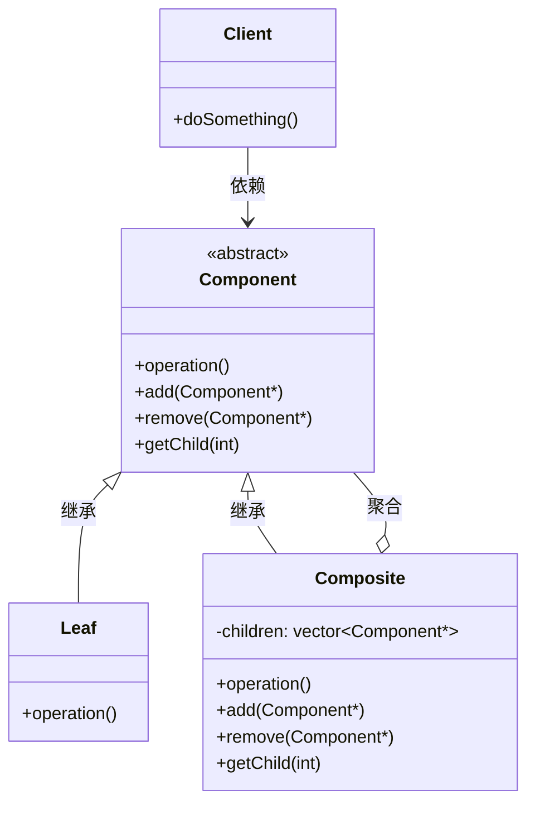

---
tags:
  - seed
  - project
created: 2026-05-30
updated: 2026-05-30
topic: tech
---

# 组合模式：如何用树形结构统一处理个体与整体？
> 让叶子节点和容器节点拥有相同的接口，客户端无需区分它们
>

## 📑 目录
+ [问题场景：文件系统与组织架构的管理困境](#问题场景文件系统与组织架构的管理困境)
+ [未使用组合模式的代码与问题分析](#未使用组合模式的代码与问题分析)
+ [组合模式：树形结构的优雅解决方案](#组合模式树形结构的优雅解决方案)
+ [应用组合模式的解决方案](#应用组合模式的解决方案)
+ [设计模式核心总结](#设计模式核心总结)
+ [留给读者的思考](#留给读者的思考)

---

## 问题场景：文件系统与组织架构的管理困境
想象这样一个场景：你需要开发一个**文件管理系统**。系统中既有**文件**（叶子节点），也有**文件夹**（容器节点）。文件夹可以包含文件，也可以包含其他文件夹。

客户端需要对文件和文件夹执行统一的操作，比如：**显示名称**、**获取大小**、**删除**等。

如果你用常规的思维方式，可能会这样设计：

+ 创建一个 `File` 类，表示文件
+ 创建一个 `Folder` 类，表示文件夹，内部用 `vector` 存储子节点

但问题来了：客户端代码如何**统一处理**文件和文件夹？如何处理**嵌套结构**？如果需求变更需要增加新的节点类型（比如**快捷方式**、**压缩包**），代码会变成什么样子？

让我们看看这种设计在实际项目中会带来什么问题。

## 未使用组合模式的代码与问题分析
### 模拟业务场景
开发一个**组织架构管理系统**，包含**员工**（个体）和**部门**（容器）。部门可以包含员工，也可以包含子部门。系统需要支持：

+ 显示整个组织架构树
+ 计算部门的总薪资（员工薪资之和）
+ 查找特定员工

### 问题代码实现
```cpp
#include <iostream>
#include <vector>
#include <string>
#include <memory>

// 员工类（叶子节点）
class Employee {
public:
    Employee(const std::string& name, double salary)
        : name_(name), salary_(salary) {}
    
    void display(int depth = 0) {
        std::string indent(depth * 2, ' ');
        std::cout << indent << "员工: " << name_ 
                  << " (薪资: " << salary_ << ")" << std::endl;
    }
    
    double getSalary() const { return salary_; }
    std::string getName() const { return name_; }
    
private:
    std::string name_;
    double salary_;
};

// 部门类（容器节点）
class Department {
public:
    Department(const std::string& name) : name_(name) {}
    
    void addEmployee(std::shared_ptr<Employee> emp) {
        employees_.push_back(emp);
    }
    
    void addSubDepartment(std::shared_ptr<Department> dept) {
        subDepartments_.push_back(dept);
    }
    
    void display(int depth = 0) {
        std::string indent(depth * 2, ' ');
        std::cout << indent << "部门: " << name_ << std::endl;
        
        // 显示员工
        for (const auto& emp : employees_) {
            emp->display(depth + 1);
        }
        
        // 显示子部门
        for (const auto& dept : subDepartments_) {
            dept->display(depth + 1);
        }
    }
    
    double getTotalSalary() {
        double total = 0.0;
        for (const auto& emp : employees_) {
            total += emp->getSalary();
        }
        for (const auto& dept : subDepartments_) {
            total += dept->getTotalSalary();
        }
        return total;
    }
    
    Employee* findEmployee(const std::string& name) {
        for (const auto& emp : employees_) {
            if (emp->getName() == name) {
                return emp.get();
            }
        }
        for (const auto& dept : subDepartments_) {
            Employee* found = dept->findEmployee(name);
            if (found) return found;
        }
        return nullptr;
    }
    
private:
    std::string name_;
    std::vector<std::shared_ptr<Employee>> employees_;
    std::vector<std::shared_ptr<Department>> subDepartments_;
};

// ========== 客户端代码 ==========
int main() {
    // 创建员工
    auto emp1 = std::make_shared<Employee>("张三", 8000);
    auto emp2 = std::make_shared<Employee>("李四", 9000);
    auto emp3 = std::make_shared<Employee>("王五", 10000);
    auto emp4 = std::make_shared<Employee>("赵六", 7500);
    
    // 创建部门
    auto techDept = std::make_shared<Department>("技术部");
    techDept->addEmployee(emp1);
    techDept->addEmployee(emp2);
    
    auto hrDept = std::make_shared<Department>("人事部");
    hrDept->addEmployee(emp3);
    
    auto financeDept = std::make_shared<Department>("财务部");
    financeDept->addEmployee(emp4);
    
    // 创建总公司，包含子部门
    auto company = std::make_shared<Department>("XX科技有限公司");
    company->addSubDepartment(techDept);
    company->addSubDepartment(hrDept);
    company->addSubDepartment(financeDept);
    
    // 显示组织架构
    std::cout << "=== 组织架构 ===" << std::endl;
    company->display();
    
    // 计算总薪资
    std::cout << "\n=== 公司总薪资 ===" << std::endl;
    std::cout << "总薪资: " << company->getTotalSalary() << " 元" << std::endl;
    
    // 查找员工
    std::cout << "\n=== 查找员工 ===" << std::endl;
    Employee* found = company->findEmployee("李四");
    if (found) {
        std::cout << "找到员工: " << found->getName() << std::endl;
    }
    
    return 0;
}
```

### 问题深度分析
#### 1. **类型不一致问题** 🔗
客户端必须**区分处理** `Employee` 和 `Department`：

```cpp
// 客户端需要知道具体类型
void processNode(Employee* emp) { emp->display(); }
void processNode(Department* dept) { dept->display(); }  // 重载但类型不同
```

这种类型分裂导致：

+ 无法用统一的方式处理节点
+ 多态性失效（`Employee` 和 `Department` 没有共同基类）

#### 2. **扩展性问题** 📈
假设需求变更：需要增加新的节点类型 `Shortcut`（快捷方式）和 `CompressedFile`（压缩包）。

**后果**：

+ 需要在 `Department` 类中添加新的容器（如 `shortcuts_` 和 `compressedFiles_`）
+ 需要修改 `display()`、`getTotalSalary()`、`findEmployee()` 等**所有方法**
+ 违反**开闭原则**——对扩展开放，对修改关闭

```cpp
// 噩梦：每增加一种新类型，就要修改Department的所有方法
class Department {
    std::vector<Shortcut> shortcuts_;      // 新增
    std::vector<CompressedFile> archives_; // 新增
    
    void display() {
        // 原有的员工和部门显示逻辑...
        // 还要添加快捷方式和压缩包的显示逻辑
        for (auto& sc : shortcuts_) sc.display();
        for (auto& ar : archives_) ar.display();
    }
    // getTotalSalary、findEmployee 也要相应修改...
};
```

#### 3. **复用性问题** 📋
`Employee` 和 `Department` 虽然有很多相似的操作（`display`、`getName` 等），但因为类型不同，代码无法复用。如果后续需要添加 `getNodeCount()` 功能，两个类都要实现一遍。

#### 4. **维护性问题** 🛠️
`Department` 类承担了**双重职责**：

+ 管理自身（名称等属性）
+ 管理子节点（添加、删除、遍历）

这违反了**单一职责原则**。随着节点类型增多，`Department` 类会变得臃肿不堪。

#### 5. **性能问题** ⚡
每次遍历树形结构时，都需要**递归调用**。如果节点类型很多，虚函数调用开销会累积（在C++中相对可控，但设计问题比性能问题更严重）。

### 实际项目中的后果
| 问题 | 具体后果 |
| --- | --- |
| **类型不一致** | 无法编写通用的树遍历算法，每个操作都要为每种节点类型重载 |
| **扩展困难** | 增加新节点类型需要修改所有容器类的所有方法，工作量随方法数线性增长 |
| **代码重复** | `Employee` 和 `Department` 的相似功能无法复用，导致代码膨胀 |
| **难以测试** | 容器类的复杂逻辑难以单独测试，需要构造完整的树结构 |
| **耦合过紧** | 容器类知道所有具体节点类型，违反了依赖倒置原则 |


**真实案例**：某项目用这种方式实现了UI控件树（按钮、面板、窗口等）。当需要增加新的控件类型时，修改了**23个文件**，引入了**17个bug**，团队花费**3天**修复。

---

## 组合模式：树形结构的优雅解决方案
### 模式灵感来源 💡
组合模式的灵感来自于**现实世界中的嵌套结构**：

+ **文件系统**：文件和文件夹都可以被"打开"、"复制"、"删除"
+ **组织结构**：员工和部门都有"名称"、"展示"、"计算成本"等操作
+ **图形系统**：圆形、矩形和组合图形都可以被"绘制"、"移动"、"缩放"
+ **HTML DOM树**：文本节点和元素节点都支持"获取子节点"、"添加子节点"等操作

**核心洞察**：**叶子节点和容器节点本质上都是"节点"，应该提供统一的接口**。

> 就像乐高积木——无论是一块小积木还是一座搭好的城堡，你都可以用同样的方式"拿起"和"放下"。
>

---

## 应用组合模式的解决方案
### 重构后的代码实现
```cpp
#include <iostream>
#include <vector>
#include <string>
#include <memory>
#include <algorithm>

// ========== 抽象基类：统一接口 ==========
class Node {
public:
    virtual ~Node() = default;
    
    // 公共接口（叶子节点和容器节点都需要实现）
    virtual void display(int depth = 0) const = 0;
    virtual std::string getName() const = 0;
    virtual double getValue() const = 0;  // 员工返回薪资，部门返回总薪资
    
    // 容器特有的操作（提供默认实现，抛出异常）
    virtual void addNode(std::shared_ptr<Node> node) {
        throw std::logic_error("叶子节点不支持添加子节点");
    }
    
    virtual void removeNode(const std::string& name) {
        throw std::logic_error("叶子节点不支持移除子节点");
    }
    
    virtual std::shared_ptr<Node> findNode(const std::string& name) {
        return nullptr;
    }
    
    // 安全获取子节点列表（叶子节点返回空列表）
    virtual const std::vector<std::shared_ptr<Node>>& getChildren() const {
        static const std::vector<std::shared_ptr<Node>> empty;
        return empty;
    }
};

// ========== 叶子节点：员工 ==========
class Employee : public Node {
public:
    Employee(const std::string& name, double salary)
        : name_(name), salary_(salary) {}
    
    void display(int depth = 0) const override {
        std::string indent(depth * 2, ' ');
        std::cout << indent << "👤 员工: " << name_ 
                  << " (薪资: " << salary_ << ")" << std::endl;
    }
    
    std::string getName() const override { return name_; }
    double getValue() const override { return salary_; }
    
private:
    std::string name_;
    double salary_;
};

// ========== 容器节点：部门 ==========
class Department : public Node {
public:
    explicit Department(const std::string& name) : name_(name) {}
    
    void display(int depth = 0) const override {
        std::string indent(depth * 2, ' ');
        std::cout << indent << "📁 部门: " << name_ << std::endl;
        
        for (const auto& child : children_) {
            child->display(depth + 1);
        }
    }
    
    std::string getName() const override { return name_; }
    
    double getValue() const override {
        double total = 0.0;
        for (const auto& child : children_) {
            total += child->getValue();
        }
        return total;
    }
    
    void addNode(std::shared_ptr<Node> node) override {
        if (node) {
            children_.push_back(node);
        }
    }
    
    void removeNode(const std::string& name) override {
        children_.erase(
            std::remove_if(children_.begin(), children_.end(),
                [&name](const std::shared_ptr<Node>& node) {
                    return node->getName() == name;
                }),
            children_.end()
        );
    }
    
    std::shared_ptr<Node> findNode(const std::string& name) override {
        // 先检查自身
        if (name_ == name) {
            return shared_from_this();
        }
        
        // 递归查找子节点
        for (const auto& child : children_) {
            auto found = child->findNode(name);
            if (found) {
                return found;
            }
        }
        return nullptr;
    }
    
    const std::vector<std::shared_ptr<Node>>& getChildren() const override {
        return children_;
    }
    
private:
    std::string name_;
    std::vector<std::shared_ptr<Node>> children_;
};

// ========== 新增节点类型：轻松扩展！ ==========
// 快捷方式节点（装饰器模式的应用）
class Shortcut : public Node {
public:
    Shortcut(const std::string& name, std::shared_ptr<Node> target)
        : name_(name + " (快捷方式)"), target_(target) {}
    
    void display(int depth = 0) const override {
        std::string indent(depth * 2, ' ');
        std::cout << indent << "🔗 " << name_ << " -> ";
        if (target_) {
            std::cout << target_->getName();
        }
        std::cout << std::endl;
    }
    
    std::string getName() const override { return name_; }
    
    double getValue() const override {
        return target_ ? target_->getValue() : 0.0;
    }
    
private:
    std::string name_;
    std::shared_ptr<Node> target_;
};

// ========== 客户端代码：完全统一！ ==========
void printTree(const Node& node, int depth = 0) {
    node.display(depth);
}

void calculateTotalValue(const Node& node) {
    std::cout << node.getName() << " 总价值: " << node.getValue() << std::endl;
}

int main() {
    // 创建员工（叶子节点）
    auto emp1 = std::make_shared<Employee>("张三", 8000);
    auto emp2 = std::make_shared<Employee>("李四", 9000);
    auto emp3 = std::make_shared<Employee>("王五", 10000);
    auto emp4 = std::make_shared<Employee>("赵六", 7500);
    
    // 创建部门（容器节点）
    auto techDept = std::make_shared<Department>("技术部");
    techDept->addNode(emp1);
    techDept->addNode(emp2);
    
    auto hrDept = std::make_shared<Department>("人事部");
    hrDept->addNode(emp3);
    
    auto financeDept = std::make_shared<Department>("财务部");
    financeDept->addNode(emp4);
    
    // 创建总公司
    auto company = std::make_shared<Department>("XX科技有限公司");
    company->addNode(techDept);
    company->addNode(hrDept);
    company->addNode(financeDept);
    
    // 添加快捷方式（新增类型，无需修改任何现有代码！）
    auto shortcutToTech = std::make_shared<Shortcut>("技术部入口", techDept);
    company->addNode(shortcutToTech);
    
    // 客户端代码：完全统一处理，无需区分类型！
    std::cout << "=== 组织架构 ===" << std::endl;
    company->display();
    
    std::cout << "\n=== 公司总薪资 ===" << std::endl;
    std::cout << "总薪资: " << company->getValue() << " 元" << std::endl;
    
    std::cout << "\n=== 技术部薪资 ===" << std::endl;
    std::cout << "技术部总薪资: " << techDept->getValue() << " 元" << std::endl;
    
    std::cout << "\n=== 查找员工 ===" << std::endl;
    auto found = company->findNode("李四");
    if (found) {
        std::cout << "找到: " << found->getName() 
                  << " (价值: " << found->getValue() << ")" << std::endl;
    }
    
    std::cout << "\n=== 演示多态性 ===" << std::endl;
    std::vector<std::shared_ptr<Node>> allNodes = {emp1, techDept, company, shortcutToTech};
    for (const auto& node : allNodes) {
        // 完全不需要知道具体类型！
        std::cout << "节点: " << node->getName() 
                  << " | 价值: " << node->getValue() << std::endl;
    }
    
    return 0;
}
```

### 解决方案优势分析
#### 1. **彻底解耦** 🔓
+ **改进前**：客户端需要区分 `Employee` 和 `Department`，使用重载或条件判断
+ **改进后**：客户端完全通过 `Node` 接口操作，**不知道也不关心**具体类型
+ **原理**：用**组合+多态**代替了类型硬编码

#### 2. **完美扩展** 📈
增加新节点类型 `Shortcut`，**零修改**现有代码：

```cpp
// 只需继承Node，实现接口，即可无缝集成
class Shortcut : public Node {
    // 实现纯虚函数...
};

// 客户端代码无需任何改动，新类型自动兼容
company->addNode(std::make_shared<Shortcut>("快捷方式", target));
```

#### 3. **高度复用** ♻️
遍历算法可以**通用化**：

```cpp
// 这个函数适用于任何Node类型！
void traverseTree(std::shared_ptr<Node> node) {
    node->display();
    for (const auto& child : node->getChildren()) {
        traverseTree(child);  // 递归处理，完全通用
    }
}
```

#### 4. **易于维护** 🛡️
+ **单一职责**：`Department` 只负责容器逻辑，`Employee` 只负责叶子逻辑
+ **开闭原则**：对扩展开放（新增 `Shortcut`），对修改关闭（不修改任何现有类）
+ **局部修改**：修改 `Employee` 的显示逻辑不影响 `Department`

#### 5. **性能优化** ⚡
+ 使用 `shared_ptr` 管理生命周期，避免内存泄漏
+ 容器操作使用 `std::vector` 保证缓存友好性
+ 对于叶子节点，`getChildren()` 返回空引用，避免不必要的对象创建

### 代码差异对比
| 维度 | 未使用组合模式 | 使用组合模式 |
| --- | --- | --- |
| **类型统一性** | 客户端需要区分类型 | 完全统一，多态处理 |
| **新增节点类型** | 修改所有容器类（N个方法） | 只需实现新类（0修改现有代码） |
| **代码重复** | Employee和Department重复实现 | 接口统一，实现独立 |
| **遍历算法** | 为每种类型编写遍历 | 一个通用算法适用所有 |
| **客户端代码行数** | 需要条件判断和类型转换 | 无需判断，直接调用 |
| **可测试性** | 容器类测试复杂 | 每个类可独立测试 |


---

## 设计模式核心总结
### 核心思想 🎯
> **将对象组合成树形结构以表示"部分-整体"的层次结构，使得用户对单个对象和组合对象的使用具有一致性。**
>

**一句话概括本质**：**让叶子节点和容器节点实现相同的接口，客户端无需区分"个体"和"整体"**。

### UML类图


### 各角色职责说明（C++术语）
| 角色 | 职责 | C++实现要点 |
| --- | --- | --- |
| **Component（抽象节点）** | 声明叶子节点和容器节点的公共接口；提供容器操作的默认实现 | 使用纯虚函数定义接口；容器操作可提供默认实现（抛出异常或空操作） |
| **Leaf（叶子节点）** | 实现叶子节点的行为；不支持容器操作 | 实现公共接口；add/remove方法抛出异常或空实现 |
| **Composite（容器节点）** | 存储子节点；实现容器操作；递归调用子节点的操作 | 使用`std::vector<std::shared_ptr<Component>>`存储；注意生命周期管理 |
| **Client（客户端）** | 通过Component接口操作对象，无需区分叶子/容器 | 依赖抽象基类，使用多态调用；避免向下转型 |


### C++特有实现要点
```cpp
// 1. 使用虚析构函数确保正确释放
virtual ~Component() = default;

// 2. 使用shared_ptr管理生命周期
std::vector<std::shared_ptr<Component>> children_;

// 3. 使用enable_shared_from_this支持返回自身
class Department : public Node, public std::enable_shared_from_this<Department>

// 4. 提供安全的默认实现
virtual void addNode(std::shared_ptr<Node> node) {
    throw std::logic_error("不支持操作");
}
```

### 典型应用场景
#### ✅ 适合的业务场景
1. **文件系统**：文件和文件夹的统一操作（显示、复制、删除）
2. **UI控件树**：按钮、面板、窗口的渲染和事件处理
3. **组织结构管理**：员工和部门的统一管理
4. **图形系统**：基本图形和组合图形的绘制、移动、缩放
5. **XML/JSON解析**：元素节点和文本节点的统一处理
6. **表达式解析**：原子表达式和复合表达式的求值
7. **菜单系统**：菜单项和子菜单的统一处理

#### ❌ 反例场景（不适用情况）
1. **节点类型差异巨大**：如果叶子节点和容器节点的接口完全不重叠，强行统一会导致接口污染
2. **性能极致敏感**：虚函数调用和递归遍历有轻微开销（通常可接受）
3. **树结构非常简单**：如固定两层结构，使用组合模式是过度设计
4. **不需要统一处理**：客户端明确知道节点类型，不需要多态性
5. **C++特殊情况**：需要值语义的场景（组合模式更适合指针语义）

### 组合模式的变体
```cpp
// 1. 透明组合：统一所有接口（本例使用）
// 优点：客户端完全统一；缺点：叶子节点有无效操作

// 2. 安全组合：只在Composite中定义容器操作
// 优点：类型安全；缺点：客户端需要类型判断
class Component { /* 只有公共操作 */ };
class Composite : public Component {
    void addNode(...);  // 只有Composite有
};
```

---

## 留给读者的思考
### 🤔 思考问题
1. **组合模式 vs 继承**
    - 如果不用组合模式，使用多重继承能否解决问题？为什么C++不推荐这样做？
2. **循环引用问题**
    - 树形结构中如何避免父节点引用子节点、子节点引用父节点导致的循环引用？
    - 在C++中应该使用`shared_ptr`还是`weak_ptr`？
3. **遍历策略**
    - 如何在不修改节点类的情况下，支持不同的遍历方式（前序、后序、层序）？
    - 提示：结合**访问者模式**会怎样？
4. **性能与安全的权衡**
    - 叶子节点的`addNode()`抛出异常 vs 空实现，哪种更好？为什么？
5. **组合模式的局限性**
    - 如果需要限制容器中节点的类型（如部门只能包含员工，不能包含其他部门），组合模式该如何调整？

### 💡 实践建议
+ **优先使用组合而非继承**来表示"部分-整体"关系
+ **接口设计要最小化**：只包含所有节点都通用的操作
+ **注意生命周期管理**：使用`shared_ptr`避免悬空指针
+ **考虑线程安全**：如果多线程访问，需要加锁保护`children_`
+ **与迭代器模式结合**：提供统一的树遍历接口

### 🔍 代码练习
尝试使用组合模式实现以下场景：

1. **计算器表达式**：数字（叶子）和加减乘除表达式（容器）的统一求值
2. **公司股权结构**：自然人（叶子）和公司（容器）的持股比例计算
3. **游戏技能树**：基础技能（叶子）和复合技能（容器）的效果叠加

---

**下期预告**：下一篇我们将探讨**装饰器模式**——如何在不修改现有代码的情况下，动态地为对象添加新功能。敬请期待！

> 💬 欢迎在评论区分享你的思考，或者提出你想了解的设计模式！
>

---

_本文为设计模式系列文章第四篇，关注公众号「C++设计模式实战」获取更多精彩内容_

