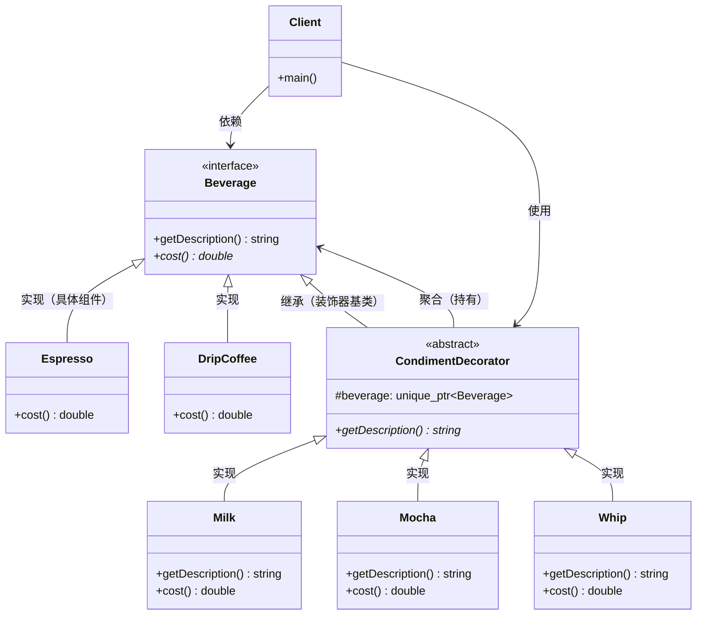

---
tags:
  - seed
  - project
created: 2026-05-30
updated: 2026-05-30
topic: tech
---

# 装饰器模式：从继承爆炸到灵活包装的进化之路
## 📑 目录
1. [未使用设计模式的代码示例与问题分析](#1-未使用设计模式的代码示例与问题分析)
2. [引出装饰器模式](#2-引出装饰器模式)
3. [应用设计模式的解决方案](#3-应用设计模式的解决方案)
4. [设计模式核心总结](#4-设计模式核心总结)
5. [留给读者的思考问题](#5-留给读者的思考问题)

---

## 1. 未使用设计模式的代码示例与问题分析
### 🎯 代码场景描述
假设我们正在开发一个 **咖啡订单系统**，需要支持不同种类的咖啡和多种配料（调料）。咖啡种类包括：浓缩咖啡（Espresso）、滴滤咖啡（DripCoffee）；配料包括：牛奶（Milk）、摩卡（Mocha）、奶泡（Whip）、豆浆（Soy）。客户可以任意组合配料，每种配料会改变咖啡的价格和描述。

### 💻 问题代码实现（继承爆炸方案）
```cpp
#include <iostream>
#include <string>
#include <memory>
#include <vector>

// 抽象咖啡基类
class Beverage {
protected:
    std::string description = "Unknown Beverage";
    
public:
    virtual ~Beverage() = default;
    virtual std::string getDescription() const { return description; }
    virtual double cost() const = 0;
};

// ========== 基础咖啡类 ==========
class Espresso : public Beverage {
public:
    Espresso() { description = "Espresso"; }
    double cost() const override { return 1.99; }
};

class DripCoffee : public Beverage {
public:
    DripCoffee() { description = "Drip Coffee"; }
    double cost() const override { return 1.49; }
};

// ========== 问题出现：需要为每种组合创建子类 ==========

// 带牛奶的浓缩咖啡
class EspressoWithMilk : public Espresso {
public:
    std::string getDescription() const override {
        return Espresso::getDescription() + ", Milk";
    }
    double cost() const override {
        return Espresso::cost() + 0.30;
    }
};

// 带摩卡的浓缩咖啡
class EspressoWithMocha : public Espresso {
public:
    std::string getDescription() const override {
        return Espresso::getDescription() + ", Mocha";
    }
    double cost() const override {
        return Espresso::cost() + 0.50;
    }
};

// 带牛奶和摩卡的浓缩咖啡
class EspressoWithMilkAndMocha : public Espresso {
public:
    std::string getDescription() const override {
        return Espresso::getDescription() + ", Milk, Mocha";
    }
    double cost() const override {
        return Espresso::cost() + 0.30 + 0.50;
    }
};

// 带牛奶、摩卡和奶泡的浓缩咖啡
class EspressoWithMilkMochaWhip : public Espresso {
public:
    std::string getDescription() const override {
        return Espresso::getDescription() + ", Milk, Mocha, Whip";
    }
    double cost() const override {
        return Espresso::cost() + 0.30 + 0.50 + 0.40;
    }
};

// 带豆浆的滴滤咖啡
class DripCoffeeWithSoy : public DripCoffee {
public:
    std::string getDescription() const override {
        return DripCoffee::getDescription() + ", Soy";
    }
    double cost() const override {
        return DripCoffee::cost() + 0.35;
    }
};

// ... 这还只是冰山一角！如果有4种基础咖啡和4种配料
// 理论上需要创建 4 * 2^4 = 64 个类！！！

// 客户端调用
int main() {
    std::cout << "========== 咖啡订单系统（继承方案）==========\n";
    
    // 点一杯浓缩咖啡
    Espresso espresso;
    std::cout << espresso.getDescription() << " $" << espresso.cost() << std::endl;
    
    // 点一杯加牛奶的浓缩咖啡
    EspressoWithMilk espressoWithMilk;
    std::cout << espressoWithMilk.getDescription() << " $" << espressoWithMilk.cost() << std::endl;
    
    // 点一杯加牛奶和摩卡的浓缩咖啡
    EspressoWithMilkAndMocha espressoWithMilkMocha;
    std::cout << espressoWithMilkMocha.getDescription() << " $" << espressoWithMilkMocha.cost() << std::endl;
    
    // 问题：想要一杯加双份摩卡的浓缩咖啡？
    // 需要再创建一个 EspressoWithDoubleMocha 类！
    
    // 问题：想要加牛奶的滴滤咖啡？
    // 需要创建 DripCoffeeWithMilk 类！
    
    return 0;
}
```

### ⚠️ 问题分析
#### **扩展性问题（类爆炸）** 🔴
```cpp
// 4种基础咖啡 × 4种配料（可重复、可任意组合）= 无数种组合
// 实际需要创建的类数量 = 4 × 组合数(2^4) = 64个类

// 仅仅增加一种新配料（比如焦糖），就需要创建：
// EspressoWithCaramel, EspressoWithMilkCaramel, EspressoWithMochaCaramel...
// DripCoffeeWithCaramel, DripCoffeeWithMilkCaramel...
// 至少新增 4 × 2^5 = 128 个新类！
```

**后果**：

+ 类的数量呈指数级增长（组合爆炸）
+ 代码库迅速膨胀到无法维护
+ 每增加一种配料，工作量呈几何级数增长

#### **复用性问题** 🔴
```cpp
// 每种配料的价格计算代码被大量重复
class EspressoWithMilk : public Espresso {
    double cost() const override {
        return Espresso::cost() + 0.30;  // 牛奶价格硬编码
    }
};

class EspressoWithMilkAndMocha : public Espresso {
    double cost() const override {
        return Espresso::cost() + 0.30 + 0.50;  // 同样的0.30和0.50
    }
};

class DripCoffeeWithMilk : public DripCoffee {
    double cost() const override {
        return DripCoffee::cost() + 0.30;  // 重复的0.30
    }
};
```

**后果**：

+ 配料价格变更时（如牛奶从0.30涨到0.40），需要修改所有包含牛奶的组合类
+ 遗漏任何一处都会导致价格计算错误
+ DRY原则被严重违反

#### **维护性问题** 🔴
```cpp
// 需求变更：增加配料的大小选择（小杯/中杯/大杯）
// 影响范围：所有现有的组合类都需要修改
class EspressoWithMilk {
    double cost() const override {
        double base = Espresso::cost();
        if (size == LARGE) return base + 0.60;  // 需要修改每个类
        return base + 0.30;
    }
};
// 需要修改64个类，每个类都要添加这个逻辑！
```

**具体后果**：

| 变更类型 | 影响范围 | 工作量 |
| --- | --- | --- |
| 新增配料 | 所有基础咖啡 × 所有现有组合 | O(2^n) 指数级 |
| 修改配料价格 | 所有包含该配料的组合类 | 需要全局搜索修改 |
| 增加咖啡类型 | 所有配料组合 × 配料类型 | 大量重复代码 |
| 修改输出格式 | 所有类的getDescription() | 数十个类逐一修改 |


#### **耦合性问题** 🟡
```cpp
// 客户端代码与具体类紧耦合
EspressoWithMilkAndMocha myCoffee;  // 客户端知道具体类名
// 想要改变配料组合？必须改变实例化代码！
```

**后果**：

+ 运行时无法动态改变对象的行为
+ 无法实现"运行时添加配料"的功能（如配料可选）
+ 测试时需要为每个组合类编写测试用例

---

## 2. 引出装饰器模式
### 💡 设计灵感来源
装饰器模式的灵感源自 **现实中的装饰艺术**：

> 想象你要装修一间房子。你不是通过**继承**房子的类型（别墅、公寓、平房）来添加装饰，而是通过**组合**的方式：
>
> + 房子本身是一个基础对象
> + 你可以给它添置沙发（装饰）
> + 你可以给它挂上窗帘（另一个装饰）
> + 还可以铺上地毯（又一个装饰）
>
> 关键是：**装饰可以动态添加和移除，且多种装饰可以互相组合，而不需要提前定义所有可能的组合**。
>

将这个思想映射到软件：

+ **组件** = 原始的房屋
+ **装饰器** = 沙发、窗帘、地毯
+ 每个装饰器都包装了被装饰的对象，并添加自己的行为

### 🎯 核心思想
> **动态地给一个对象添加额外的职责，使用组合代替继承来避免类爆炸，实现运行时行为扩展**
>

---

## 3. 应用设计模式的解决方案
### 🚀 重构后的代码实现
```cpp
#include <iostream>
#include <string>
#include <memory>
#include <vector>

// ========== 组件接口 ==========
class Beverage {
protected:
    std::string description = "Unknown Beverage";
    
public:
    virtual ~Beverage() = default;
    
    virtual std::string getDescription() const { 
        return description; 
    }
    
    virtual double cost() const = 0;
};

// ========== 具体组件（被装饰者）==========
class Espresso : public Beverage {
public:
    Espresso() { 
        description = "Espresso"; 
    }
    
    double cost() const override { 
        return 1.99; 
    }
};

class DripCoffee : public Beverage {
public:
    DripCoffee() { 
        description = "Drip Coffee"; 
    }
    
    double cost() const override { 
        return 1.49; 
    }
};

class HouseBlend : public Beverage {
public:
    HouseBlend() { 
        description = "House Blend Coffee"; 
    }
    
    double cost() const override { 
        return 0.89; 
    }
};

// ========== 抽象装饰器类 ==========
class CondimentDecorator : public Beverage {
protected:
    std::unique_ptr<Beverage> beverage;  // 持有被装饰对象的引用
    
public:
    explicit CondimentDecorator(std::unique_ptr<Beverage> bev) 
        : beverage(std::move(bev)) {}
    
    // 纯虚函数，强制子类实现
    std::string getDescription() const override = 0;
};

// ========== 具体装饰器：牛奶 ==========
class Milk : public CondimentDecorator {
public:
    explicit Milk(std::unique_ptr<Beverage> bev) 
        : CondimentDecorator(std::move(bev)) {}
    
    std::string getDescription() const override {
        return beverage->getDescription() + ", Milk";
    }
    
    double cost() const override {
        return beverage->cost() + 0.30;
    }
};

// ========== 具体装饰器：摩卡 ==========
class Mocha : public CondimentDecorator {
public:
    explicit Mocha(std::unique_ptr<Beverage> bev) 
        : CondimentDecorator(std::move(bev)) {}
    
    std::string getDescription() const override {
        return beverage->getDescription() + ", Mocha";
    }
    
    double cost() const override {
        return beverage->cost() + 0.50;
    }
};

// ========== 具体装饰器：奶泡 ==========
class Whip : public CondimentDecorator {
public:
    explicit Whip(std::unique_ptr<Beverage> bev) 
        : CondimentDecorator(std::move(bev)) {}
    
    std::string getDescription() const override {
        return beverage->getDescription() + ", Whip";
    }
    
    double cost() const override {
        return beverage->cost() + 0.40;
    }
};

// ========== 具体装饰器：豆浆 ==========
class Soy : public CondimentDecorator {
public:
    explicit Soy(std::unique_ptr<Beverage> bev) 
        : CondimentDecorator(std::move(bev)) {}
    
    std::string getDescription() const override {
        return beverage->getDescription() + ", Soy";
    }
    
    double cost() const override {
        return beverage->cost() + 0.35;
    }
};

// ========== 高级特性：支持重复添加相同配料 ==========
// 双份摩卡装饰器（可以基于Mocha再次包装）
// 但更优雅的方式是直接多次包装同一个配料

// ========== 客户端调用 ==========
int main() {
    std::cout << "========== 咖啡订单系统（装饰器模式）==========\n\n";
    
    // 场景1：一杯浓缩咖啡，不加任何配料
    std::cout << "【场景1】基础浓缩咖啡：\n";
    std::unique_ptr<Beverage> espresso = std::make_unique<Espresso>();
    std::cout << espresso->getDescription() << " $" << espresso->cost() << std::endl;
    
    // 场景2：一杯浓缩咖啡，加双份摩卡和奶泡
    std::cout << "\n【场景2】浓缩咖啡 + 双份摩卡 + 奶泡：\n";
    std::unique_ptr<Beverage> espresso2 = std::make_unique<Espresso>();
    espresso2 = std::make_unique<Mocha>(std::move(espresso2));   // 第一份摩卡
    espresso2 = std::make_unique<Mocha>(std::move(espresso2));   // 第二份摩卡
    espresso2 = std::make_unique<Whip>(std::move(espresso2));    // 奶泡
    std::cout << espresso2->getDescription() << " $" << espresso2->cost() << std::endl;
    
    // 场景3：一杯滴滤咖啡，加牛奶和豆浆
    std::cout << "\n【场景3】滴滤咖啡 + 牛奶 + 豆浆：\n";
    std::unique_ptr<Beverage> drip = std::make_unique<DripCoffee>();
    drip = std::make_unique<Milk>(std::move(drip));
    drip = std::make_unique<Soy>(std::move(drip));
    std::cout << drip->getDescription() << " $" << drip->cost() << std::endl;
    
    // 场景4：综合咖啡（HouseBlend）加摩卡、牛奶、奶泡
    std::cout << "\n【场景4】综合咖啡 + 摩卡 + 牛奶 + 奶泡：\n";
    std::unique_ptr<Beverage> houseBlend = std::make_unique<HouseBlend>();
    houseBlend = std::make_unique<Mocha>(std::move(houseBlend));
    houseBlend = std::make_unique<Milk>(std::move(houseBlend));
    houseBlend = std::make_unique<Whip>(std::move(houseBlend));
    std::cout << houseBlend->getDescription() << " $" << houseBlend->cost() << std::endl;
    
    // 场景5：动态组合 - 运行时决定配料（演示灵活性）
    std::cout << "\n【场景5】运行时动态组合（模拟点餐系统）：\n";
    std::vector<std::string> order = {"Mocha", "Milk", "Whip", "Mocha"};  // 双份摩卡
    
    std::unique_ptr<Beverage> custom = std::make_unique<Espresso>();
    for (const auto& condiment : order) {
        if (condiment == "Mocha") {
            custom = std::make_unique<Mocha>(std::move(custom));
        } else if (condiment == "Milk") {
            custom = std::make_unique<Milk>(std::move(custom));
        } else if (condiment == "Whip") {
            custom = std::make_unique<Whip>(std::move(custom));
        } else if (condiment == "Soy") {
            custom = std::make_unique<Soy>(std::move(custom));
        }
    }
    std::cout << custom->getDescription() << " $" << custom->cost() << std::endl;
    
    // 演示装饰器嵌套结构
    std::cout << "\n========== 装饰器嵌套关系 ==========\n";
    std::cout << "最内层: Espresso\n";
    std::cout << "↓ 被 Mocha 包装\n";
    std::cout << "↓ 被 Milk 包装\n";
    std::cout << "↓ 被 Whip 包装（最外层）\n";
    
    return 0;
}
```

### 📊 改进原理对比
| 问题维度 | 改进前（继承） | 改进后（装饰器） | 原理说明 |
| --- | --- | --- | --- |
| **扩展性** | 类数量指数级增长 | 类数量 = 1 + 1 + N（线性） | **组合优于继承**：装饰器可以任意排列组合 |
| **复用性** | 配料价格代码重复 | 每个配料类只定义一次 | **单一职责**：每个装饰器只关心自己的行为 |
| **维护性** | 修改配料影响所有组合 | 修改只影响单个装饰器类 | **开闭原则**：对扩展开放，对修改关闭 |
| **灵活性** | 编译时确定组合 | 运行时动态组合 | **动态行为**：可在运行时添加/移除职责 |
| **耦合度** | 客户端依赖具体类 | 客户端依赖抽象接口 | **依赖倒置**：面向接口编程 |


#### 核心代码差异对比
```cpp
// ❌ 改进前：需要64个类，组合固定
EspressoWithMilkAndMocha coffee;  // 编译时确定组合
// 无法动态添加配料

// ✅ 改进后：只需4个装饰器类，组合灵活
std::unique_ptr<Beverage> coffee = std::make_unique<Espresso>();
coffee = std::make_unique<Milk>(std::move(coffee));
coffee = std::make_unique<Mocha>(std::move(coffee));
// 可以随时改变装饰顺序和数量
```

#### 类数量对比
| 基础咖啡数 | 配料数 | 继承方案类数 | 装饰器方案类数 |
| --- | --- | --- | --- |
| 4 | 4 | 64+ | 4 + 4 = 8 |
| 4 | 10 | 4096+ | 4 + 10 = 14 |
| 10 | 10 | 10240+ | 10 + 10 = 20 |


---

## 4. 设计模式核心总结
### 🧠 核心思想
> **使用对象组合的方式，以透明、动态的方式给对象添加额外职责，是继承的一种灵活替代方案**
>

### 📐 UML类图


### 📝 角色职责说明（C++术语）
| 角色 | C++实现方式 | 职责 |
| --- | --- | --- |
| **Component** | 抽象基类（接口） | 定义对象的接口，可以动态添加职责 |
| **ConcreteComponent** | 派生类 | 定义基础对象，是被装饰的原始对象 |
| **Decorator** | 抽象基类（继承Component） | 持有Component引用，定义装饰器接口 |
| **ConcreteDecorator** | 派生类 | 添加具体职责，在调用前后扩展行为 |


### 🎯 典型应用场景
#### ✅ 适合的场景
1. **需要动态、透明地添加职责**

```cpp
// 文件流处理：可以动态添加加密、压缩、缓冲等功能
auto file = std::make_unique<FileStream>("data.txt");
file = std::make_unique<EncryptStream>(std::move(file));
file = std::make_unique<CompressStream>(std::move(file));
file = std::make_unique<BufferedStream>(std::move(file));
```

2. **无法通过继承扩展（final类）**

```cpp
class FinalClass final { ... };  // 无法继承
// 使用装饰器模式包装它
class Decorator : public Interface {
    std::unique_ptr<FinalClass> wrapped;
};
```

3. **需要避免类爆炸的场景**

```cpp
// UI组件：窗口可以添加滚动条、边框、阴影等
auto window = std::make_unique<Window>();
window = std::make_unique<ScrollBar>(std::move(window));
window = std::make_unique<Border>(std::move(window));
```

4. **需要运行时撤销职责**

```cpp
// 游戏中角色的增益效果（Buff）
class Character {
    std::vector<std::unique_ptr<Buff>> activeBuffs;
    void addBuff(Buff* buff) { ... }
    void removeBuff(Buff* buff) { ... }
};
```

#### ❌ 反例场景
1. **对象结构内部复杂，装饰器需要修改大量内部状态**

```cpp
// 装饰器模式适用于透明包装，不适用于需要深入修改内部结构的场景
```

2. **装饰链过长导致性能问题**

```cpp
// 深度嵌套的装饰器（>10层）可能影响性能
// 考虑使用其他模式或优化
```

3. **被装饰的对象有唯一标识需求**

```cpp
// 如果依赖对象身份（如==比较），装饰器会破坏身份一致性
```

### 🔧 C++特性注意事项
```cpp
// ✅ 推荐：使用移动语义避免不必要的拷贝
class Milk : public CondimentDecorator {
public:
    explicit Milk(std::unique_ptr<Beverage> bev) 
        : CondimentDecorator(std::move(bev)) {}  // 移动语义
};

// ✅ 支持流式调用（但注意所有权转移）
auto coffee = std::make_unique<Espresso>()
    | std::make_unique<Mocha>()
    | std::make_unique<Whip>();

// ⚠️ 注意：虚函数调用的开销
// 每个装饰器调用都会产生虚函数调用开销
// 对于高频调用场景需要权衡

// ✅ 使用CRTP优化（静态多态）
template<typename Derived>
class StaticDecorator : public Beverage {
    // 编译时多态，零开销
};
```

---

## 5. 留给读者的思考问题
### 🤔 深入思考
1. **装饰器模式 vs 继承的抉择**

```cpp
// 以下场景你会选择哪种方案？
// 场景A：日志系统（添加时间戳、线程ID、文件位置）
// 场景B：图形形状（圆形、矩形、带边框、带阴影、带渐变）
```

2. **装饰器顺序的影响**

```cpp
// 以下两种装饰顺序的结果有何不同？
auto coffee1 = Mocha(Whip(Espresso()));  // 先加奶泡再加摩卡
auto coffee2 = Whip(Mocha(Espresso()));  // 先加摩卡再加奶泡
// 价格相同？描述相同？实际业务中可能有影响吗？
```

3. **半透明装饰器**

```cpp
// 如果装饰器添加了Component接口中没有的方法
class ScrollBar : public Decorator {
public:
    void scrollTo(int position);  // 额外方法
};
// 客户端如何处理这种"半透明"装饰器？
```

4. **线程安全问题**

```cpp
// 如果多个线程同时装饰同一个对象
// 如何保证装饰器的线程安全？
class ThreadSafeDecorator : public Decorator {
    std::mutex mtx;
    // 同步策略？
};
```

5. **与智能指针的配合**

```cpp
// 如何实现装饰器的自动内存管理？
// shared_ptr vs unique_ptr 的选择
// 装饰器链的析构顺序
```

### 🎯 进阶挑战
实现一个支持**动态撤销**和**多层嵌套**的装饰器系统：

```cpp
// 需求：战斗游戏中的Buff系统
class Character {
    void addBuff(Buff* buff);
    void removeBuff(const std::string& buffName);
    double getAttack() const;  // 计算累积效果
};

// 要求Buff可以叠加（相同Buff多层）、可以过期自动移除
// 使用装饰器模式实现，并处理Buff的优先级和覆盖规则
```

### 📚 实际项目思考
1. **在哪些开源库中见过装饰器模式的运用？**
    - STL中的`std::iostream`体系（`std::cout` + 格式化器）
    - OpenGL的着色器包装
    - 网络协议栈的层层封装（HTTP over SSL over TCP）
2. **重构你的项目**
    - 找出项目中因继承导致类爆炸的代码
    - 评估是否适合用装饰器模式重构
    - 设计重构方案，考虑C++特有的内存管理

---

**总结**：装饰器模式通过**组合代替继承**，优雅地解决了类爆炸问题。它允许在**运行时动态**地给对象添加职责，符合**开闭原则**。在C++中，结合`std::unique_ptr`和移动语义，可以实现高效且安全的装饰器链。记住：**当你在为"某个类的所有组合"创建大量子类时，停下来想一想装饰器模式**。

