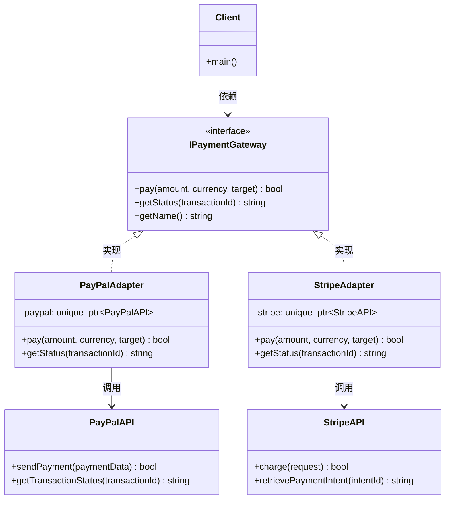

# 适配器模式：从接口不兼容到无缝协作的进化之路
## 📑 目录
1. [未使用设计模式的代码示例与问题分析](#1-未使用设计模式的代码示例与问题分析)
2. [引出适配器模式](#2-引出适配器模式)
3. [应用设计模式的解决方案](#3-应用设计模式的解决方案)
4. [设计模式核心总结](#4-设计模式核心总结)
5. [留给读者的思考问题](#5-留给读者的思考问题)

---

## 1. 未使用设计模式的代码示例与问题分析
### 🎯 代码场景描述
假设我们正在开发一个 **第三方服务集成系统**。系统需要对接多个不同的支付网关（PayPal、Stripe、支付宝）。每个支付网关的API接口设计完全不同：方法名不同、参数格式不同、返回值格式也不同。我们的目标是让客户端代码能够统一调用所有支付网关，而不需要关心具体实现细节。

### 💻 问题代码实现（硬编码适配）
```cpp
#include <iostream>
#include <string>
#include <memory>
#include <map>
#include <ctime>

// ========== 第三方支付网关1：PayPal ==========
class PayPalAPI {
private:
    std::string apiKey;
    std::string apiSecret;
    
public:
    PayPalAPI(const std::string& key, const std::string& secret) 
        : apiKey(key), apiSecret(secret) {}
    
    // PayPal特有的接口：参数格式(map)，方法名不同
    bool sendPayment(const std::map<std::string, std::string>& paymentData) {
        std::cout << "[PayPal] 处理支付..." << std::endl;
        std::cout << "  收款人: " << paymentData.at("receiver") << std::endl;
        std::cout << "  金额: " << paymentData.at("amount") << std::endl;
        std::cout << "  货币: " << paymentData.at("currency") << std::endl;
        return true;
    }
    
    std::string getTransactionStatus(const std::string& transactionId) {
        return "PayPal交易状态: COMPLETED";
    }
};

// ========== 第三方支付网关2：Stripe ==========
class StripeAPI {
private:
    std::string secretKey;
    
public:
    StripeAPI(const std::string& key) : secretKey(key) {}
    
    // Stripe特有的接口：参数使用结构体，方法名不同
    struct PaymentRequest {
        std::string customerId;
        double amount;
        std::string currency;
        std::string description;
    };
    
    bool charge(PaymentRequest request) {
        std::cout << "[Stripe] 处理支付..." << std::endl;
        std::cout << "  客户ID: " << request.customerId << std::endl;
        std::cout << "  金额: $" << request.amount << std::endl;
        std::cout << "  货币: " << request.currency << std::endl;
        return true;
    }
    
    std::string retrievePaymentIntent(const std::string& intentId) {
        return "Stripe支付状态: succeeded";
    }
};

// ========== 第三方支付网关3：支付宝 ==========
class AlipayAPI {
private:
    std::string appId;
    std::string privateKey;
    
public:
    AlipayAPI(const std::string& appId, const std::string& privateKey) 
        : appId(appId), privateKey(privateKey) {}
    
    // 支付宝特有的接口：参数使用JSON字符串
    bool execute(const std::string& jsonParams) {
        std::cout << "[支付宝] 处理支付..." << std::endl;
        std::cout << "  参数JSON: " << jsonParams << std::endl;
        return true;
    }
    
    std::string query(const std::string& outTradeNo) {
        return "支付宝交易状态: TRADE_SUCCESS";
    }
};

// ========== 客户端业务代码（硬编码处理每个网关）==========
class PaymentService {
public:
    // 处理PayPal支付
    static bool processPayPalPayment(const std::string& receiver, 
                                      double amount, 
                                      const std::string& currency) {
        PayPalAPI paypal("api_key_123", "api_secret_456");
        
        std::map<std::string, std::string> paymentData;
        paymentData["receiver"] = receiver;
        paymentData["amount"] = std::to_string(amount);
        paymentData["currency"] = currency;
        
        return paypal.sendPayment(paymentData);
    }
    
    // 处理Stripe支付
    static bool processStripePayment(const std::string& customerId,
                                      double amount,
                                      const std::string& currency) {
        StripeAPI stripe("sk_test_12345");
        
        StripeAPI::PaymentRequest request;
        request.customerId = customerId;
        request.amount = amount;
        request.currency = currency;
        request.description = "商品购买";
        
        return stripe.charge(request);
    }
    
    // 处理支付宝支付
    static bool processAlipayPayment(const std::string& outTradeNo,
                                      double amount,
                                      const std::string& subject) {
        AlipayAPI alipay("app_12345", "private_key");
        
        // 手动构造JSON字符串（容易出错）
        std::string jsonParams = "{"
            "\"out_trade_no\":\"" + outTradeNo + "\","
            "\"total_amount\":\"" + std::to_string(amount) + "\","
            "\"subject\":\"" + subject + "\""
        "}";
        
        return alipay.execute(jsonParams);
    }
};

// ========== 客户端调用 ==========
int main() {
    std::cout << "========== 支付系统（无适配器）==========\n\n";
    
    // 问题1：客户端需要知道每个网关的具体调用方式
    std::cout << "1. 使用PayPal支付：\n";
    PaymentService::processPayPalPayment("seller@paypal.com", 99.99, "USD");
    
    std::cout << "\n2. 使用Stripe支付：\n";
    PaymentService::processStripePayment("cus_123456", 99.99, "USD");
    
    std::cout << "\n3. 使用支付宝支付：\n";
    PaymentService::processAlipayPayment("202312010001", 99.99, "iPhone 15");
    
    std::cout << "\n========== 问题暴露 ==========\n";
    std::cout << "问题1：新增支付网关需要修改PaymentService类\n";
    std::cout << "问题2：客户端代码需要为每个网关编写不同的调用逻辑\n";
    std::cout << "问题3：参数格式转换逻辑分散在多处\n";
    
    return 0;
}
```

### ⚠️ 问题分析
#### **耦合性问题** 🔴
```cpp
// 客户端代码与具体支付网关紧耦合
PaymentService::processPayPalPayment("seller@paypal.com", 99.99, "USD");
PaymentService::processStripePayment("cus_123456", 99.99, "USD");
// 如果要切换支付方式，必须修改客户端代码
```

**后果**：

+ 切换支付网关需要修改所有调用点
+ 无法实现运行时的支付方式动态切换
+ 每个新的支付方式都需要学习不同的API

#### **扩展性问题** 🔴
```cpp
// 新增支付网关（如微信支付）需要：
// 1. 在PaymentService中增加新方法
static bool processWeChatPayment(...) {
    // 新接入代码
}

// 2. 修改所有使用支付服务的客户端代码
// 3. 添加新的参数转换逻辑
```

**后果**：

+ 违反开闭原则，每次扩展都要修改现有代码
+ 代码膨胀，PaymentService类会变得越来越庞大
+ 每个新网关都增加5-10行样板代码

#### **复用性问题** 🔴
```cpp
// 参数转换逻辑无法复用
// PayPal: 需要转换为map
// Stripe: 需要转换为struct  
// 支付宝: 需要转换为JSON字符串
// 同样的金额、货币等概念，需要为每个网关重复转换
```

**后果**：

+ 代码重复率高，维护成本增加
+ 新增网关必须重新实现所有转换逻辑
+ 单元测试需要为每个网关编写测试用例

#### **维护性问题** 🔴
| 变更类型 | 影响范围 | 具体后果 |
| --- | --- | --- |
| 第三方API升级 | 所有调用该网关的代码 | PayPal修改参数格式 → PaymentService中所有PayPal相关代码需修改 |
| 业务规则变更 | 全部支付方式 | 如添加"支付金额必须大于0"的校验，需修改3+个方法 |
| 统一添加日志 | 全部支付方式 | 需要在每个process方法中手动添加日志代码 |
| 统一错误处理 | 全部支付方式 | 错误处理逻辑分散，难以统一管理 |


```cpp
// 需求变更：对所有支付添加重试机制
// 需要修改每个process方法，代码量巨大！
static bool processPayPalPayment(...) {
    for (int i = 0; i < 3; i++) {  // 添加重试
        if (paypal.sendPayment(paymentData)) return true;
    }
    return false;
}
// 同样逻辑要在Stripe、Alipay中重复3次！
```

#### **性能问题** 🟡
```cpp
// 每次调用都创建新的API对象
static bool processPayPalPayment(...) {
    PayPalAPI paypal("api_key_123", "api_secret_456");  // 重复创建
    // 无法复用已创建的对象
}
```

**后果**：

+ 频繁的对象创建和销毁增加开销
+ 无法利用连接池等优化手段
+ 配置文件需要多次读取解析

---

## 2. 引出适配器模式
### 💡 设计灵感来源
适配器模式的灵感源自 **现实中的电源适配器**：

> 当你带着笔记本电脑去不同国家旅行时：
>
> + 美国使用110V扁平两脚插头
> + 欧洲使用220V圆脚插头
> + 中国使用220V扁三脚插头
>
> 你的电脑只需要**一个统一的电源接口**（期望的接口），而**电源适配器**负责将各国的不同插座（已有的接口）转换成电脑需要的标准接口。
>
> **关键是**：适配器在不修改原有插座和电脑的情况下，解决了接口不兼容的问题！
>

将这个思想映射到软件：

+ **客户端** = 笔记本电脑（需要统一接口）
+ **被适配者** = 各国的插座（已有接口）
+ **适配器** = 电源适配器（转换接口）
+ **目标接口** = 电脑电源接口（期望的标准）

### 🎯 核心思想
> **将一个类的接口转换成客户期望的另一个接口，使原本因接口不兼容而无法一起工作的类可以协同工作**
>

---

## 3. 应用设计模式的解决方案
### 🚀 重构后的代码实现
```cpp
#include <iostream>
#include <string>
#include <memory>
#include <map>
#include <vector>
#include <ctime>

// ========== 第三方支付网关（同前）==========
class PayPalAPI {
private:
    std::string apiKey;
    std::string apiSecret;
    
public:
    PayPalAPI(const std::string& key, const std::string& secret) 
        : apiKey(key), apiSecret(secret) {}
    
    bool sendPayment(const std::map<std::string, std::string>& paymentData) {
        std::cout << "[PayPal] 处理支付..." << std::endl;
        std::cout << "  收款人: " << paymentData.at("receiver") << std::endl;
        std::cout << "  金额: " << paymentData.at("amount") << std::endl;
        std::cout << "  货币: " << paymentData.at("currency") << std::endl;
        return true;
    }
    
    std::string getTransactionStatus(const std::string& transactionId) {
        return "PayPal交易状态: COMPLETED";
    }
};

class StripeAPI {
private:
    std::string secretKey;
    
public:
    StripeAPI(const std::string& key) : secretKey(key) {}
    
    struct PaymentRequest {
        std::string customerId;
        double amount;
        std::string currency;
        std::string description;
    };
    
    bool charge(PaymentRequest request) {
        std::cout << "[Stripe] 处理支付..." << std::endl;
        std::cout << "  客户ID: " << request.customerId << std::endl;
        std::cout << "  金额: $" << request.amount << std::endl;
        std::cout << "  货币: " << request.currency << std::endl;
        return true;
    }
    
    std::string retrievePaymentIntent(const std::string& intentId) {
        return "Stripe支付状态: succeeded";
    }
};

class AlipayAPI {
private:
    std::string appId;
    std::string privateKey;
    
public:
    AlipayAPI(const std::string& appId, const std::string& privateKey) 
        : appId(appId), privateKey(privateKey) {}
    
    bool execute(const std::string& jsonParams) {
        std::cout << "[支付宝] 处理支付..." << std::endl;
        std::cout << "  参数JSON: " << jsonParams << std::endl;
        return true;
    }
    
    std::string query(const std::string& outTradeNo) {
        return "支付宝交易状态: TRADE_SUCCESS";
    }
};

// ========== 统一的目标接口（客户端期望的接口）==========
class IPaymentGateway {
public:
    virtual ~IPaymentGateway() = default;
    
    // 统一的支付接口
    virtual bool pay(double amount, 
                     const std::string& currency,
                     const std::string& target) = 0;
    
    // 统一的查询接口
    virtual std::string getStatus(const std::string& transactionId) = 0;
    
    // 统一的网关名称
    virtual std::string getName() const = 0;
};

// ========== 对象适配器：PayPal适配器 ==========
class PayPalAdapter : public IPaymentGateway {
private:
    std::unique_ptr<PayPalAPI> paypal;
    
public:
    explicit PayPalAdapter(std::unique_ptr<PayPalAPI> api) 
        : paypal(std::move(api)) {}
    
    bool pay(double amount, const std::string& currency, const std::string& target) override {
        // 转换参数：double → string，target作为receiver
        std::map<std::string, std::string> paymentData;
        paymentData["receiver"] = target;
        paymentData["amount"] = std::to_string(amount);
        paymentData["currency"] = currency;
        
        // 调用PayPal特有接口
        return paypal->sendPayment(paymentData);
    }
    
    std::string getStatus(const std::string& transactionId) override {
        return paypal->getTransactionStatus(transactionId);
    }
    
    std::string getName() const override {
        return "PayPal";
    }
};

// ========== 对象适配器：Stripe适配器 ==========
class StripeAdapter : public IPaymentGateway {
private:
    std::unique_ptr<StripeAPI> stripe;
    
public:
    explicit StripeAdapter(std::unique_ptr<StripeAPI> api) 
        : stripe(std::move(api)) {}
    
    bool pay(double amount, const std::string& currency, const std::string& target) override {
        // 转换参数：target作为customerId
        StripeAPI::PaymentRequest request;
        request.customerId = target;
        request.amount = amount;
        request.currency = currency;
        request.description = "Payment via Adapter";
        
        return stripe->charge(request);
    }
    
    std::string getStatus(const std::string& transactionId) override {
        return stripe->retrievePaymentIntent(transactionId);
    }
    
    std::string getName() const override {
        return "Stripe";
    }
};

// ========== 对象适配器：支付宝适配器 ==========
class AlipayAdapter : public IPaymentGateway {
private:
    std::unique_ptr<AlipayAPI> alipay;
    
public:
    explicit AlipayAdapter(std::unique_ptr<AlipayAPI> api) 
        : alipay(std::move(api)) {}
    
    bool pay(double amount, const std::string& currency, const std::string& target) override {
        // 转换参数：生成交易单号
        std::string outTradeNo = "ORDER_" + std::to_string(std::time(nullptr));
        
        // 构建JSON字符串
        std::string jsonParams = "{"
            "\"out_trade_no\":\"" + outTradeNo + "\","
            "\"total_amount\":\"" + std::to_string(amount) + "\","
            "\"subject\":\"" + target + "\","
            "\"currency\":\"" + currency + "\""
        "}";
        
        return alipay->execute(jsonParams);
    }
    
    std::string getStatus(const std::string& transactionId) override {
        return alipay->query(transactionId);
    }
    
    std::string getName() const override {
        return "Alipay";
    }
};

// ========== 便捷工厂：创建适配好的支付网关 ==========
class PaymentGatewayFactory {
public:
    static std::unique_ptr<IPaymentGateway> createPayPal() {
        auto api = std::make_unique<PayPalAPI>("api_key_123", "api_secret_456");
        return std::make_unique<PayPalAdapter>(std::move(api));
    }
    
    static std::unique_ptr<IPaymentGateway> createStripe() {
        auto api = std::make_unique<StripeAPI>("sk_test_12345");
        return std::make_unique<StripeAdapter>(std::move(api));
    }
    
    static std::unique_ptr<IPaymentGateway> createAlipay() {
        auto api = std::make_unique<AlipayAPI>("app_12345", "private_key");
        return std::make_unique<AlipayAdapter>(std::move(api));
    }
};

// ========== 统一客户端代码 ==========
class PaymentService {
private:
    std::unique_ptr<IPaymentGateway> gateway;
    
public:
    explicit PaymentService(std::unique_ptr<IPaymentGateway> gw) 
        : gateway(std::move(gw)) {}
    
    // 切换支付网关（运行时动态）
    void setGateway(std::unique_ptr<IPaymentGateway> gw) {
        gateway = std::move(gw);
    }
    
    // 统一的支付接口
    bool processPayment(double amount, const std::string& currency, const std::string& target) {
        std::cout << "使用 " << gateway->getName() << " 处理支付...\n";
        return gateway->pay(amount, currency, target);
    }
    
    // 统一的状态查询
    std::string checkStatus(const std::string& transactionId) {
        return gateway->getStatus(transactionId);
    }
};

// ========== 客户端调用（完全解耦）==========
int main() {
    std::cout << "========== 支付系统（适配器模式）==========\n\n";
    
    // 场景1：使用不同支付方式（统一接口）
    std::cout << "【场景1】直接使用适配器：\n";
    auto paypal = PaymentGatewayFactory::createPayPal();
    paypal->pay(99.99, "USD", "seller@paypal.com");
    
    auto stripe = PaymentGatewayFactory::createStripe();
    stripe->pay(99.99, "USD", "cus_123456");
    
    auto alipay = PaymentGatewayFactory::createAlipay();
    alipay->pay(99.99, "CNY", "iPhone 15");
    
    // 场景2：使用统一服务类
    std::cout << "\n【场景2】使用统一PaymentService：\n";
    PaymentService service(PaymentGatewayFactory::createPayPal());
    service.processPayment(49.99, "USD", "seller@paypal.com");
    
    // 运行时切换支付方式
    std::cout << "\n【场景3】运行时动态切换支付方式：\n";
    service.setGateway(PaymentGatewayFactory::createStripe());
    service.processPayment(199.99, "EUR", "cus_789012");
    
    service.setGateway(PaymentGatewayFactory::createAlipay());
    service.processPayment(2999.99, "CNY", "MacBook Pro");
    
    // 场景4：批量处理 - 多网关并存
    std::cout << "\n【场景4】批量处理多个支付：\n";
    std::vector<std::unique_ptr<IPaymentGateway>> gateways;
    gateways.push_back(PaymentGatewayFactory::createPayPal());
    gateways.push_back(PaymentGatewayFactory::createStripe());
    gateways.push_back(PaymentGatewayFactory::createAlipay());
    
    for (auto& gw : gateways) {
        gw->pay(50.00, "USD", "test@example.com");
    }
    
    std::cout << "\n========== 优势总结 ==========\n";
    std::cout << "✓ 新增网关只需实现适配器，无需修改现有代码\n";
    std::cout << "✓ 客户端代码完全统一，不依赖具体网关\n";
    std::cout << "✓ 支持运行时动态切换支付方式\n";
    std::cout << "✓ 转换逻辑封装在适配器内部，易于维护\n";
    std::cout << "✓ 符合开闭原则，对扩展开放，对修改关闭\n";
    
    return 0;
}
```

### 📊 改进原理对比
| 问题维度 | 改进前 | 改进后 | 原理说明 |
| --- | --- | --- | --- |
| **耦合性** | 客户端依赖具体API | 客户端依赖抽象接口 | **依赖倒置**：通过接口隔离变化 |
| **扩展性** | 新增网关需修改多处 | 只需新增适配器类 | **开闭原则**：对扩展开放，对修改关闭 |
| **复用性** | 转换逻辑分散 | 转换逻辑封装在适配器 | **单一职责**：每个适配器负责一种转换 |
| **维护性** | 修改影响全局 | 修改隔离在单个适配器 | **隔离变化**：第三方API变化影响范围最小 |
| **灵活性** | 编译时绑定 | 运行时动态切换 | **策略模式**：可互换的算法族 |


#### 核心代码差异对比
```cpp
// ❌ 改进前：每个网关调用方式不同
PaymentService::processPayPalPayment("seller@paypal.com", 99.99, "USD");
PaymentService::processStripePayment("cus_123456", 99.99, "USD");
PaymentService::processAlipayPayment("202312010001", 99.99, "iPhone 15");

// ✅ 改进后：完全统一的调用接口
gateway->pay(99.99, "USD", "seller@paypal.com");
gateway->pay(99.99, "USD", "cus_123456");
gateway->pay(99.99, "CNY", "iPhone 15");
```

#### 新增网关的成本对比
| 任务 | 改进前 | 改进后 |
| --- | --- | --- |
| 新增WeChatPay | 修改PaymentService类 + 修改所有客户端 | 新增WeChatAdapter类 |
| 代码修改行数 | ~30行（分散在多处） | ~20行（集中在新类） |
| 影响现有代码 | 是（违反开闭原则） | 否 |
| 测试范围 | 回归测试所有支付方式 | 只测试新适配器 |
| 上线风险 | 高（可能影响其他网关） | 低（新增模块隔离） |


---

## 4. 设计模式核心总结
### 🧠 核心思想
> **通过包装现有类，将不兼容的接口转换为客户端期望的接口，让原本无法协作的类可以一起工作**
>

### 📐 UML类图


### 📝 角色职责说明（C++术语）
| 角色 | C++实现方式 | 职责 |
| --- | --- | --- |
| **Target** | 抽象基类（纯虚接口） | 定义客户端期望使用的统一接口 |
| **Adaptee** | 现有类（第三方库） | 已有但接口不兼容的类，需要被适配 |
| **Adapter** | 派生类（实现Target） | 将Adaptee的接口转换为Target接口，核心转换逻辑在此 |
| **Client** | 调用方代码 | 只依赖Target接口，不关心具体Adaptee |


### 🔧 C++实现方式分类
```cpp
// 方式1：对象适配器（推荐）- 使用组合
class ObjectAdapter : public Target {
private:
    std::unique_ptr<Adaptee> adaptee;  // 持有Adaptee对象
public:
    void request() override {
        adaptee->specificRequest();  // 转发调用
    }
};

// 方式2：类适配器（多继承）- 谨慎使用
class ClassAdapter : public Target, private Adaptee {
public:
    void request() override {
        specificRequest();  // 直接调用继承的方法
    }
};
```

### 🎯 典型应用场景
#### ✅ 适合的场景
1. **集成第三方库/遗留系统**

```cpp
// 新项目期望统一日志接口，但旧系统使用不同的日志库
class NewLogger { virtual void log(const string& msg) = 0; };
class OldLogger { void writeLog(const char* msg, int level); };

class LoggerAdapter : public NewLogger {
    OldLogger oldLogger;
    void log(const string& msg) override {
        oldLogger.writeLog(msg.c_str(), INFO);
    }
};
```

2. **统一多个相似但接口不同的API**

```cpp
// 云存储适配：AWS S3、阿里云OSS、腾讯COS
class CloudStorageAdapter : public ICloudStorage {
    // 统一的上传、下载、删除接口
};
```

3. **数据格式转换**

```cpp
// XML数据 → JSON数据适配器
class XMLToJSONAdapter : public IDataReader {
    XMLParser xmlParser;
    JSONObject parse() override {
        // XML → JSON转换
    }
};
```

4. **遗留代码重构过渡期**

```cpp
// 逐步替换旧接口，让新旧系统并存
class LegacyInterfaceWrapper : public NewInterface {
    // 包装旧接口，让旧代码能在新架构中运行
};
```

#### ❌ 反例场景
1. **接口设计初期可以统一**

```cpp
// 不要为设计不完善的接口创建适配器
// 应该直接重构不统一的接口
```

2. **Adaptee接口频繁变化**

```cpp
// 如果第三方API经常改变，维护适配器成本高
// 考虑使用更稳定的中间层
```

3. **性能敏感的热路径**

```cpp
// 适配器会引入额外的虚函数调用和转发开销
// 高频调用场景需要评估性能影响
```

4. **需要适配的类过多**

```cpp
// 如果有几十个类需要适配，考虑是否接口设计有问题
// 可能需要重新设计统一接口
```

---

## 5. 留给读者的思考问题
### 🤔 深入思考
1. **对象适配器 vs 类适配器**

```cpp
// C++中，何时选择对象适配器？何时选择类适配器？
// 对象适配器：使用组合，更灵活，可适配整个家族
// 类适配器：使用多继承，更紧凑，但受限于继承
```

2. **双向适配器**

```cpp
// 如果需要两个系统互相适配
class BidirectionalAdapter : public ITargetA, public ITargetB {
    // 如何实现双向转换？
};
```

3. **适配器模式与外观模式的区别**

```cpp
// 适配器：转换接口
// 外观：简化接口
// 如何判断当前问题应该用哪个？
```

4. **参数适配的挑战**

```cpp
// 当参数无法直接映射时如何处理？
// 例如：Adaptee需要时间戳，Target只有日期字符串
// 应该在适配器中实现转换逻辑吗？
```

5. **适配器链**

```cpp
// 多个适配器串联：A → Adapter1 → B → Adapter2 → C
// 什么场景下需要这种设计？有什么优缺点？
```

### 🎯 进阶挑战
实现一个**智能适配器工厂**：

```cpp
// 需求：根据配置文件自动选择并创建合适的适配器
class SmartAdapterFactory {
public:
    static std::unique_ptr<IPaymentGateway> create(const std::string& configFile) {
        // 读取配置
        // 自动实例化对应的Adapter
        // 支持插件式添加新Adapter
    }
};

// 使用智能指针管理适配器生命周期
// 支持适配器的热插拔
```

### 📚 实际项目思考
1. **在你的项目中，哪些地方存在接口不兼容的问题？**
    - 数据库访问层（MySQL、PostgreSQL、MongoDB）
    - 消息队列（Kafka、RabbitMQ、ActiveMQ）
    - 缓存系统（Redis、Memcached）
2. **如何测试适配器？**
    - 如何Mock Adaptee的行为？
    - 如何测试边界条件转换？
3. **适配器模式的代价**
    - 增加系统复杂度和间接层
    - 可能损失部分性能
    - 调试时多一层调用栈

---

**总结**：适配器模式是**集成第三方代码和遗留系统**的救星。它通过引入一个中间层，让不兼容的接口能够无缝协作。在C++中，**对象适配器**（使用组合）比类适配器（多继承）更常用，因为它更灵活、更安全。记住：**当你发现无法修改的代码和需要兼容的接口时，适配器模式就是你的最佳选择**。

