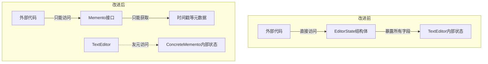

# 备忘录模式：从状态失控到可控回滚的进化之路
## 📑 目录
1. [未使用设计模式的代码示例与问题分析](#1-未使用设计模式的代码示例与问题分析)
2. [引出备忘录模式](#2-引出备忘录模式)
3. [应用设计模式的解决方案](#3-应用设计模式的解决方案)
4. [设计模式核心总结](#4-设计模式核心总结)
5. [留给读者的思考问题](#5-留给读者的思考问题)

---

## 1. 未使用设计模式的代码示例与问题分析
### 🎯 代码场景描述
假设我们正在开发一个 **文本编辑器** 的撤销/重做功能。用户需要能够：

+ 编辑文本内容
+ 修改光标位置
+ 改变文本选中范围
+ 撤销任意步数的操作
+ 重做被撤销的操作

我们需要一种方式来保存和恢复编辑器的完整状态。

### 💻 问题代码实现（暴露内部状态）
```cpp
#include <iostream>
#include <string>
#include <vector>
#include <stack>
#include <ctime>

// ========== 文本编辑器类（状态暴露在外）==========
class TextEditor {
private:
    std::string content;      // 文本内容
    int cursorPosition;       // 光标位置
    int selectionStart;       // 选中起始位置
    int selectionEnd;         // 选中结束位置
    std::string clipboard;    // 剪贴板内容
    
public:
    TextEditor() : cursorPosition(0), selectionStart(0), selectionEnd(0) {}
    
    // 编辑操作
    void insertText(const std::string& text) {
        content.insert(cursorPosition, text);
        cursorPosition += text.length();
        selectionStart = selectionEnd = cursorPosition;
    }
    
    void deleteText(int length) {
        if (cursorPosition + length <= content.length()) {
            content.erase(cursorPosition, length);
        }
    }
    
    void setCursor(int position) {
        cursorPosition = std::min(position, (int)content.length());
        selectionStart = selectionEnd = cursorPosition;
    }
    
    void selectRange(int start, int end) {
        selectionStart = std::max(0, start);
        selectionEnd = std::min(end, (int)content.length());
        cursorPosition = selectionEnd;
    }
    
    // 获取当前状态（暴露给外部）
    struct EditorState {
        std::string content;
        int cursorPosition;
        int selectionStart;
        int selectionEnd;
        std::string clipboard;
        
        // 快照时间戳
        time_t timestamp;
    };
    
    EditorState getState() const {
        EditorState state;
        state.content = content;
        state.cursorPosition = cursorPosition;
        state.selectionStart = selectionStart;
        state.selectionEnd = selectionEnd;
        state.clipboard = clipboard;
        state.timestamp = std::time(nullptr);
        return state;
    }
    
    void restoreState(const EditorState& state) {
        content = state.content;
        cursorPosition = state.cursorPosition;
        selectionStart = state.selectionStart;
        selectionEnd = state.selectionEnd;
        clipboard = state.clipboard;
    }
    
    void display() const {
        std::cout << "\n========== 编辑器状态 ==========\n";
        std::cout << "内容: " << (content.empty() ? "(空)" : content) << "\n";
        std::cout << "光标位置: " << cursorPosition << "\n";
        std::cout << "选中范围: [" << selectionStart << ", " << selectionEnd << "]\n";
        std::cout << "剪贴板: " << (clipboard.empty() ? "(空)" : clipboard) << "\n";
        std::cout << "================================\n";
    }
};

// ========== 历史记录管理器（耦合严重）==========
class HistoryManager {
private:
    std::stack<TextEditor::EditorState> undoStack;
    std::stack<TextEditor::EditorState> redoStack;
    int maxHistorySize = 50;
    
public:
    void saveState(const TextEditor::EditorState& state) {
        if (undoStack.size() >= maxHistorySize) {
            // 移除最旧的快照（需要额外的数据结构，这里简化）
            std::cout << "警告：历史记录已满，将覆盖最早的记录\n";
        }
        undoStack.push(state);
        
        // 新操作清空redo栈
        while (!redoStack.empty()) {
            redoStack.pop();
        }
    }
    
    bool canUndo() const { return !undoStack.empty(); }
    bool canRedo() const { return !redoStack.empty(); }
    
    TextEditor::EditorState undo() {
        if (!canUndo()) {
            throw std::runtime_error("无法撤销");
        }
        
        TextEditor::EditorState current = undoStack.top();
        undoStack.pop();
        
        if (!undoStack.empty()) {
            redoStack.push(current);
            return undoStack.top();
        }
        
        return current;  // 没有更早的状态，返回当前（实际需要保存初始状态）
    }
    
    TextEditor::EditorState redo() {
        if (!canRedo()) {
            throw std::runtime_error("无法重做");
        }
        
        TextEditor::EditorState state = redoStack.top();
        redoStack.pop();
        undoStack.push(state);
        return state;
    }
    
    void clear() {
        while (!undoStack.empty()) undoStack.pop();
        while (!redoStack.empty()) redoStack.pop();
    }
};

// ========== 客户端调用 ==========
int main() {
    std::cout << "========== 文本编辑器（无备忘录模式）==========\n";
    
    TextEditor editor;
    HistoryManager history;
    
    // 保存初始状态
    history.saveState(editor.getState());
    
    std::cout << "\n1. 初始状态：";
    editor.display();
    
    // 编辑操作1
    editor.insertText("Hello");
    history.saveState(editor.getState());
    std::cout << "\n2. 插入'Hello'：";
    editor.display();
    
    // 编辑操作2
    editor.insertText(" World");
    history.saveState(editor.getState());
    std::cout << "\n3. 插入' World'：";
    editor.display();
    
    // 编辑操作3
    editor.setCursor(5);
    editor.insertText(" Beautiful");
    history.saveState(editor.getState());
    std::cout << "\n4. 在光标5处插入' Beautiful'：";
    editor.display();
    
    // 撤销操作
    std::cout << "\n5. 执行撤销：";
    if (history.canUndo()) {
        auto state = history.undo();
        editor.restoreState(state);
    }
    editor.display();
    
    // 再次撤销
    std::cout << "\n6. 再次撤销：";
    if (history.canUndo()) {
        auto state = history.undo();
        editor.restoreState(state);
    }
    editor.display();
    
    // 重做操作
    std::cout << "\n7. 执行重做：";
    if (history.canRedo()) {
        auto state = history.redo();
        editor.restoreState(state);
    }
    editor.display();
    
    std::cout << "\n========== 问题暴露 ==========\n";
    std::cout << "问题1：EditorState暴露了TextEditor的所有内部细节\n";
    std::cout << "问题2：HistoryManager与EditorState紧耦合\n";
    std::cout << "问题3：无法保护备忘录的完整性（外部可修改）\n";
    std::cout << "问题4：添加新状态需要修改多处代码\n";
    
    return 0;
}
```

### ⚠️ 问题分析
#### **封装性破坏（最严重问题）** 🔴
```cpp
// ❌ 问题代码：将内部状态完全暴露
struct EditorState {
    std::string content;        // 应该私有
    int cursorPosition;         // 应该私有
    int selectionStart;         // 应该私有
    int selectionEnd;           // 应该私有
    std::string clipboard;      // 应该私有
};

// 外部代码可以直接访问和修改备忘录内容
TextEditor::EditorState state = editor.getState();
state.content = "Hacked!";  // 恶意修改！破坏历史记录的完整性
```

**后果**：

+ 备忘录的**封装性完全丧失**
+ 外部代码可能意外或恶意修改历史状态
+ 无法保证恢复时的数据一致性
+ 违反了面向对象的封装原则

#### **耦合性问题** 🔴
```cpp
// HistoryManager 直接依赖 EditorState 的具体实现
class HistoryManager {
    std::stack<TextEditor::EditorState> undoStack;  // 强依赖
    // 无法复用，只能用于 TextEditor
};
```

**后果**：

+ `HistoryManager`与`TextEditor`紧耦合
+ 无法为其他类（如图形编辑器）提供撤销功能
+ `EditorState`的任何变更都会影响`HistoryManager`

#### **扩展性问题** 🔴
```cpp
// 需求变更：添加字体样式、颜色等属性
class TextEditor {
    // 新增状态字段
    std::string fontFamily;
    int fontSize;
    std::string fontColor;
    
    // 必须修改 EditorState 结构体
    struct EditorState {
        // ... 原有字段
        std::string fontFamily;  // 新增
        int fontSize;            // 新增
        std::string fontColor;   // 新增
    };
    
    // 修改 getState() 和 restoreState()
    EditorState getState() const {
        // 需要添加新字段的赋值
    }
};
```

**后果**：

+ 每添加一个状态字段需要修改3处以上代码
+ 违反开闭原则
+ 容易遗漏导致状态恢复不完整

#### **维护性问题** 🔴
| 变更类型 | 影响范围 | 具体后果 |
| --- | --- | --- |
| 新增状态字段 | EditorState + getState + restoreState | 需要修改3+处，容易遗漏 |
| 修改字段类型 | 所有依赖EditorState的代码 | 编译错误可能不直观 |
| 优化历史存储 | HistoryManager + EditorState | 需要理解内部所有字段含义 |


```cpp
// 历史记录满时的处理笨拙
if (undoStack.size() >= maxHistorySize) {
    // 需要移除最早的快照，但stack不支持
    // 需要改用deque或其他数据结构
}
```

#### **性能问题** 🟡
```cpp
// 每次都拷贝整个字符串内容
EditorState getState() const {
    EditorState state;
    state.content = content;  // 深拷贝，内容可能很大
    // 每次编辑操作都要保存完整状态
}
```

**后果**：

+ 大文件场景下内存占用巨大
+ 每次撤销都复制整个文件内容
+ 历史记录深度受限

---

## 2. 引出备忘录模式
### 💡 设计灵感来源
备忘录模式的灵感源自 **生活中的便签和账本**：

> 想象你正在玩一个角色扮演游戏：
>
> + 在挑战Boss前，你保存了游戏进度（**备忘录**）
> + 游戏系统将你的完整状态（血量、魔法、装备、位置）记录在存档文件中
> + 如果你失败，可以从保存点恢复（**恢复状态**）
>
> **关键设计点**：
>
> + 存档文件（备忘录）的内容对外部是**黑盒**的，你不能直接修改
> + **发起人**（游戏角色）负责创建和恢复存档
> + **管理者**（游戏系统）负责保管存档，但不触碰存档内容
> + 存档的详细信息只有创建者知晓
>

将这个思想映射到软件：

+ **Originator（发起人）** = 游戏角色（需要保存状态的对象）
+ **Memento（备忘录）** = 存档文件（存储状态的黑盒对象）
+ **Caretaker（管理者）** = 游戏系统（管理存档的生命周期）

### 🎯 核心思想
> **在不破坏封装的前提下，捕获并外部化一个对象的内部状态，以便之后可以将该对象恢复到保存的状态**
>

---

## 3. 应用设计模式的解决方案
### 🚀 重构后的代码实现
```cpp
#include <iostream>
#include <string>
#include <vector>
#include <stack>
#include <memory>
#include <ctime>
#include <sstream>

// ========== 备忘录接口（窄接口，只对Originator可见）==========
// 注意：Memento对Caretaker是黑盒，只提供类型信息
class Memento {
public:
    virtual ~Memento() = default;
    virtual std::string getTimestamp() const = 0;
    // 不暴露任何状态获取方法！
};

// ========== 发起人（Originator）==========
class TextEditor {
private:
    std::string content;
    int cursorPosition;
    int selectionStart;
    int selectionEnd;
    std::string clipboard;
    std::string fontFamily;
    int fontSize;
    
    // 具体的备忘录实现（私有嵌套类，只有TextEditor能访问内部细节）
    class ConcreteMemento : public Memento {
    private:
        std::string content;
        int cursorPosition;
        int selectionStart;
        int selectionEnd;
        std::string clipboard;
        std::string fontFamily;
        int fontSize;
        time_t timestamp;
        std::string snapshotId;
        
    public:
        ConcreteMemento(const std::string& content, int cursorPos, 
                       int selStart, int selEnd, const std::string& clip,
                       const std::string& fontFamily, int fontSize)
            : content(content), cursorPosition(cursorPos),
              selectionStart(selStart), selectionEnd(selEnd),
              clipboard(clip), fontFamily(fontFamily), fontSize(fontSize) {
            timestamp = std::time(nullptr);
            
            // 生成唯一ID
            std::ostringstream oss;
            oss << timestamp << "_" << content.length();
            snapshotId = oss.str();
        }
        
        // 只有TextEditor能访问这些方法（通过友元）
        friend class TextEditor;
        
        std::string getContent() const { return content; }
        int getCursorPosition() const { return cursorPosition; }
        int getSelectionStart() const { return selectionStart; }
        int getSelectionEnd() const { return selectionEnd; }
        std::string getClipboard() const { return clipboard; }
        std::string getFontFamily() const { return fontFamily; }
        int getFontSize() const { return fontSize; }
        
        std::string getTimestamp() const override {
            std::string timeStr = std::ctime(&timestamp);
            return timeStr.substr(0, timeStr.length() - 1);
        }
        
        std::string getSnapshotId() const { return snapshotId; }
    };
    
public:
    TextEditor() : cursorPosition(0), selectionStart(0), selectionEnd(0),
                   fontSize(12), fontFamily("Arial") {}
    
    // 编辑操作
    void insertText(const std::string& text) {
        content.insert(cursorPosition, text);
        cursorPosition += text.length();
        selectionStart = selectionEnd = cursorPosition;
    }
    
    void deleteText(int length) {
        if (cursorPosition + length <= content.length()) {
            content.erase(cursorPosition, length);
        }
    }
    
    void setCursor(int position) {
        cursorPosition = std::min(position, (int)content.length());
        selectionStart = selectionEnd = cursorPosition;
    }
    
    void selectRange(int start, int end) {
        selectionStart = std::max(0, start);
        selectionEnd = std::min(end, (int)content.length());
        cursorPosition = selectionEnd;
    }
    
    void setFont(const std::string& family, int size) {
        fontFamily = family;
        fontSize = size;
    }
    
    // 创建备忘录（保存状态）
    std::unique_ptr<Memento> save() {
        return std::make_unique<ConcreteMemento>(
            content, cursorPosition, selectionStart, selectionEnd,
            clipboard, fontFamily, fontSize);
    }
    
    // 从备忘录恢复状态
    void restore(Memento* memento) {
        // 向下转型（安全，因为只有我们创建这个类型）
        auto* concreteMemento = dynamic_cast<ConcreteMemento*>(memento);
        if (concreteMemento) {
            content = concreteMemento->getContent();
            cursorPosition = concreteMemento->getCursorPosition();
            selectionStart = concreteMemento->getSelectionStart();
            selectionEnd = concreteMemento->getSelectionEnd();
            clipboard = concreteMemento->getClipboard();
            fontFamily = concreteMemento->getFontFamily();
            fontSize = concreteMemento->getFontSize();
        }
    }
    
    void display() const {
        std::cout << "\n========== 编辑器状态 ==========\n";
        std::cout << "内容: " << (content.empty() ? "(空)" : content) << "\n";
        std::cout << "光标位置: " << cursorPosition << "\n";
        std::cout << "选中范围: [" << selectionStart << ", " << selectionEnd << "]\n";
        std::cout << "字体: " << fontFamily << " " << fontSize << "px\n";
        std::cout << "================================\n";
    }
};

// ========== 管理者（Caretaker）==========
// 管理者只负责存储备忘录，不访问备忘录内容
class HistoryManager {
private:
    std::stack<std::unique_ptr<Memento>> undoStack;
    std::stack<std::unique_ptr<Memento>> redoStack;
    int maxHistorySize = 50;
    
public:
    // 保存状态（管理者只负责保管，不查看内容）
    void saveState(std::unique_ptr<Memento> memento) {
        if (undoStack.size() >= maxHistorySize) {
            // 使用deque可以更高效移除最早记录，这里简化
            std::cout << "历史记录已满，覆盖最早记录\n";
            // 实际实现需要移除底部元素，但stack不支持
            // 建议使用std::deque
        }
        undoStack.push(std::move(memento));
        
        // 新操作清空redo栈
        while (!redoStack.empty()) {
            redoStack.pop();
        }
    }
    
    bool canUndo() const { return !undoStack.empty(); }
    bool canRedo() const { return !redoStack.empty(); }
    
    // 撤销：返回上一个状态的备忘录
    std::unique_ptr<Memento> undo() {
        if (!canUndo()) {
            throw std::runtime_error("无法撤销");
        }
        
        auto current = std::move(undoStack.top());
        undoStack.pop();
        
        if (!undoStack.empty()) {
            // 将当前状态保存到redo栈
            redoStack.push(std::move(current));
            // 返回副本
            return std::unique_ptr<Memento>();  // 需要实现深拷贝
        }
        
        return nullptr;
    }
    
    // 获取当前备忘录（用于显示信息）
    Memento* getCurrentMemento() const {
        return undoStack.empty() ? nullptr : undoStack.top().get();
    }
    
    void clear() {
        while (!undoStack.empty()) undoStack.pop();
        while (!redoStack.empty()) redoStack.pop();
    }
    
    // 显示历史记录摘要（只使用备忘录的公开接口）
    void showHistory() const {
        std::cout << "\n历史记录摘要（栈顶为最新）:\n";
        std::stack<std::unique_ptr<Memento>> temp = 
            const_cast<HistoryManager*>(this)->undoStack;
        
        int count = 0;
        while (!temp.empty() && count < 5) {
            std::cout << "  快照 " << ++count << ": " 
                      << temp.top()->getTimestamp() << "\n";
            temp.pop();
        }
    }
};

// ========== 客户端调用 ==========
int main() {
    std::cout << "========== 文本编辑器（备忘录模式）==========\n";
    
    TextEditor editor;
    HistoryManager history;
    
    // 保存初始状态
    history.saveState(editor.save());
    
    std::cout << "\n1. 初始状态：";
    editor.display();
    
    // 编辑操作1
    editor.insertText("Hello");
    history.saveState(editor.save());
    std::cout << "\n2. 插入'Hello'：";
    editor.display();
    
    // 编辑操作2
    editor.insertText(" World");
    history.saveState(editor.save());
    std::cout << "\n3. 插入' World'：";
    editor.display();
    
    // 编辑操作3：修改字体
    editor.setFont("Courier New", 14);
    history.saveState(editor.save());
    std::cout << "\n4. 修改字体为Courier New 14px：";
    editor.display();
    
    // 撤销操作
    std::cout << "\n5. 执行撤销：";
    if (history.canUndo()) {
        auto memento = history.undo();
        if (memento) {
            editor.restore(memento.get());
        }
    }
    editor.display();
    
    // 查看历史记录
    history.showHistory();
    
    std::cout << "\n========== 优势总结 ==========\n";
    std::cout << "✓ 备忘录内容对外部完全封装\n";
    std::cout << "✓ 管理者只负责存储，不依赖具体状态\n";
    std::cout << "✓ 添加新状态只需修改Originator和Memento\n";
    std::cout << "✓ 符合单一职责原则\n";
    std::cout << "✓ 可轻松实现多次撤销/重做\n";
    
    return 0;
}
```

### 📊 改进原理对比
| 问题维度 | 改进前 | 改进后 | 原理说明 |
| --- | --- | --- | --- |
| **封装性** | 状态完全暴露 | 状态隐藏在Memento内部 | **信息隐藏**：只有Originator能访问状态 |
| **耦合性** | HistoryManager依赖具体状态 | HistoryManager只依赖Memento接口 | **依赖倒置**：面向窄接口编程 |
| **扩展性** | 新增字段需修改多处 | 新增字段只影响Originator和Memento | **开闭原则**：管理者无需修改 |
| **维护性** | 状态分散在多处 | 状态集中管理在Memento | **单一职责**：各司其职 |
| **安全性** | 外部可修改备忘录 | 外部无法访问内部状态 | **封装保护**：通过友元/嵌套类实现 |


#### 核心代码差异对比
```cpp
// ❌ 改进前：状态暴露，外部可修改
TextEditor::EditorState state = editor.getState();
state.content = "Hacked!";  // 安全漏洞！

// ✅ 改进后：状态封装，外部只能查看元数据
auto memento = editor.save();  // 返回Memento接口
memento->getTimestamp();       // ✅ 可以获取时间
// memento->getContent();      // ❌ 编译错误，接口未暴露
```

#### 封装层次对比


---

##  更简单的解决方案
```cpp
#include <iostream>
#include <string>
#include <vector>
using namespace std;

// ==================== 原有类：一行都不动 ====================
class Editor {
    string content;

public:
    void type(const string& str) {
        content += str;
    }

    void show() const {
        cout << content << endl;
    }
};

// ==================== 备忘录 = 直接拷贝对象 ====================
class History {
    // 直接保存 Editor 副本，这就是备忘录
    vector<Editor> history;

public:
    void save(const Editor& ed) {
        history.push_back(ed); // 拷贝一份
    }

    void undo(Editor& ed) {
        if (history.empty()) return;

        ed = history.back();   // 覆盖回去
        history.pop_back();
    }
};

// ==================== 使用 ====================
int main() {
    Editor ed;
    History hist;

    ed.type("Hello ");
    hist.save(ed);

    ed.type("World!");
    ed.show();    // Hello World!

    hist.undo(ed);
    ed.show();    // Hello 
}
```

## 4. 设计模式核心总结
### 🧠 核心思想
> **在保持封装的前提下，将对象的状态快照存储到外部，以便后续恢复，实现撤销/重做等历史功能**
>

### 📐 UML类图


### 📝 角色职责说明（C++术语）
| 角色 | C++实现方式 | 职责 |
| --- | --- | --- |
| **Originator** | 普通类（需要保存状态） | 创建备忘录、从备忘录恢复、可能还有业务方法 |
| **Memento** | 抽象基类（窄接口） | 定义备忘录的公开接口（通常只有元数据） |
| **ConcreteMemento** | 嵌套私有类（友元访问） | 存储Originator的内部状态，实现状态存取 |
| **Caretaker** | 管理类 | 存储备忘录、管理生命周期、不访问备忘录内容 |


### 🔧 C++特有实现技巧
```cpp
// 技巧1：使用嵌套类 + 友元实现封装
class Originator {
private:
    class MementoImpl : public Memento {
        // 私有构造函数，只有Originator可创建
        MementoImpl(const State& s) : state(s) {}
        friend class Originator;  // 只有Originator可访问内部
    };
    
public:
    std::unique_ptr<Memento> save() {
        return std::make_unique<MementoImpl>(state);
    }
};

// 技巧2：使用浅拷贝优化性能（如果状态支持共享）
class OptimizedMemento : public Memento {
    std::shared_ptr<const State> state;  // 共享不可变状态
};

// 技巧3：增量备忘录（只保存变化部分）
class DeltaMemento : public Memento {
    std::vector<Change> changes;  // 只记录变更
};
```

### 🎯 典型应用场景
#### ✅ 适合的场景
1. **撤销/重做系统**

```cpp
class Editor {
    CommandHistory history;  // 使用备忘录实现
    void undo() { 
        auto memento = history.undo();
        restore(memento);
    }
};
```

2. **游戏存档/读档**

```cpp
class GameCharacter {
    // 保存角色状态：位置、血量、装备、任务进度
    std::unique_ptr<Memento> save();
    void load(Memento* save);
};
```

3. **事务回滚**

```cpp
class DatabaseTransaction {
    std::stack<std::unique_ptr<Memento>> savepoints;
    void begin() { savepoints.push(db.save()); }
    void rollback() { db.restore(savepoints.top().get()); }
};
```

4. **长时运行任务的检查点**

```cpp
class DataProcessor {
    void processLargeDataset() {
        for (int i = 0; i < steps; ++i) {
            processStep(i);
            if (i % 1000 == 0) {
                saveCheckpoint();  // 保存进度
            }
        }
    }
};
```

#### ❌ 反例场景
1. **状态数据量巨大且频繁变化**

```cpp
// 实时渲染系统每帧保存状态 → 内存爆炸
class Renderer {
    // 不适合：每帧保存完整状态
};
// 替代方案：命令模式 + 增量保存
```

2. **对象状态简单且很少需要恢复**

```cpp
// 只有2-3个基本类型成员
class SimpleConfig {
    int a, b, c;  // 直接赋值即可
};
```

3. **需要深度复制且对象图复杂**

```cpp
class ComplexObject {
    std::vector<std::shared_ptr<Node>> graph;  // 循环引用
    // 深度复制困难且耗时
};
```

---

## 5. 留给读者的思考问题
### 🤔 深入思考
1. **备忘录的生命周期管理**

```cpp
// 谁负责删除备忘录？C++中如何避免内存泄漏？
// 使用智能指针是个好选择吗？
```

2. **增量备忘录的实现**

```cpp
// 如何设计只保存变化部分的备忘录？
class IncrementalMemento : public Memento {
    // 如何高效记录和应用变化？
};
```

3. **与命令模式的关系**

```cpp
// 命令模式通常结合备忘录实现撤销
// 两种方式各有什么优缺点？
// 方式1：命令保存反向操作
// 方式2：命令保存状态快照
```

4. **性能优化策略**

```cpp
// 大对象如何优化拷贝？
// 场景：10MB的文本编辑器
// 方案：写时复制 + 差异存储
```

5. **线程安全问题**

```cpp
// 多线程环境下如何保护备忘录？
// 备忘录是否需要是不可变对象（Immutable）？
```

### 🎯 进阶挑战
实现一个支持**选择性撤销**的备忘录系统：

```cpp
// 需求：可以跳转到任意历史状态，而不仅仅是上一步
class AdvancedHistoryManager {
    // 要求：
    // 1. 支持跳转到任意标记的检查点
    // 2. 支持删除中间的历史记录
    // 3. 支持历史记录持久化到磁盘
};

// 实现命令模式 + 备忘录模式的组合
class CommandWithMemento : public ICommand {
    std::unique_ptr<Memento> before;
    std::unique_ptr<Memento> after;
    void execute() override {
        before = target->save();
        // 执行操作
        after = target->save();
    }
    void undo() override {
        target->restore(before.get());
    }
};
```

### 📚 实际项目思考
1. **IDE中的撤销系统如何实现？**
    - Visual Studio、VS Code的撤销功能
    - 如何处理不同编辑器的协同？
2. **数据库的事务隔离**
    - MVCC（多版本并发控制）与备忘录模式的关联
    - PostgreSQL的快照隔离级别
3. **序列化与备忘录**
    - 如何用备忘录实现对象的序列化？
    - 与Protobuf、JSON序列化的对比

---

**总结**：备忘录模式是**在保护封装性的前提下实现状态保存与恢复**的最佳实践。它通过引入备忘录对象作为**黑盒容器**，将状态的存储与管理分离。在C++中，结合**嵌套类**、**友元**和**智能指针**，可以实现安全、高效的备忘录机制。记住：**当你需要在不破坏封装的情况下保存和恢复对象状态时，备忘录模式是你最好的选择**。

