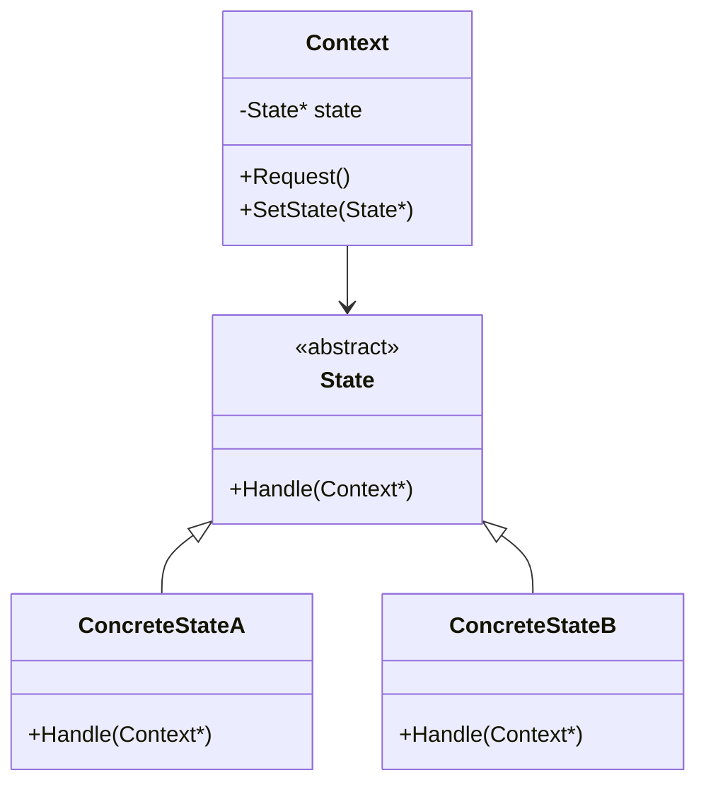

---
tags:
  - seed
  - project
created: 2026-05-30
updated: 2026-05-30
topic: tech
---

# 状态模式：告别冗余的条件判断，让对象状态变换如流水般自然
## 📑 目录
1. [未使用设计模式的代码示例与问题分析](#1-未使用设计模式的代码示例与问题分析)
2. [状态模式的灵感来源](#2-状态模式的灵感来源)
3. [应用状态模式的解决方案](#3-应用状态模式的解决方案)
4. [状态模式核心总结](#4-状态模式核心总结)
5. [留给读者的思考题](#5-留给读者的思考题)

---

## 1. 未使用设计模式的代码示例与问题分析
### 🎬 代码场景：TCP连接状态机
假设我们正在开发一个网络库，需要模拟TCP连接的状态转换。一个TCP连接可能处于以下状态：`CLOSED`、`LISTEN`、`ESTABLISHED`。每个状态下，对于不同的操作（`Connect`、`Listen`、`Close`）都有不同的行为。

### 💻 代码实现：传统条件分支方式
```cpp
#include <iostream>
#include <string>
using namespace std;

// TCP连接状态枚举
enum class TCPState {
    CLOSED,
    LISTEN,
    ESTABLISHED
};

class TCPConnection {
private:
    TCPState state;
    string name;
    
public:
    TCPConnection(const string& n) : name(n), state(TCPState::CLOSED) {}
    
    // Connect操作：根据当前状态执行不同行为
    void Connect() {
        if (state == TCPState::CLOSED) {
            cout << name << " [CLOSED -> LISTEN] 发起连接..." << endl;
            state = TCPState::LISTEN;
        } 
        else if (state == TCPState::LISTEN) {
            cout << name << " [LISTEN] 等待连接中，不能重复Connect" << endl;
        } 
        else if (state == TCPState::ESTABLISHED) {
            cout << name << " [ESTABLISHED] 已经建立连接，无需重复Connect" << endl;
        }
        else {
            cout << "无效状态" << endl;
        }
    }
    
    // Listen操作：监听端口
    void Listen() {
        if (state == TCPState::CLOSED) {
            cout << name << " [CLOSED -> LISTEN] 开始监听端口..." << endl;
            state = TCPState::LISTEN;
        }
        else if (state == TCPState::LISTEN) {
            cout << name << " [LISTEN] 正在监听中..." << endl;
        }
        else if (state == TCPState::ESTABLISHED) {
            cout << name << " [ESTABLISHED] 连接已建立，不能监听" << endl;
        }
    }
    
    // Close操作：关闭连接
    void Close() {
        if (state == TCPState::CLOSED) {
            cout << name << " [CLOSED] 已经关闭" << endl;
        }
        else if (state == TCPState::LISTEN) {
            cout << name << " [LISTEN -> CLOSED] 关闭监听..." << endl;
            state = TCPState::CLOSED;
        }
        else if (state == TCPState::ESTABLISHED) {
            cout << name << " [ESTABLISHED -> CLOSED] 断开连接..." << endl;
            state = TCPState::CLOSED;
        }
    }
    
    void ShowState() {
        string stateStr;
        switch(state) {
            case TCPState::CLOSED: stateStr = "CLOSED"; break;
            case TCPState::LISTEN: stateStr = "LISTEN"; break;
            case TCPState::ESTABLISHED: stateStr = "ESTABLISHED"; break;
        }
        cout << name << " 当前状态: " << stateStr << endl;
    }
};

// 客户端调用代码
int main() {
    TCPConnection conn("TCP-连接A");
    
    conn.ShowState();  // CLOSED
    conn.Connect();    // 发起连接
    conn.ShowState();  // LISTEN
    conn.Listen();     // 正在监听
    conn.Connect();    // 无效操作
    conn.Close();      // 关闭连接
    conn.ShowState();  // CLOSED
    
    return 0;
}
```

### 🔍 问题分析
上面的代码存在以下严重缺陷：

| 问题类型 | 具体表现 | 项目演进后果 |
| --- | --- | --- |
| **扩展性问题** | 新增状态（如`SYN_SENT`）需要修改所有方法（Connect/Listen/Close） | 修改3个方法 × N个状态，容易遗漏导致bug |
| **耦合性问题** | TCPConnection与所有状态逻辑紧密耦合 | 状态逻辑复用困难，单元测试无法独立测试状态行为 |
| **复用性问题** | 相似的条件判断在每个方法中重复 | 代码膨胀，增加维护成本 |
| **维护性问题** | 违反开闭原则，每次变更都需修改核心类 | 需求变更（如添加超时状态）需要大规模重构 |
| **性能问题** | 每次调用都进行多次条件判断 | 高频网络场景下CPU缓存不友好 |


#### 💥 实际项目中的恶性循环
```cpp
// 想象一下：当TCP状态增加到10个，操作增加到8个时...
void TCPConnection::Operation1() {
    if (state == 1) { ... }
    else if (state == 2) { ... }
    // ... 10个分支
}

void TCPConnection::Operation2() {
    if (state == 1) { ... }  // 重复代码
    else if (state == 2) { ... }
    // ... 又一个10个分支
}
// 总共10状态 × 8操作 = 80个条件分支！
```

**真实案例**：某电商系统使用类似方式处理订单状态（待支付/已支付/已发货/已完成/已取消/退款中...），当业务扩展时：

+ 添加"待审核"状态需要修改19个方法
+ 导致2个线上P0级事故（遗漏了某个方法的状态处理）
+ Code Review需要2小时

---

## 2. 状态模式的灵感来源
### 💡 设计灵感
状态模式的核心思想源自一个简单而深刻的洞察：**将对象的状态及其行为分离**。

想象一下红绿灯系统：

+ 红灯：禁止通行，等待→变绿
+ 绿灯：允许通行，倒计时→变黄  
+ 黄灯：警告通行，准备→变红

如果把所有逻辑写在一个`TrafficLight`类中用`if-else`，代码会像一团乱麻。而真实世界告诉我们：**每个状态应该自主管理自己的行为和状态转换**。

这种"分而治之"的思想，启发了状态模式：将状态相关的行为封装到独立的状态类中，通过委托代替条件判断。

---

## 3. 应用状态模式的解决方案
### 🏗️ 重构后的代码实现
```cpp
#include <iostream>
#include <memory>
#include <string>
using namespace std;

// 前置声明
class TCPConnection;

// 抽象状态类：定义状态接口
class TCPState {
public:
    virtual ~TCPState() = default;
    
    virtual void Connect(TCPConnection* conn) = 0;
    virtual void Listen(TCPConnection* conn) = 0;
    virtual void Close(TCPConnection* conn) = 0;
    virtual string GetName() const = 0;
};

// 具体状态类：CLOSED状态
class ClosedState : public TCPState {
public:
    void Connect(TCPConnection* conn) override;
    void Listen(TCPConnection* conn) override;
    void Close(TCPConnection* conn) override;
    string GetName() const override { return "CLOSED"; }
};

// 具体状态类：LISTEN状态
class ListenState : public TCPState {
public:
    void Connect(TCPConnection* conn) override;
    void Listen(TCPConnection* conn) override;
    void Close(TCPConnection* conn) override;
    string GetName() const override { return "LISTEN"; }
};

// 具体状态类：ESTABLISHED状态
class EstablishedState : public TCPState {
public:
    void Connect(TCPConnection* conn) override;
    void Listen(TCPConnection* conn) override;
    void Close(TCPConnection* conn) override;
    string GetName() const override { return "ESTABLISHED"; }
};

// 上下文类：TCP连接
class TCPConnection {
private:
    string name;
    shared_ptr<TCPState> state;  // 当前状态
    
public:
    TCPConnection(const string& n) 
        : name(n), state(make_shared<ClosedState>()) {}
    
    void SetState(shared_ptr<TCPState> newState) {
        state = newState;
    }
    
    void Connect() { 
        cout << ">>> " << name << " 执行Connect操作，当前状态：" << state->GetName() << endl;
        state->Connect(this); 
    }
    
    void Listen() { 
        cout << ">>> " << name << " 执行Listen操作，当前状态：" << state->GetName() << endl;
        state->Listen(this); 
    }
    
    void Close() { 
        cout << ">>> " << name << " 执行Close操作，当前状态：" << state->GetName() << endl;
        state->Close(this); 
    }
    
    void ShowState() {
        cout << name << " 最终状态: " << state->GetName() << endl;
    }
    
    string GetName() const { return name; }
};

// 实现具体状态的转换逻辑（需要放在类定义之后）
void ClosedState::Connect(TCPConnection* conn) {
    cout << conn->GetName() << " [CLOSED -> LISTEN] 发起连接..." << endl;
    conn->SetState(make_shared<ListenState>());
}

void ClosedState::Listen(TCPConnection* conn) {
    cout << conn->GetName() << " [CLOSED -> LISTEN] 开始监听..." << endl;
    conn->SetState(make_shared<ListenState>());
}

void ClosedState::Close(TCPConnection* conn) {
    cout << conn->GetName() << " [CLOSED] 已经关闭" << endl;
}

void ListenState::Connect(TCPConnection* conn) {
    cout << conn->GetName() << " [LISTEN] 等待连接中，不能重复Connect" << endl;
}

void ListenState::Listen(TCPConnection* conn) {
    cout << conn->GetName() << " [LISTEN] 正在监听中..." << endl;
}

void ListenState::Close(TCPConnection* conn) {
    cout << conn->GetName() << " [LISTEN -> CLOSED] 关闭监听..." << endl;
    conn->SetState(make_shared<ClosedState>());
}

void EstablishedState::Connect(TCPConnection* conn) {
    cout << conn->GetName() << " [ESTABLISHED] 已经建立连接" << endl;
}

void EstablishedState::Listen(TCPConnection* conn) {
    cout << conn->GetName() << " [ESTABLISHED] 已连接，不能监听" << endl;
}

void EstablishedState::Close(TCPConnection* conn) {
    cout << conn->GetName() << " [ESTABLISHED -> CLOSED] 断开连接..." << endl;
    conn->SetState(make_shared<ClosedState>());
}

// 客户端调用代码
int main() {
    TCPConnection conn("TCP-连接A");
    
    conn.ShowState();   // CLOSED
    conn.Connect();     // CLOSED -> LISTEN
    conn.ShowState();   // LISTEN
    conn.Listen();      // LISTEN 中
    conn.Connect();     // LISTEN 无效操作
    conn.Close();       // LISTEN -> CLOSED
    conn.ShowState();   // CLOSED
    
    return 0;
}
```

### 📊 代码对比与改进分析
| 对比维度 | 传统方式 | 状态模式 | 原理说明 |
| --- | --- | --- | --- |
| **解耦关系** | TCPConnection依赖所有状态逻辑 | TCPConnection只依赖抽象状态接口 | 依赖倒置原则 |
| **扩展性** | 新增状态需修改所有方法 | 新增状态类即可，无需修改现有代码 | 开闭原则 |
| **复用性** | 状态逻辑无法复用 | 状态类可在不同上下文中复用 | 单一职责原则 |
| **维护性** | 80个条件分支 | 每个状态类独立维护 | 高内聚低耦合 |
| **性能** | 每次调用O(n)分支预测 | 虚函数调用O(1) | 去除条件判断 |


#### 🎯 关键改进点
```cpp
// ❌ 改进前：每个操作都是巨大的switch-case
void TCPConnection::Connect() {
    if (state == CLOSED) { ... }
    else if (state == LISTEN) { ... }
    // 增加状态必须修改这里
}

// ✅ 改进后：状态自己决定行为
void TCPConnection::Connect() {
    state->Connect(this);  // 多态委托，无需修改
}
```

---

## 4. 状态模式核心总结
### 🎯 核心思想
> **将对象的状态封装为独立的类，通过委托替代条件判断，使状态转换和行为局部化。**
>

### 📐 UML类图


#### C++特性标注说明
| 角色 | C++实现要点 | 职责 |
| --- | --- | --- |
| **Context** | 持有`std::shared_ptr<State>`，提供`SetState()` | 维护当前状态对象，将请求委托给状态 |
| **State** | 抽象基类（纯虚函数），可选析构函数为`virtual` | 定义状态行为接口 |
| **ConcreteState** | 派生类实现具体行为，可持有Context引用 | 封装特定状态的行为和转换规则 |


### ✅ 典型应用场景
#### 适合的业务场景
1. **对象的行为依赖于其状态**，且运行时状态会变化
    - 游戏角色状态（站立/奔跑/跳跃）
    - 工作流引擎（审批中/已通过/已驳回）
2. **有大量与状态相关的条件语句**
    - 订单状态机（待支付→已支付→已发货→已完成）
    - TCP连接状态机
3. **状态转换规则复杂且可能频繁变更**
    - 电梯控制系统（运行/停止/维修/超载）
    - 自动售货机（投币/选购/出货/找零）

#### C++特定场景优势
```cpp
// 利用RAII管理状态转换
class ScopedStateChange {
    Context& ctx;
    State* oldState;
public:
    ScopedStateChange(Context& c, State* newState) : ctx(c) {
        oldState = ctx.GetState();
        ctx.SetState(newState);
    }
    ~ScopedStateChange() { ctx.SetState(oldState); }
};
```

#### ❌ 反例场景（不适用情况）
1. **状态数量极少且固定**（如只有2-3个状态，逻辑简单）
2. **状态转换逻辑极其简单**（如只有1-2个操作）
3. **性能敏感且状态切换频率极高**（虚函数调用有开销）
4. **需要跨语言序列化状态对象**（不同编译器RTTI可能不同）

### 📌 最佳实践建议
```cpp
// ✅ 推荐：状态对象复用（减少内存分配）
class TCPConnection {
    static shared_ptr<TCPState> closedState;
    static shared_ptr<TCPState> listenState;
    // ... 共享状态实例
};

// ⚠️ 注意：避免循环引用
class TCPState {
    weak_ptr<TCPConnection> conn;  // 使用weak_ptr打破循环
};
```

---

## 5. 留给读者的思考题
### 🔔 基础思考
1. **状态模式与策略模式的区别**：两者UML结构相似，核心区别是什么？何时用状态模式何时用策略模式？
2. **状态转换的责任归属**：上面的例子中状态转换逻辑放在了`ConcreteState`类中，如果将转换逻辑移到`Context`类中会有什么优缺点？
3. **性能优化**：当状态数量达到几十个时，频繁创建状态对象会有性能问题，如何实现状态对象的复用？

### 🚀 进阶挑战
4. **并发安全**：在多线程环境下，如何保证状态转换的原子性？改造上面TCPConnection代码使其线程安全。
5. **分布式状态机**：如果状态对象需要跨进程或跨网络传输（如微服务中的订单状态），状态模式如何适配？
6. **反射与序列化**：如何在不破坏封装的前提下，实现状态对象的状态持久化和恢复（保存/加载当前状态）？

### 💻 实践任务
实现一个**自动售货机**的状态机：

+ 状态：`NoCoin`（未投币）、`HasCoin`（已投币）、`SoldOut`（售罄）
+ 操作：`InsertCoin()`、`SelectGoods()`、`ReturnCoin()`
+ 要求：使用状态模式，并添加一个`Maintenance`（维修）状态，展示扩展性

---

## 📚 参考资料
+ 《设计模式：可复用面向对象软件的基础》第5章
+ 《C++设计模式》—— State模式章节
+ Effective C++ 条款34：区分接口继承和实现继承

---

> 💡 **一句话回顾**：状态模式通过将状态封装为对象，让状态变化看起来像是对象换了"外套"，从而消除庞大的条件分支，使代码更具扩展性和可维护性。
>

