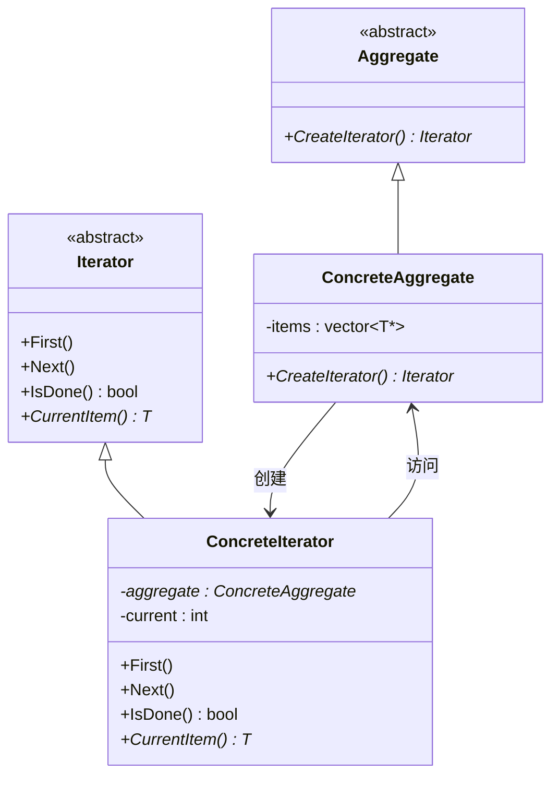

# 迭代器模式：统一遍历的艺术，让容器与算法优雅分离
## 📑 目录
1. [未使用设计模式的代码示例与问题分析](#1-未使用设计模式的代码示例与问题分析)
2. [迭代器模式的灵感来源](#2-迭代器模式的灵感来源)
3. [应用迭代器模式的解决方案](#3-应用迭代器模式的解决方案)
4. [迭代器模式核心总结](#4-迭代器模式核心总结)
5. [留给读者的思考题](#5-留给读者的思考题)

---

## 1. 未使用设计模式的代码示例与问题分析
### 🎬 代码场景：图书管理系统的书籍遍历
假设我们正在开发一个图书馆管理系统，需要支持多种方式遍历图书集合：

+ 按添加顺序遍历
+ 按书名排序遍历
+ 按作者名称遍历

初期需求很简单，只需要按顺序遍历即可。

### 💻 代码实现：传统暴露内部结构的方式
```cpp
#include <iostream>
#include <vector>
#include <string>
#include <algorithm>

using namespace std;

// 图书类
class Book {
private:
    string title;
    string author;
    string isbn;
    
public:
    Book(const string& t, const string& a, const string& i)
        : title(t), author(a), isbn(i) {}
    
    string GetTitle() const { return title; }
    string GetAuthor() const { return author; }
    string GetISBN() const { return isbn; }
    
    void Print() const {
        cout << "《" << title << "》 - " << author << " (" << isbn << ")" << endl;
    }
};

// 图书集合类：直接暴露内部存储结构
class BookCollection {
private:
    vector<Book*> books;  // 直接使用vector存储
    
public:
    void AddBook(Book* book) {
        books.push_back(book);
    }
    
    void RemoveBook(Book* book) {
        auto it = find(books.begin(), books.end(), book);
        if (it != books.end()) {
            books.erase(it);
        }
    }
    
    // 问题1：直接暴露内部数据结构给客户端
    vector<Book*>& GetBooks() {
        return books;
    }
    
    // 问题2：为了遍历不得不提供获取内部容器的方法
    size_t GetSize() const {
        return books.size();
    }
    
    Book* GetBookAt(int index) const {
        if (index >= 0 && index < books.size()) {
            return books[index];
        }
        return nullptr;
    }
};

// 客户端代码：需要了解BookCollection的内部实现细节
int main() {
    BookCollection collection;
    
    // 添加图书
    collection.AddBook(new Book("C++ Primer", "Stanley Lippman", "978-0321714114"));
    collection.AddBook(new Book("Effective C++", "Scott Meyers", "978-0321334879"));
    collection.AddBook(new Book("Design Patterns", "Erich Gamma", "978-0201633610"));
    
    // 方式1：直接获取内部vector进行遍历（暴露了内部实现）
    cout << "=== 方式1：直接遍历内部vector ===" << endl;
    vector<Book*>& books = collection.GetBooks();
    for (auto& book : books) {
        book->Print();
    }
    
    // 方式2：通过索引访问进行遍历（需要知道底层是数组结构）
    cout << "\n=== 方式2：通过索引遍历 ===" << endl;
    for (size_t i = 0; i < collection.GetSize(); ++i) {
        Book* book = collection.GetBookAt(i);
        if (book) {
            book->Print();
        }
    }
    
    // 内存泄漏：忘记释放Book对象
    // 实际项目中需要手动遍历释放
    
    return 0;
}
```

### 🔍 问题分析
上面的代码存在以下严重缺陷：

| 问题类型 | 具体表现 | 项目演进后果 |
| --- | --- | --- |
| **耦合性问题** | `BookCollection`暴露了内部`vector` | 客户端代码与内部数据结构强耦合，更换数据结构（如改用`list`）会破坏所有客户端代码 |
| **扩展性问题** | 需要添加新的遍历方式（排序遍历、过滤遍历） | 必须在客户端实现遍历逻辑，导致重复代码遍布各处 |
| **复用性问题** | 遍历逻辑无法复用 | 每个需要遍历的地方都要重复写循环代码 |
| **维护性问题** | 违反开闭原则 | 修改遍历算法需要修改所有客户端代码 |
| **安全性问题** | 客户端可以修改内部数据 | `GetBooks()`返回引用，客户端可能意外修改或删除数据 |


#### 💥 实际项目中的恶性循环
```cpp
// 需求变更1：需要按书名排序遍历
// 客户端到处都要写这样的代码：
vector<Book*>& books = collection.GetBooks();
sort(books.begin(), books.end(), 
     [](Book* a, Book* b) { return a->GetTitle() < b->GetTitle(); });
for (auto& book : books) {
    book->Print();
}

// 需求变更2：需要只遍历特定作者的图书
// 客户端又得写：
vector<Book*>& books = collection.GetBooks();
for (auto& book : books) {
    if (book->GetAuthor() == "Scott Meyers") {
        book->Print();
    }
}

// 需求变更3：底层数据结构改为list（为了更高效的插入删除）
// 改为list后，所有使用GetBooks()的客户端代码全部编译失败！
class BookCollection {
private:
    list<Book*> books;  // 从vector改为list
public:
    // GetBooks() 返回类型不兼容！需要修改所有客户端代码
    vector<Book*>& GetBooks();  // 错误！
};
```

**真实案例**：某电商系统的商品列表，最初使用`vector`存储，后来为了支持快速插入改为`list`，结果导致300+处客户端代码需要修改，测试周期延长2周，上线后出现多处编译错误。

---

## 2. 迭代器模式的灵感来源
### 💡 设计灵感
迭代器模式的灵感来自**现实世界的迭代器概念**：

想象一下图书馆的**图书检索系统**：

+ 不同的读者（客户端）想要不同的访问方式：按索书号、按分类、按作者
+ 图书馆员（容器）不会让读者直接进入书库翻找（暴露内部结构）
+ 而是提供**索引卡片**或**检索终端**（迭代器）

读者只需知道如何使用卡片，无需关心图书在书架上的具体位置。

**数学上的灵感**：类似数学中的**枚举器**概念，提供一个统一的接口来遍历集合中的元素，而无需暴露集合的内部表示。这与C++ STL的设计哲学一脉相承。

---

## 3. 应用迭代器模式的解决方案
### 🏗️ 重构后的代码实现
```cpp
#include <iostream>
#include <vector>
#include <list>
#include <string>
#include <memory>
#include <algorithm>

using namespace std;

// 前置声明
class BookIterator;

// 图书类
class Book {
private:
    string title;
    string author;
    string isbn;
    
public:
    Book(const string& t, const string& a, const string& i)
        : title(t), author(a), isbn(i) {}
    
    string GetTitle() const { return title; }
    string GetAuthor() const { return author; }
    string GetISBN() const { return isbn; }
    
    void Print() const {
        cout << "《" << title << "》 - " << author << " (" << isbn << ")" << endl;
    }
};

// 抽象迭代器接口
template<typename T>
class Iterator {
public:
    virtual ~Iterator() = default;
    virtual bool HasNext() const = 0;  // 是否还有下一个元素
    virtual T* Next() = 0;              // 返回当前元素并移动到下一个
    virtual void Reset() = 0;           // 重置到起始位置
};

// 抽象集合接口
template<typename T>
class Aggregate {
public:
    virtual ~Aggregate() = default;
    virtual unique_ptr<Iterator<T>> CreateIterator() = 0;
    virtual size_t GetSize() const = 0;
};

// 具体迭代器：正向遍历
template<typename T>
class ForwardIterator : public Iterator<T> {
private:
    vector<T*>& items;  // 引用底层容器
    size_t current;
    
public:
    ForwardIterator(vector<T*>& vec) : items(vec), current(0) {}
    
    bool HasNext() const override {
        return current < items.size();
    }
    
    T* Next() override {
        if (HasNext()) {
            return items[current++];
        }
        return nullptr;
    }
    
    void Reset() override {
        current = 0;
    }
};

// 具体迭代器：排序遍历（按书名）
template<typename T>
class SortedByTitleIterator : public Iterator<T> {
private:
    vector<T*> sortedItems;
    size_t current;
    
public:
    SortedByTitleIterator(vector<T*>& items) : current(0) {
        // 创建排序后的副本（不影响原容器）
        sortedItems = items;
        sort(sortedItems.begin(), sortedItems.end(),
             [](T* a, T* b) {
                 return a->GetTitle() < b->GetTitle();
             });
    }
    
    bool HasNext() const override {
        return current < sortedItems.size();
    }
    
    T* Next() override {
        if (HasNext()) {
            return sortedItems[current++];
        }
        return nullptr;
    }
    
    void Reset() override {
        current = 0;
    }
};

// 具体迭代器：过滤遍历（只遍历特定作者的图书）
class FilterByAuthorIterator : public Iterator<Book> {
private:
    vector<Book*> filteredItems;
    size_t current;
    string targetAuthor;
    
public:
    FilterByAuthorIterator(vector<Book*>& items, const string& author) 
        : current(0), targetAuthor(author) {
        // 创建过滤后的副本
        for (auto& book : items) {
            if (book->GetAuthor() == targetAuthor) {
                filteredItems.push_back(book);
            }
        }
    }
    
    bool HasNext() const override {
        return current < filteredItems.size();
    }
    
    Book* Next() override {
        if (HasNext()) {
            return filteredItems[current++];
        }
        return nullptr;
    }
    
    void Reset() override {
        current = 0;
    }
};

// 具体集合类：图书集合
class BookCollection : public Aggregate<Book> {
private:
    vector<Book*> books;  // 内部可以使用任何数据结构
    
public:
    ~BookCollection() {
        // 清理资源
        for (auto& book : books) {
            delete book;
        }
    }
    
    void AddBook(Book* book) {
        books.push_back(book);
    }
    
    // 创建默认迭代器（正向遍历）
    unique_ptr<Iterator<Book>> CreateIterator() override {
        return make_unique<ForwardIterator<Book>>(books);
    }
    
    // 创建排序迭代器
    unique_ptr<Iterator<Book>> CreateSortedByTitleIterator() {
        return make_unique<SortedByTitleIterator<Book>>(books);
    }
    
    // 创建过滤迭代器
    unique_ptr<Iterator<Book>> CreateFilterByAuthorIterator(const string& author) {
        return make_unique<FilterByAuthorIterator>(books, author);
    }
    
    size_t GetSize() const override {
        return books.size();
    }
    
    // 不再暴露内部数据结构！
private:
    // vector<Book*>& GetBooks() 已删除 - 客户端无法直接访问内部容器
};

// 辅助函数：统一的遍历接口
void PrintAllBooks(Iterator<Book>* iter) {
    iter->Reset();
    while (iter->HasNext()) {
        Book* book = iter->Next();
        if (book) {
            book->Print();
        }
    }
}

// 客户端代码：无需了解内部实现细节
int main() {
    BookCollection collection;
    
    // 添加图书
    collection.AddBook(new Book("C++ Primer", "Stanley Lippman", "978-0321714114"));
    collection.AddBook(new Book("Effective C++", "Scott Meyers", "978-0321334879"));
    collection.AddBook(new Book("Design Patterns", "Erich Gamma", "978-0201633610"));
    collection.AddBook(new Book("More Effective C++", "Scott Meyers", "978-0201633719"));
    
    // 方式1：使用默认迭代器（顺序遍历）
    cout << "=== 顺序遍历所有图书 ===" << endl;
    auto iter1 = collection.CreateIterator();
    PrintAllBooks(iter1.get());
    
    // 方式2：使用排序迭代器（按书名排序）
    cout << "\n=== 按书名排序遍历 ===" << endl;
    auto iter2 = collection.CreateSortedByTitleIterator();
    PrintAllBooks(iter2.get());
    
    // 方式3：使用过滤迭代器（只显示Scott Meyers的书）
    cout << "\n=== 只显示Scott Meyers的著作 ===" << endl;
    auto iter3 = collection.CreateFilterByAuthorIterator("Scott Meyers");
    PrintAllBooks(iter3.get());
    
    // 方式4：客户端自定义遍历逻辑（但仍通过统一接口）
    cout << "\n=== 自定义：显示前两本书 ===" << endl;
    auto iter4 = collection.CreateIterator();
    int count = 0;
    while (iter4->HasNext() && count < 2) {
        Book* book = iter4->Next();
        if (book) {
            cout << count + 1 << ". ";
            book->Print();
        }
        count++;
    }
    
    // 资源自动管理（unique_ptr自动释放迭代器，BookCollection析构释放Book）
    
    return 0;
}
```

### 📊 代码对比与改进分析
| 对比维度 | 传统方式 | 迭代器模式 | 原理说明 |
| --- | --- | --- | --- |
| **耦合性** | 客户端直接访问`vector<Book*>` | 客户端通过`Iterator`接口访问 | 依赖倒置原则 |
| **扩展性** | 新增遍历方式需修改所有客户端 | 新增迭代器类即可，符合开闭原则 | 单一职责原则 |
| **复用性** | 遍历逻辑分散在各处 | 遍历逻辑封装在迭代器中 | 高内聚低耦合 |
| **维护性** | 更换数据结构需修改所有客户端 | 只需修改集合类内部实现 | 接口隔离原则 |
| **安全性** | 客户端可修改内部数据 | 迭代器通常只读或提供安全访问 | 封装原则 |


#### 🎯 关键改进点
```cpp
// ❌ 改进前：暴露内部实现
class BookCollection {
    vector<Book*> books;
public:
    vector<Book*>& GetBooks() { return books; }  // 危险！
};

// 客户端代码
vector<Book*>& books = collection.GetBooks();
books.clear();  // 意外清空！灾难性后果

// ✅ 改进后：封装内部结构
class BookCollection {
    vector<Book*> books;
public:
    unique_ptr<Iterator<Book>> CreateIterator() {  // 只暴露迭代器
        return make_unique<ForwardIterator<Book>>(books);
    }
    // 客户端无法直接访问books
};

// 客户端代码：安全！集合数据不会被意外修改
auto iter = collection.CreateIterator();
while (iter->HasNext()) {
    Book* book = iter->Next();  // 只能读取，不能修改集合
}
```

---

## 4. 迭代器模式核心总结
### 🎯 核心思想
> **提供一种方法顺序访问聚合对象中的各个元素，而又不暴露其内部的表示。将遍历行为抽象为独立的迭代器对象，实现容器与算法的解耦。**
>

### 📐 UML类图


#### C++特性标注说明
| 角色 | C++实现要点 | 职责 |
| --- | --- | --- |
| **Iterator** | 抽象基类（纯虚函数），支持多态析构 | 定义遍历接口：`HasNext()`、`Next()`、`Reset()` |
| **ConcreteIterator** | 持有容器的引用或指针，维护当前位置 | 实现具体遍历算法，封装遍历状态 |
| **Aggregate** | 抽象基类，定义创建迭代器的工厂方法 | 提供统一的迭代器创建接口 |
| **ConcreteAggregate** | 存储数据的容器（可用`vector`/`list`/`map`） | 实现创建迭代器的方法，不暴露内部结构 |


#### C++特有优化技巧
```cpp
// 1. 使用CRTP实现静态多态迭代器（零开销）
template<typename T, typename Container>
class IteratorBase {
    // 编译期多态，避免虚函数开销
};

// 2. 使用类型萃取（Traits）实现STL风格迭代器
template<typename T>
struct iterator_traits {
    using value_type = T;
    using difference_type = ptrdiff_t;
    // ...
};

// 3. RAII管理迭代器生命周期
using BookIteratorPtr = unique_ptr<Iterator<Book>>;
```

### ✅ 典型应用场景
#### 适合的业务场景
1. **需要以多种方式遍历集合**
    - 树形结构的深度优先/广度优先遍历
    - 数据库查询结果集的翻页遍历
2. **需要统一不同容器的访问接口**
    - 适配多种第三方库的容器类
    - 编写通用算法库（如排序、查找）
3. **需要延迟创建或按需加载元素**
    - 大文件的分块读取
    - 无限序列生成器（斐波那契数列、素数）
4. **C++特定场景**
    - 实现STL风格的容器（兼容标准算法）
    - 封装遗留C数组为现代C++接口
    - 智能指针容器的遍历

```cpp
// 实战示例：封装C数组为可迭代对象
class ArrayWrapper {
    int* data;
    size_t size;
public:
    class Iterator {
        int* ptr;
    public:
        Iterator(int* p) : ptr(p) {}
        int& operator*() { return *ptr; }
        Iterator& operator++() { ++ptr; return *this; }
        bool operator!=(const Iterator& other) { return ptr != other.ptr; }
    };
    
    Iterator begin() { return Iterator(data); }
    Iterator end() { return Iterator(data + size); }
};
```

#### ❌ 反例场景（不适用情况）
1. **集合结构简单且不会变化**
    - 只有2-3个元素的固定数组
    - 永远不会改变的数据结构
2. **性能要求极端苛刻**
    - 直接索引访问比迭代器快10%以上
    - 实时系统中最内层循环（但现代编译器会优化迭代器）
3. **需要遍历时修改集合结构**
    - 迭代器失效问题难以处理（C++的`vector`插入/删除会使迭代器失效）
    - 需要特殊的失效处理机制
4. **语言本身已提供迭代器支持**
    - 使用C++ STL容器时，标准迭代器已足够
    - 模式主要用于设计自定义容器

### 📌 最佳实践建议
```cpp
// ✅ 推荐：使用标准库风格（const迭代器和非const迭代器）
class MyContainer {
public:
    using iterator = MyIterator<T>;
    using const_iterator = MyConstIterator<T>;
    
    iterator begin() { return iterator(data); }
    iterator end() { return iterator(data + size); }
    const_iterator begin() const { return const_iterator(data); }
    const_iterator end() const { return const_iterator(data + size); }
};

// ⚠️ 注意：处理迭代器失效问题
class SafeIterator {
    weak_ptr<Container> container;
    size_t index;
public:
    bool IsValid() const {
        auto c = container.lock();
        return c && index < c->size();
    }
};

// 💡 技巧：使用迭代器适配器
#include <iterator>
#include <algorithm>

// 使用标准库的迭代器适配器
copy(collection.begin(), collection.end(), 
     ostream_iterator<Book>(cout, "\n"));
```

---

## 5. 留给读者的思考题
### 🔔 基础思考
1. **迭代器模式 vs STL迭代器**：C++ STL的迭代器是泛化的，使用的是静态多态（模板），而GoF的迭代器模式使用的是动态多态（虚函数）。两者的优劣是什么？何时选择哪种？
2. **迭代器的生命周期管理**：如果集合被销毁，迭代器还持有引用会导致悬垂指针，如何用智能指针安全地管理迭代器和集合的关系？
3. **遍历时的并发修改**：当一个线程使用迭代器遍历时，另一个线程修改了集合，如何保证迭代器的安全性？有哪些常见的策略？

### 🚀 进阶挑战
4. **实现"快照"迭代器**：创建一个迭代器，它遍历的是创建时刻的集合快照，即使后续集合发生变化也不受影响。如何在性能和正确性之间权衡？
5. **内外迭代器的区别**：C++ STL使用的是外迭代器（由客户端控制遍历），而有些语言使用内迭代器（传入函数对象）。两者的本质区别是什么？如何用C++实现内迭代器？
6. **迭代器的类别实现**：实现一个支持`std::iterator_traits`的随机访问迭代器，需要支持`+`、`-`、`[]`、`++`、`--`等操作，使其能用于STL算法（如`std::sort`）。

### 💻 实践任务
实现一个**树结构的迭代器**：

+ 数据结构：多叉树（文件系统的目录树）
+ 要求实现三种迭代器：
    - **前序遍历**（PreOrder）
    - **中序遍历**（InOrder，仅二叉树）
    - **层序遍历**（LevelOrder，使用队列）
+ 使用迭代器模式封装遍历算法
+ 测试代码需要展示不同遍历方式的差异

**进阶挑战**：实现一个**可恢复的迭代器**，能够暂停遍历并在之后从暂停点继续。

---

## 6. 扩展阅读：C++20的迭代器改进
C++20引入了**Concept**和**Ranges**库，革命性地改进了迭代器的使用体验：

```cpp
#include <ranges>
#include <vector>
#include <iostream>

auto result = collection 
    | std::views::filter([](Book& b) { return b.GetAuthor() == "Scott Meyers"; })
    | std::views::transform([](Book& b) { return b.GetTitle(); })
    | std::views::take(2);

for (auto title : result) {
    std::cout << title << std::endl;
}
```

思考：Ranges库与迭代器模式的关系是什么？是取代还是增强？

---

> 💡 **一句话回顾**：迭代器模式通过引入中间层的迭代器对象，将遍历算法从容器中分离，使客户端可以统一方式访问不同结构的集合，而无需关心其内部实现细节——这是"接口隔离"与"单一职责"原则的完美体现。
>

